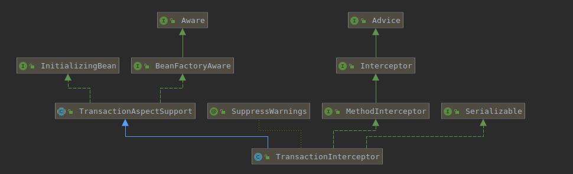

## 一、关键类

### 1、EnableTransactionManagement

```java
@Target(ElementType.TYPE)
@Retention(RetentionPolicy.RUNTIME)
@Documented
@Import(TransactionManagementConfigurationSelector.class)
public @interface EnableTransactionManagement {
}
```

### 2、TransactionManagementConfigurationSelector

```java
public class TransactionManagementConfigurationSelector extends AdviceModeImportSelector<EnableTransactionManagement> {

    @Override
    protected String[] selectImports(AdviceMode adviceMode) {
        switch (adviceMode) {
            case PROXY:
                return new String[] {AutoProxyRegistrar.class.getName(), ProxyTransactionManagementConfiguration.class.getName()};
            case ASPECTJ:
                return new String[] {TransactionManagementConfigUtils.TRANSACTION_ASPECT_CONFIGURATION_CLASS_NAME};
            default:
                return null;
        }
    }

}
```

### 3、AutoProxyRegistrar会注册生成动态代理的BeanPostProcessor

`AutoProxyRegistrar#registerBeanDefinitions`调用`AopConfigUtils#registerAutoProxyCreatorIfNecessary`把InfrastructureAdvisorAutoProxyCreator注册进入BeanFactory。


### 4、ProxyTransactionManagementConfiguration注册事务的Advisor(TransactionInterceptor)

org.springframework.transaction.annotation.ProxyTransactionManagementConfiguration

```java
@Configuration
public class ProxyTransactionManagementConfiguration extends AbstractTransactionManagementConfiguration {
    @Bean(name = TransactionManagementConfigUtils.TRANSACTION_ADVISOR_BEAN_NAME)
    @Role(BeanDefinition.ROLE_INFRASTRUCTURE)
    public BeanFactoryTransactionAttributeSourceAdvisor transactionAdvisor() {
        BeanFactoryTransactionAttributeSourceAdvisor advisor = new BeanFactoryTransactionAttributeSourceAdvisor();
    // 解析Transaction注解，确定Bean是否需要进行过事务Advisor注入
        advisor.setTransactionAttributeSource(transactionAttributeSource());
        advisor.setAdvice(transactionInterceptor());
        advisor.setOrder(this.enableTx.<Integer>getNumber("order"));
        return advisor;
    }

    @Bean
    @Role(BeanDefinition.ROLE_INFRASTRUCTURE)
    public TransactionAttributeSource transactionAttributeSource() {
        return new AnnotationTransactionAttributeSource();
    }

    @Bean
    @Role(BeanDefinition.ROLE_INFRASTRUCTURE)
    public TransactionInterceptor transactionInterceptor() {
        TransactionInterceptor interceptor = new TransactionInterceptor();
        interceptor.setTransactionAttributeSource(transactionAttributeSource());
        if (this.txManager != null) {
            interceptor.setTransactionManager(this.txManager);
        }
        return interceptor;
    }

}
```



## 二、AOP和事务的BeanPostProcessor谁生效

两者的beanName相同，有多个代理生成的后置处理器时，根据APC_PRIORITY_LIST顺序进行选择，大的生效，即同时开启时AOP的Bean后置处理器生效。

```java
public abstract class AopConfigUtils {
  /**
     * Stores the auto proxy creator classes in escalation order.
     */
    private static final List<Class<?>> APC_PRIORITY_LIST = new ArrayList<Class<?>>();

    /**
     * Setup the escalation list.
     */
    static {
    // 事务BeanPostProcessor
        APC_PRIORITY_LIST.add(InfrastructureAdvisorAutoProxyCreator.class);
        APC_PRIORITY_LIST.add(AspectJAwareAdvisorAutoProxyCreator.class);
    // AOPBeanPostProcessor
        APC_PRIORITY_LIST.add(AnnotationAwareAspectJAutoProxyCreator.class);
    }
}
```

## 三、自定义Advisor和事务Advisor执行顺序

显示指定Order来声明顺序

## 四、事务异常回滚

```java
public class TransactionInterceptor extends TransactionAspectSupport implements MethodInterceptor, Serializable {

  protected Object invokeWithinTransaction(Method method, Class<?> targetClass, final InvocationCallback invocation) throws Throwable {
        if (txAttr == null || !(tm instanceof CallbackPreferringPlatformTransactionManager)) {
            // Standard transaction demarcation with getTransaction and commit/rollback calls.
            TransactionInfo txInfo = createTransactionIfNecessary(tm, txAttr, joinpointIdentification);
            Object retVal = null;
            try {
                // This is an around advice: Invoke the next interceptor in the chain.
                // This will normally result in a target object being invoked.
                retVal = invocation.proceedWithInvocation();
            }
            catch (Throwable ex) {
                // target invocation exception
        // 事务异常处理
                completeTransactionAfterThrowing(txInfo, ex);
                throw ex;
            }
            finally {
                cleanupTransactionInfo(txInfo);
            }
            commitTransactionAfterReturning(txInfo);
            return retVal;
        }

      ...

  }
}
```

```java
public class DefaultTransactionAttribute extends DefaultTransactionDefinition implements TransactionAttribute {
  // 默认只回滚Error和RuntimeException
  public boolean rollbackOn(Throwable ex) {
        return (ex instanceof RuntimeException || ex instanceof Error);
    }
    ... 
}
```

所以尽量在方法上声明@Transactional(rollbackFor = Exception.class)来对检查异常进行回滚。

## 五、事务嵌套

参考：org.springframework.transaction.support.AbstractPlatformTransactionManager#suspend

生成SuspendedResourcesHolder的单链表结构保存事务信息。