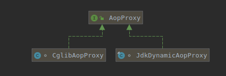

<!-- date: 2021.01.14 14:29 -->
## 一、Spring抽象出了AopProxy接口

用处：

1）用来抽象JDK和Cglib；

2）暗示统一了他们的自调用行为：调用Target的方法。



Note：

**CGlib可以实现自调用时走代理对象，但是Spring统一了动态代理的规则，使其和jdk的动态代理保持一致，致使程序在使用不同的代理时能表现一致。（非不能也，实不为也）**

这就是事务方法嵌套调用时，第二个注解不生效原因。可通过exposeTarget，通过代理类显示调用另一个方法。

## 二、CglibAopProxy源码

从以下代码的路径中可以发现，Cglib使用`methodProxy.invoke(target, argsToUse)`而非`methodProxy.invoke(proxy, argsToUse)`，来保持和jdk动态代理同样的逻辑。

### 1、位置：DynamicAdvisedInterceptor#intercept

```java
public Object intercept(Object proxy, Method method, Object[] args, MethodProxy methodProxy) throws Throwable {
    Object oldProxy = null;
    boolean setProxyContext = false;
    Class<?> targetClass = null;
    Object target = null;
    try {
        if (this.advised.exposeProxy) {
            // Make invocation available if necessary.
            oldProxy = AopContext.setCurrentProxy(proxy);
            setProxyContext = true;
        }
        // May be null. Get as late as possible to minimize the time we
        // "own" the target, in case it comes from a pool...
        target = getTarget();
        if (target != null) {
            targetClass = target.getClass();
        }
        List<Object> chain = this.advised.getInterceptorsAndDynamicInterceptionAdvice(method, targetClass);
        Object retVal;
        // Check whether we only have one InvokerInterceptor: that is,
        // no real advice, but just reflective invocation of the target.
        if (chain.isEmpty() && Modifier.isPublic(method.getModifiers())) {
            // We can skip creating a MethodInvocation: just invoke the target directly.
            // Note that the final invoker must be an InvokerInterceptor, so we know
            // it does nothing but a reflective operation on the target, and no hot
            // swapping or fancy proxying.
            Object[] argsToUse = AopProxyUtils.adaptArgumentsIfNecessary(method, args);
            retVal = methodProxy.invoke(target, argsToUse);
        }
        else {
            // We need to create a method invocation...
            retVal = new CglibMethodInvocation(proxy, target, method, args, targetClass, chain, methodProxy).proceed();
        }
        retVal = processReturnType(proxy, target, method, retVal);
        return retVal;
    }
    finally {
        if (target != null) {
            releaseTarget(target);
        }
        if (setProxyContext) {
            // Restore old proxy.
            AopContext.setCurrentProxy(oldProxy);
        }
    }
}
```

### 2、位置：CglibMethodInvocation

```java
private static class CglibMethodInvocation extends ReflectiveMethodInvocation {
        private final MethodProxy methodProxy;
        private final boolean publicMethod;

        public CglibMethodInvocation(Object proxy, Object target, Method method, Object[] arguments,
                Class<?> targetClass, List<Object> interceptorsAndDynamicMethodMatchers, MethodProxy methodProxy) {

            super(proxy, target, method, arguments, targetClass, interceptorsAndDynamicMethodMatchers);
            this.methodProxy = methodProxy;
            this.publicMethod = Modifier.isPublic(method.getModifiers());
        }

        /**
         * Gives a marginal performance improvement versus using reflection to
         * invoke the target when invoking public methods.
         */
        @Override
        protected Object invokeJoinpoint() throws Throwable {
            if (this.publicMethod) {
                return this.methodProxy.invoke(this.target, this.arguments);
            } else {
                return super.invokeJoinpoint();
            }
        }
    }
```

* 位置：org.springframework.aop.support.AopUtils#invokeJoinpointUsingReflection

```java
public static Object invokeJoinpointUsingReflection(Object target, Method method, Object[] args)
            throws Throwable {

        // Use reflection to invoke the method.
        try {
            ReflectionUtils.makeAccessible(method);
            return method.invoke(target, args);
        }
        catch (InvocationTargetException ex) {
            // Invoked method threw a checked exception.
            // We must rethrow it. The client won't see the interceptor.
            throw ex.getTargetException();
        }
        catch (IllegalArgumentException ex) {
            throw new AopInvocationException("AOP configuration seems to be invalid: tried calling method [" +
                    method + "] on target [" + target + "]", ex);
        }
        catch (IllegalAccessException ex) {
            throw new AopInvocationException("Could not access method [" + method + "]", ex);
        }
    }
```