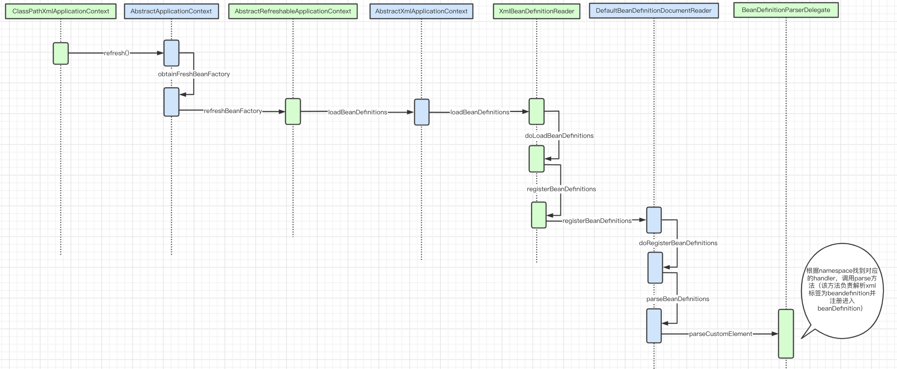
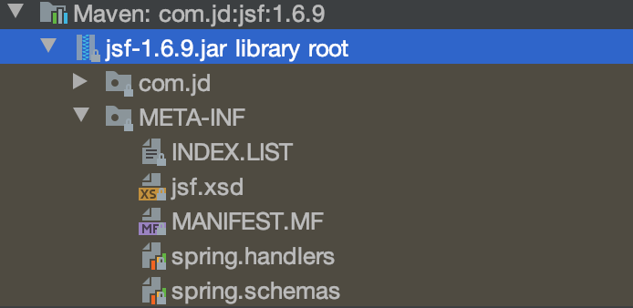
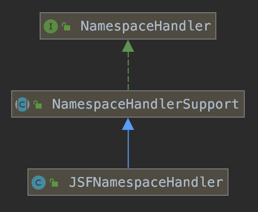
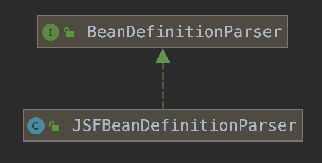
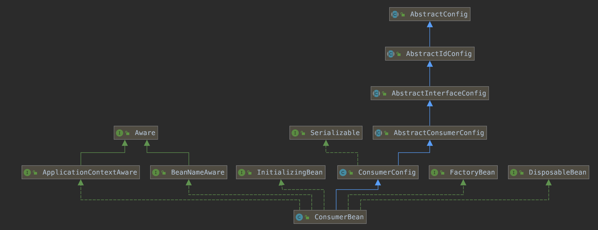

#### 一、JSF介绍

jsf是京东内部自研使用的RPC框架，同dubbo，目前已开源至github—[joyrpc](https://github.com/joyrpc/joyrpc)。本文从spring的角度去看是如何集成jsf的。

#### 二、Spring在配置文件支持自定义namespace

通过阅读源码画出如下流程图，从中可看出在解析XML时会调用BeanDefinitionParserDelegate来解析自定义的namespace，并根据其指定的NamespaceHandler实例，调用parse方法完成beanDefinition注册。



```java
public class BeanDefinitionParserDelegate {
    /**
     * Parse a custom element (outside of the default namespace).
     * @param ele the element to parse
     * @param containingBd the containing bean definition (if any)
     * @return the resulting bean definition
     */
     @Nullable
    public BeanDefinition parseCustomElement(Element ele, @Nullable BeanDefinition containingBd) {
        String namespaceUri = getNamespaceURI(ele);
        if (namespaceUri == null) {
            return null;
        }
        NamespaceHandler handler = this.readerContext.getNamespaceHandlerResolver().resolve(namespaceUri);
        if (handler == null) {
            error("Unable to locate Spring NamespaceHandler for XML schema namespace [" + namespaceUri + "]", ele);
            return null;
        }
        return handler.parse(ele, new ParserContext(this.readerContext, this, containingBd));
    }
}  
```

#### 三、JSF通过自定义namespace注册bean

##### 1. jsf-comsumer.xml常规配置

在Sping的bean配置文件中增加jsf的schema信息后，声明两个jsf的bean：注册中心和一个示例消费者。

```xml
<?xml version="1.0" encoding="UTF-8"?>
<beans xmlns="http://www.springframework.org/schema/beans"
       xmlns:xsi="http://www.w3.org/2001/XMLSchema-instance"
       xmlns:jsf="http://jsf.jd.com/schema/jsf"
       xsi:schemaLocation="http://www.springframework.org/schema/beans http://www.springframework.org/schema/beans/spring-beans.xsd
    http://jsf.jd.com/schema/jsf http://jsf.jd.com/schema/jsf/jsf.xsd">

  <!-- 注册中心 -->
  <jsf:registry id="jsfRegistry" protocol="jsfRegistry" index="i.jsf.jd.com" />

  <!-- 服务调用者配置-->
  <jsf:consumer id="demoConsumer" interface="pers.jsf.demo.IDemoConsumer" protocol="jsf" alias="demo" />
</beans>
```

##### 2. 找到jsf的schema对应的handler



在jsf-1.6.9的依赖中找到jsf集成spring的两个文件：spring.schemas和spring.handlers（可类比参考[joyrpc/joyrpc-spring/src/main/resources/META-INF](https://github.com/joyrpc/joyrpc/tree/master/joyrpc-spring/src/main/resources/META-INF)目录，只是schema有些差异）

1）spring.schemas

声明xml中jsf相关配置的语法，可用于让IDE自动提示和校验语法。

```properties
http\://jsf.jd.com/schema/jsf/jsf.xsd=META-INF/jsf.xsd
```

2）spring.handlers

声明xml中jsf命名空间对应的NamespaceHandler实例。

```properties
http\://jsf.jd.com/schema/jsf=com.jd.jsf.gd.config.spring.JSFNamespaceHandler
```

##### 3. JSFNamespaceHandler

JSFNamespaceHandler是spring的NamespaceHanlder的子类，用来处理命名空间下声明的各个标签。在pase方法里调用了init方法中注册的针对不同标签的BeanDefinitionParser（目的是把bean定义解析注册逻辑分离到JSFBeanDefinitionParser，单一职责）。



```java
public class JSFNamespaceHandler extends NamespaceHandlerSupport {
      private final Map<String, BeanDefinitionParser> parsers = new HashMap<String, BeanDefinitionParser>();

    public void init() {
        this.registerBeanDefinitionParser("provider", new JSFBeanDefinitionParser(ProviderBean.class, true));
        this.registerBeanDefinitionParser("consumer", new JSFBeanDefinitionParser(ConsumerBean.class, true));
        this.registerBeanDefinitionParser("consumerGroup", new JSFBeanDefinitionParser(ConsumerGroupBean.class, true));
        this.registerBeanDefinitionParser("server", new JSFBeanDefinitionParser(ServerBean.class, true));
        this.registerBeanDefinitionParser("registry", new JSFBeanDefinitionParser(RegistryConfig.class, true));
        this.registerBeanDefinitionParser("annotation", new JSFBeanDefinitionParser(AnnotationBean.class, true));
        this.registerBeanDefinitionParser("parameter", new JSFParameterDefinitionParser(ParameterConfig.class));
        this.registerBeanDefinitionParser("filter", new JSFBeanDefinitionParser(FilterBean.class, true));
        this.registerBeanDefinitionParser("connStrategy", new JSFBeanDefinitionParser(ConnStrategyBean.class, true));
    }

  @Override
    public BeanDefinition parse(Element element, ParserContext parserContext) {
        return findParserForElement(element, parserContext).parse(element, parserContext);
    }

    private BeanDefinitionParser findParserForElement(Element element, ParserContext parserContext) {
        String localName = parserContext.getDelegate().getLocalName(element);
        BeanDefinitionParser parser = this.parsers.get(localName);
        if (parser == null) {
            parserContext.getReaderContext().fatal(
                    "Cannot locate BeanDefinitionParser for element [" + localName + "]", element);
        }
        return parser;
    }

  protected final void registerBeanDefinitionParser(String elementName, BeanDefinitionParser parser) {
        this.parsers.put(elementName, parser);
    }
}
```

##### 4. JSFBeanDefinitionParser

JSFBeanDefinitionParser是spring的BeanDefinitionParser的子类，用来根据xml中配置的参数，把某个jsf标签解析为一个spring bean。由于类代码较长，取其中关键代码，可参考[joyrpc-AbstractBeanDefinitionParser.java](https://github.com/joyrpc/joyrpc/blob/master/joyrpc-spring/src/main/java/io/joyrpc/spring/schema/AbstractBeanDefinitionParser.java)



```java
 public class JSFBeanDefinitionParser implements BeanDefinitionParser {
    private static final Logger logger = LoggerFactory.getLogger(JSFBeanDefinitionParser.class);
    private final Class<?> beanClass;
    private final boolean required;

    public JSFBeanDefinitionParser(Class<?> beanClass, boolean required) {
        this.beanClass = beanClass;
        this.required = required;
    }

        public BeanDefinition parse(Element element, ParserContext parserContext) {
        return this.parse(element, parserContext, this.beanClass, this.required);
    }

     private BeanDefinition parse(Element element, ParserContext parserContext, Class<?> beanClass, boolean requireId) {
         RootBeanDefinition beanDefinition = new RootBeanDefinition();
         beanDefinition.setBeanClass(beanClass);
         beanDefinition.setLazyInit(false);

         /** 
          *    从element取属性填充到beanDefinition中，调用方法：
          *    beanDefinition.getPropertyValues().addPropertyValue(property, value);
          * 忽略此处逻辑
          */ 

         String id = element.getAttribute("id");
         parserContext.getRegistry().registerBeanDefinition(id, beanDefinition);
         return beanDefinition;
     }
}
```

由源码可见在创建RootBeanDefinition时设置的类是JSFNamespaceHandler中传入的，此处我们取ConsumerBean进行观察。

##### 5. ConsumerBean



从类图可看出ConsumerBean是一个FactoryBean，在其getObject方法里，调用了JSF的获取Consumer实例的API，并返回实例。

```java
public class ConsumerBean<T> extends ConsumerConfig<T> implements InitializingBean, FactoryBean, ApplicationContextAware, DisposableBean, BeanNameAware {
    private static final long serialVersionUID = 6835324481364430812L;
    private static final Logger LOGGER = LoggerFactory.getLogger(ConsumerBean.class);
    private ApplicationContext applicationContext;
    private transient String beanName;
    private transient T object;
    private transient Class objectType;

    protected ConsumerBean() {
    }

    public T getObject() throws Exception {
        this.object = CommonUtils.isUnitTestMode() ? null : this.refer();
        return this.object;
    }

      ...
}
```

##### 6. 小结

Jsf通过声明自定义namespace对应的NamespaceHandler子类，来处理xml中jsf标签的解析和注册逻辑。且最终注册的beanDefinition是一个FactoryBean，在其getObject里进行具体bean实例的生成。

#### 四、总结

第三方组件要集成进入spring，把类交给spring容器进行声明周期管理，一般都会采取FactoryBean实现。通过FactoryBean可以获取足够的灵活性，第三方组件可以用一个公共的逻辑对组件内的类完成注入Spring的过程。