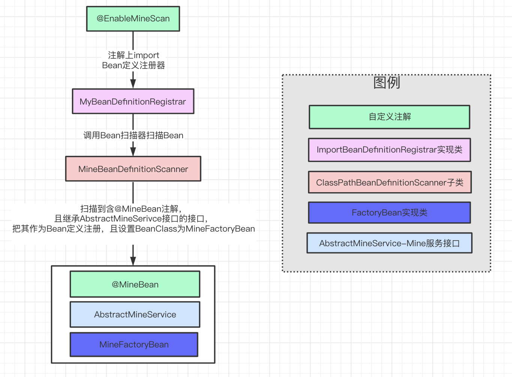

### 一、背景描述

我构想了一个类似于mybatis的简化场景如下：

假设当前我有一个组件，名字是Mine。其功能是读取XML文件封装为内存对象，并提供一些操作，如读写等。现在我想通过Spring集成该组件。达到通过自定义注解的属性指定其绑定的XML文件，然后通过FactoryBean解析生成真正的目标对象，然后被纳入Spring的Bean管理中。使其可以通过Spring的注解（如Autowire等）注入到其他Bean里。

### 二、实践

#### 1. 流程如下图

比较简单，不做解释



#### 2. 具体代码

#####  Ø EnableMineScan.java

```java
@Retention(RetentionPolicy.RUNTIME)
@Target(ElementType.TYPE)
@Documented
@Import(MineBeanDefinitionRegistrar.class)
public @interface EnableMineScan {

    /**
     * Alias for the {@link #basePackages()} attribute. Allows for more concise
     * annotation declarations e.g.:
     * {@code @EnableMyBatisMapperScanner("org.my.pkg")} instead of {@code
     *
     * @EnableMyBatisMapperScanner(basePackages= "org.my.pkg"})}.
     */
    String[] value() default {};

    /**
     * Base packages to scan for MyBatis interfaces. Note that only interfaces
     * with at least one method will be registered; concrete classes will be
     * ignored.
     */
    String[] basePackages() default {};

    /**
     * Type-safe alternative to {@link #basePackages()} for specifying the packages
     * to scan for annotated components. The package of each class specified will be scanned.
     * <p>Consider creating a special no-op marker class or interface in each package
     * that serves no purpose other than being referenced by this attribute.
     */
    Class<?>[] basePackageClasses() default {};
}
```

##### Ø MineBeanDefinitionRegistrar.java

```java
public class MineBeanDefinitionRegistrar implements ImportBeanDefinitionRegistrar, ResourceLoaderAware {
    private ResourceLoader resourceLoader;

    @Override
    public void setResourceLoader(ResourceLoader resourceLoader) {
        this.resourceLoader = resourceLoader;
    }

    @Override
    public void registerBeanDefinitions(AnnotationMetadata importingClassMetadata, 
                                        BeanDefinitionRegistry registry) {
        MineBeanDefinitionScanner scanner = new MineBeanDefinitionScanner(registry);

        // this check is needed in Spring 3.1
        if (resourceLoader != null) {
            scanner.setResourceLoader(resourceLoader);
        }

        AnnotationAttributes annoAttrs = AnnotationAttributes.fromMap(
          importingClassMetadata.getAnnotationAttributes(EnableMineScan.class.getName()));
        List<String> basePackages = new ArrayList<>();
        for (String pkg : annoAttrs.getStringArray("value")) {
            if (StringUtils.hasText(pkg)) {
                basePackages.add(pkg);
            }
        }
        for (String pkg : annoAttrs.getStringArray("basePackages")) {
            if (StringUtils.hasText(pkg)) {
                basePackages.add(pkg);
            }
        }
        for (Class<?> clazz : annoAttrs.getClassArray("basePackageClasses")) {
            basePackages.add(ClassUtils.getPackageName(clazz));
        }
        scanner.doScan(StringUtils.toStringArray(basePackages));
    }
}
```

##### Ø MineBeanDefinitionScanner.java

```java
public class MineBeanDefinitionScanner extends ClassPathBeanDefinitionScanner {
    public MineBeanDefinitionScanner(BeanDefinitionRegistry registry) {
        super(registry, false);
    }

    @Override
    public Set<BeanDefinitionHolder> doScan(String... basePackages) {
        Set<BeanDefinitionHolder> beanDefinitions = super.doScan(basePackages);
        if (beanDefinitions.isEmpty()) {
            logger.warn("No MineService was found in '" + Arrays.toString(basePackages) + "' package. Please check your configuration.");
        } else {
            processBeanDefinitions(beanDefinitions);
        }
        return beanDefinitions;
    }

    private void processBeanDefinitions(Set<BeanDefinitionHolder> beanDefinitions) {
        for (BeanDefinitionHolder holder : beanDefinitions) {
            ScannedGenericBeanDefinition definition = (ScannedGenericBeanDefinition) holder.getBeanDefinition();
            Map<String, Object> annotationAttributes = definition.getMetadata()
              .getAnnotationAttributes(MineBean.class.getName());
          
            definition.getConstructorArgumentValues().addGenericArgumentValue(definition.getBeanClassName());
            definition.setBeanClass(MineFactoryBean.class);
            definition.setAutowireMode(AbstractBeanDefinition.AUTOWIRE_BY_TYPE);
            definition.getPropertyValues().add("xmlFile", annotationAttributes.get("xmlFile"));
        }
    }

    @Override
    protected boolean isCandidateComponent(AnnotatedBeanDefinition beanDefinition) {
        return isCandidateComponent(beanDefinition.getMetadata());
    }

    @Override
    protected boolean isCandidateComponent(MetadataReader metadataReader) {
        return isCandidateComponent(metadataReader.getClassMetadata());
    }

    private boolean isCandidateComponent(ClassMetadata classMetadata) {
        return classMetadata.isInterface() && classMetadata.isIndependent()
                && ArrayUtils.contains(classMetadata.getInterfaceNames(), AbstractMineService.class.getName());
    }

    @Override
    protected boolean checkCandidate(String beanName, BeanDefinition beanDefinition) {
        if (super.checkCandidate(beanName, beanDefinition)) {
            return true;
        } else {
            logger.warn("Skipping MineFactoryBean with name '" + beanName
                    + "' and '" + beanDefinition.getBeanClassName()
                    + ". Bean already defined with the same name!");
            return false;
        }
    }
}
```

##### Ø MineBean.java

```java
public @interface MineBean {
    String value() default "";

    String xmlFile() default "";
}
```

##### Ø AbstractMineService.java

```java
public interface AbstractMineService {
    Object read(String xpath);
  	void write(String xpath, Object obj);
}
```

##### Ø MineFactoryBean.java

```java
public class MineFactoryBean<T extends AbstractMineService> implements FactoryBean<T> {
    private Class<? extends AbstractMineService> mapperInterface;
    private String xmlFile;

    public MineFactoryBean() {
    }

    public MineFactoryBean(Class<? extends AbstractMineService> mapperInterface) {
        this.mapperInterface = mapperInterface;
    }

    @Override
    public T getObject() throws Exception {
        ClassLoader contextClassLoader = Thread.currentThread().getContextClassLoader();
        return (T) Proxy.newProxyInstance(contextClassLoader, new Class[]{mapperInterface}, new MineBeanInvoker());
    }

    @Override
    public Class<?> getObjectType() {
        return mapperInterface;
    }

    @Override
    public boolean isSingleton() {
        return true;
    }

    public String getXmlFile() {
        return xmlFile;
    }

    public void setXmlFile(String xmlFile) {
        this.xmlFile = xmlFile;
    }

    class MineBeanInvoker implements InvocationHandler {
        @Override
        public Object invoke(Object proxy, Method method, Object[] args) throws Throwable {
           // 调用Mine组件进行解析和执行，忽略具体逻辑
        }
    }
}

```

#### 3. 使用示例

```java
@EnableMineScan(basePackageClasses = SpringConfiguration.class)
@Configuration
public class SpringConfiguration {
}	
```

````java
@MineFactoryBean(xmlFile = "any.xml")
public interface MineDemoRunner extends AbstractMineService {
}
````

```java
@RunWith(value = SpringJUnit4ClassRunner.class)
@ContextConfiguration(classes = SpringConfiguration.class)
public class SpringMain {
    @Autowired
    private MineDemoRunner mineService;

    @Test
    public void test() {
        mineService.read("/root/sub")
    }
}
```

