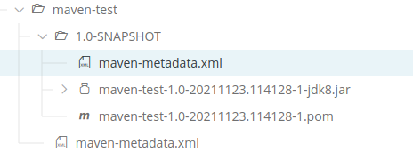

### classifier

### 一、官网描述

> https://maven.apache.org/pom.html
>
> The classifier distinguishes artifacts that were built from the same POM but differ in content. It is some optional and arbitrary string that - if present - is appended to the artifact name just after the version number.
>
> As a motivation for this element, consider for example a project that offers an artifact targeting Java 11 but at the same time also an artifact that still supports Java 1.8. The first artifact could be equipped with the classifier `jdk11` and the second one with `jdk8` such that clients can choose which one to use.
>
> Another common use case for classifiers is to attach secondary artifacts to the project's main artifact. If you browse the Maven central repository, you will notice that the classifiers `sources` and `javadoc` are used to deploy the project source code and API docs along with the packaged class files.

### 二、使用场景

**用于GAV相同，但内容不同的构件。**例如：

#### 1. 编译等级分类

1）发布方

pom中指定classfier，然后`mvn clean install` or `mvn clean deploy`。

```xml
<?xml version="1.0" encoding="UTF-8"?>
<project xmlns="http://maven.apache.org/POM/4.0.0"
         xmlns:xsi="http://www.w3.org/2001/XMLSchema-instance"
         xsi:schemaLocation="http://maven.apache.org/POM/4.0.0 http://maven.apache.org/xsd/maven-4.0.0.xsd">
    <modelVersion>4.0.0</modelVersion>
    <groupId>org.example</groupId>
    <artifactId>maven-test</artifactId>
    <version>1.0-SNAPSHOT</version>
    <properties>
        <maven.compiler.source>8</maven.compiler.source>
        <maven.compiler.target>8</maven.compiler.target>
    </properties>
    <build>
        <plugins>
            <plugin>
                <artifactId>maven-jar-plugin</artifactId>
                <executions>
                    <execution>
                        <id>default-jar</id>
                        <goals>
                            <goal>jar</goal>
                        </goals>
                        <configuration>
                            <classifier>jdk8</classifier>
                        </configuration>
                    </execution>
                </executions>
            </plugin>
        </plugins>
    </build>
    <distributionManagement>
        <snapshotRepository>
            <id>snapshots</id>
            <name>maven2 repository-snapshots</name>
            <url>http://artifactory.xxx.com/libs-snapshots-local</url>
        </snapshotRepository>
    </distributionManagement>
</project>
```

2）使用方

使用带分类的jar时，需要指定分类。

```xml
<dependency>
    <groupId>org.example</groupId>
    <artifactId>maven-test</artifactId>
    <version>1.0-SNAPSHOT</version>
    <classifier>jdk8</classifier>
</dependency>
```

3）查看私服的jar包信息



*maven-test/1.0-SNAPSHOT/maven-metadata.xml* 中，jar包上加了`<classifier>jdk8</classifier>`限定。

```xml
<?xml version="1.0" encoding="UTF-8"?>
<metadata modelVersion="1.1.0">
  <groupId>org.example</groupId>
  <artifactId>maven-test</artifactId>
  <version>1.0-SNAPSHOT</version>
  <versioning>
    <snapshot>
      <timestamp>20211123.114128</timestamp>
      <buildNumber>1</buildNumber>
    </snapshot>
    <lastUpdated>20211123114129</lastUpdated>
    <snapshotVersions>
      <snapshotVersion>
        <extension>pom</extension>
        <value>1.0-20211123.114128-1</value>
        <updated>20211123114128</updated>
      </snapshotVersion>
      <snapshotVersion>
        <classifier>jdk8</classifier>
        <extension>jar</extension>
        <value>1.0-20211123.114128-1</value>
        <updated>20211123114128</updated>
      </snapshotVersion>
    </snapshotVersions>
  </versioning>
</metadata>
```

#### 2. 类型分类

文档、源码、Jar

### # 参考

1. https://stackoverflow.com/questions/13061193/maven-generating-two-jar-files-when-used-with-classifier-tag
2. https://stackoverflow.com/questions/4725668/how-to-deploy-snapshot-with-sources-and-javadoc

