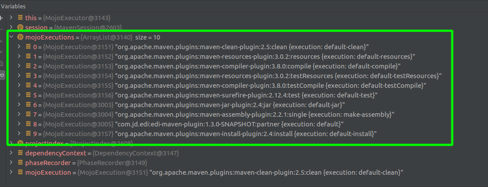
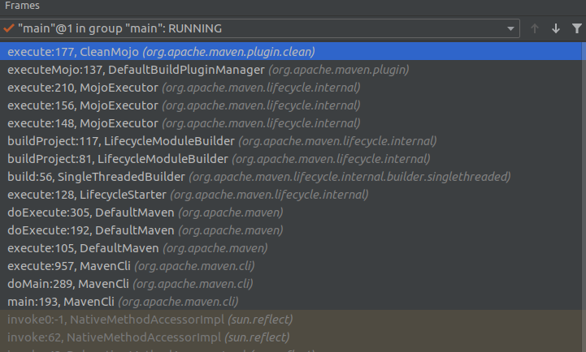

## 一、MavenCli#main

maven使用Plexus容器（一种IOC容器）进行MOJO等管理，*apache-maven/src/bin/m2.conf*里声明了其主类org.apache.maven.cli.MavenCli：

```ini
main is org.apache.maven.cli.MavenCli from plexus.core

set maven.conf default ${maven.home}/conf

[plexus.core]
load       ${maven.conf}/logging
optionally ${maven.home}/lib/ext/*.jar
load       ${maven.home}/lib/*.jar
```

```java
public int doMain( CliRequest cliRequest )
    initialize( cliRequest );

    // 解析输入的命令
    cli( cliRequest );

    // 获取系统配置
    properties( cliRequest );
    logging( cliRequest );
    version( cliRequest );
    
    // 初始化Plexus容器，查找Maven相关实现
    // lookup(Maven、ModelProcessor、ConfigurationProcessor、ToolchainsBuilder...)
    PlexusContainer localContainer = container( cliRequest );
    commands( cliRequest );
    // 解析全局和用户级别的settings.xml，并填充至cliRequest.request
    configure( cliRequest );
    // 解析工具链，支持插件使用指定版本JDK
    toolchains( cliRequest );
    // 根据环境配置配置、命令行参数等填充cliRequest
    populateRequest( cliRequest );
    encryption( cliRequest );
    repository( cliRequest );

    // 执行
    return execute( cliRequest );      
}
```

## 二、DefaultMaven#execute

> 步骤参考类注释：*org.apache.maven.DefaultMaven#doExecute(org.apache.maven.execution.MavenExecutionRequest)*

### 1. Setup initial properties

设置开始时间

### 2. Validate local repository directory is accessible

验证本地仓库目录可访问。

### 3. Create RepositorySystemSession

调用*org.apache.maven.repository.internal.MavenRepositorySystemUtils#newSession*生成Session。Session内主要包含了用来解析依赖图的相关配置，如下源码所示：

```java
DefaultRepositorySystemSession session = new DefaultRepositorySystemSession();

// 依赖遍历器
DependencyTraverser depTraverser = new FatArtifactTraverser();
session.setDependencyTraverser(depTraverser);

// 设置依赖版本约束
DependencyManager depManager = new ClassicDependencyManager();
session.setDependencyManager(depManager);

// 设置依赖过滤器，如过滤test,provided范围，可选的和排除的依赖。
DependencySelector depFilter =  new AndDependencySelector(new ScopeDependencySelector("test", "provided"), new OptionalDependencySelector(), new ExclusionDependencySelector());
session.setDependencySelector( depFilter );

// 设置依赖冲突调节器，如路径最短选择器
DependencyGraphTransformer transformer = new ConflictResolver(new NearestVersionSelector(), new JavaScopeSelector(), new SimpleOptionalitySelector(), new JavaScopeDeriver());
transformer = new ChainedDependencyGraphTransformer( transformer, new JavaDependencyContextRefiner() );
session.setDependencyGraphTransformer(transformer);
```

另外，session里还包含了仓库，proxy，认证等信息。

### 4. Create MavenSession

MavenSession内引用了PlexusContainer、RepositorySystemSession，cliRequest.request（类型为：MavenExecutionRequest）。

### 5. Execute AbstractLifecycleParticipant.afterSessionStart(session)

Sesstion开始后的扩展点，当前无默认实现。

### 6. Get reactor projects looking for general POM errors

### 7. Create ProjectDependencyGraph

> Create ProjectDependencyGraph using trimming which takes into account --projects and reactor mode. This ensures that the projects passed into the ReactorReader are only those specified.    

1）*DefaultProjectBuider -> DefaultModelBuilder*对当前pom进行Model构建，也就是生成effective pom。

> **具体细节可参考下一节。**

2）*DefaultProjectBuider*中对Model注入生命周期的插件Mojo、递归解析import的DependencyManagement。

3）*DefaultProjectBuider -> DefaultModelBuilder*对parent pom进行Model，也就是生成effective pom。

4）*DefaultProjectBuider*设置当前Model、父Model、要执行的插件等信息到Project对象。

5）设置Project对象至MavenSession。

### 8. Create ReactorReader with the getProjectMap(projects)

> NOTE that getProjectMap(projects) is the code that checks for duplicate projects definitions in the build. Ideally this type of duplicate checking should be part of getting the reactor projects in 6). The duplicate checking is conflated with getProjectMap(projects).    

### 9. Execute AbstractLifecycleParticipant.afterProjectsRead(session)

Project读取后的扩展点，当前无默认实现。

### 10. Create ProjectDependencyGraph without trimming

> Create ProjectDependencyGraph without trimming(as trimming was done in 7). A new topological sort is required after the execution of 9) as the AbstractLifecycleParticipants are free to mutate the MavenProject instances, which may change dependencies which can, in turn, affect the build order.    

### 11. Execute LifecycleStarter.start()

```java
// 构建执行计划
MavenExecutionPlan executionPlan = builderCommon.resolveBuildPlan( session, currentProject, taskSegment, new HashSet<Artifact>() );

// 获取执行计划中要执行的MOJO
List<MojoExecution> mojoExecutions = executionPlan.getMojoExecutions();

// 执行MOJO
mojoExecutor.execute( session, mojoExecutions, reactorContext.getProjectIndex());
```

1）*DefaultLifecycleExecutionP	lanCalculator -> DefaultMavenPluginManager*根据命令行指定的插件或生命周期，从Maven插件管理器中获取要执行的Mojo。

构建执行计划时会根据输入的maven命令和Maven的phase集，计算出本次命令需要执行的所有phase及phase绑定的MOJO（关键方法：*DefaultLifecycleExecutionPlanCalculator#calculateMojoExecutions*）。

2）根据要执行的Mojo列表生成*MavenExecutionPlan*，调用*MojoExecutor.execute*。

3）*MojoExecutor#ensureDependenciesAreResolved*对依赖进行深度递归解析。

> **具体细节可参考下一节。**

4）调用*DefaultBuildePluginManager#executeMojo*执行Mojo，执行相应逻辑。

图 - MojoExecutor接收到的mojoExecutions



## 附录、整体调用栈




