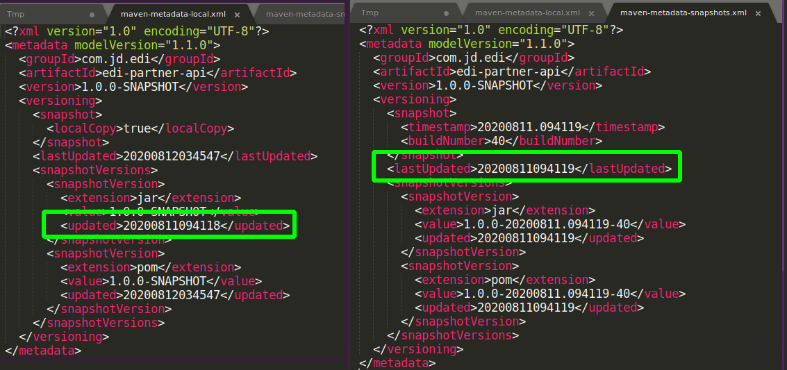

<!-- date: 2020.08.11 17:39 -->

> maven仓库的更新策略指的是更新`maven-metadata-[repository].xml`，即何时触发从远程仓库读取最西的'maven-metadata-[repository].xml'的策略。

#### 一、Maven下载仓库配置

updatePolicy: 该标签用于指定更新尝试发生的频率。Maven会比较远程和本地pom的时间戳（时间戳在maven-metadata文件）。可选项有：1）always；2）daily（默认）；3）interval:X(X为整数，单位为分钟)；4）never。

```xml
<project xmlns="http://maven.apache.org/POM/4.0.0"
  xmlns:xsi="http://www.w3.org/2001/XMLSchema-instance"
  xsi:schemaLocation="http://maven.apache.org/POM/4.0.0
                      https://maven.apache.org/xsd/maven-4.0.0.xsd">
  ...
  <repositories>
    <repository>
      <releases>
        <enabled>false</enabled>
        <updatePolicy>always</updatePolicy>
        <checksumPolicy>warn</checksumPolicy>
      </releases>
      <snapshots>
        <enabled>true</enabled>
        <updatePolicy>never</updatePolicy>
        <checksumPolicy>fail</checksumPolicy>
      </snapshots>
      <name>Nexus Snapshots</name>
      <id>snapshots-repo</id>
      <url>https://oss.sonatype.org/content/repositories/snapshots</url>
      <layout>default</layout>
    </repository>
  </repositories>
  <pluginRepositories>
    ...
  </pluginRepositories>
  ...
</project>
```

#### 二、Maven更新逻辑

> 参考maven3.6.3源码：org.apache.maven.artifact.repository.metadata.DefaultRepositoryMetadataManager#resolve方法

1. 如果`-U`强制更新，update=true

2. 如果`maven-metadata-local.xml`存在，且该文件的lastModified不符合更新策略，update=false

3. 如果`maven-metadata-snapshot.xml`不存在，update=true

4. 如果`maven-metadata-snapshot.xml`存在，则检查`resolver-status.properties`中的时间戳是否符合更新策略
   1）如果符合，update=true
   2）否则，update=false
   
   ```properties
   #NOTE: This is a Maven Resolver internal implementation file, its format can be changed without prior notice.
   #Tue Aug 11 16:46:54 CST 2020
   maven-metadata-snapshots.xml.lastUpdated=1597135614187
   ```
   
#### 三、Maven更新策略源码
   
> 参考maven3.6.3源码：org.apache.maven.artifact.repository.ArtifactRepositoryPolicy#checkOutOfDate
   
   ```java
   public boolean checkOutOfDate(Date lastModified) {
        boolean checkForUpdates = false;
   
        if (UPDATE_POLICY_ALWAYS.equals(updatePolicy)) {
            checkForUpdates = true;
        } else if (UPDATE_POLICY_DAILY.equals(updatePolicy)) {
            // Get local midnight boundary
            Calendar cal = Calendar.getInstance();
   
            cal.set(Calendar.HOUR_OF_DAY, 0);
            cal.set(Calendar.MINUTE, 0);
            cal.set(Calendar.SECOND, 0);
            cal.set(Calendar.MILLISECOND, 0);
   
            if (cal.getTime().after(lastModified)) {
                checkForUpdates = true;
            }
        } else if (updatePolicy.startsWith(UPDATE_POLICY_INTERVAL)) {
            String s = updatePolicy.substring(UPDATE_POLICY_INTERVAL.length() + 1);
            int minutes = Integer.valueOf(s);
            Calendar cal = Calendar.getInstance();
            cal.add(Calendar.MINUTE, -minutes);
            if (cal.getTime().after(lastModified)) {
                checkForUpdates = true;
            }
        }
        // else assume "never"
        return checkForUpdates;
    }
   ```
   
#### 四、Maven build时使用哪个Jar

1. 读取`groupId/artifactId/version/maven-metadata-local.xml`中`versioning -> snapshotVersions -> snapshotVersion -> updated`（只看jar包的，忽略pom）

2. 读取`groupId/artifactId/version/maven-metadata-snapshot.xml`中`versioning -> lastUpdated`

3. 选择最近的时间戳的依赖版本；若是远程版本，且版本不存在时会触发远程jar下载逻辑。

NOTE:
如果远程比本地的新，则远程下载的包会复制一份覆盖本地的`artifactId-version.jar`和pom文件;



#### 参考

1. [http://maven.apache.org/pom.html#Repositories](http://maven.apache.org/pom.html#Repositories)