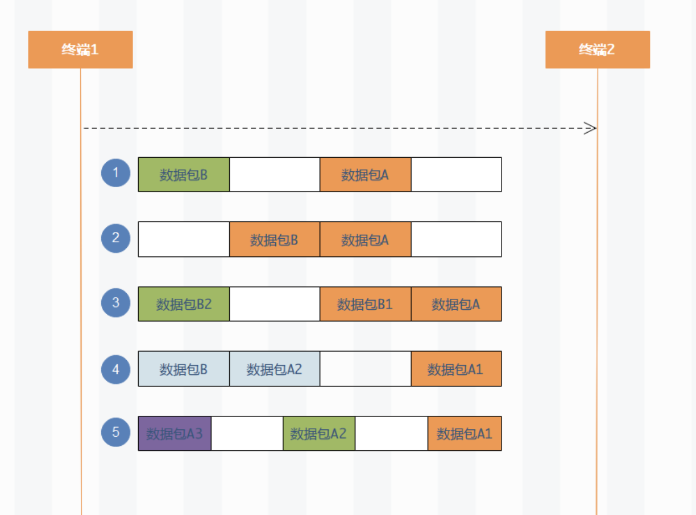
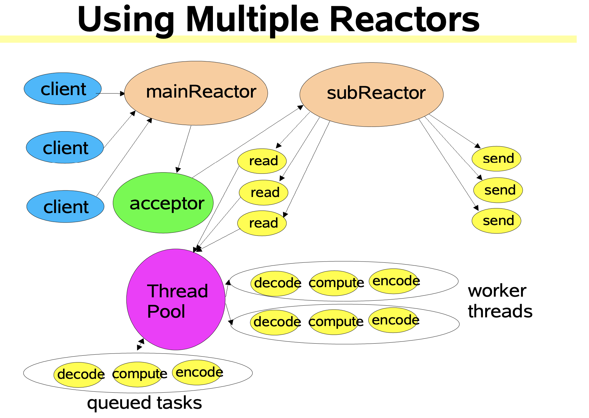

#### 一、概述

本文使用Netty实现了简单的聊天逻辑，旨在理解Netty的API使用，粘包拆包，编解码，处理器链的内容。

**应用层需要对接收到的TCP数据包的粘包拆包情况进行必要处理**，粘包拆包如下图：



参考：

1. [servlet是如何处理粘包问题的?](https://www.zhihu.com/question/270798548)
2. [怎样判断已经接收完HTTP客户端的请求数据？](https://www.zhihu.com/question/61383567/answer/188410442)
3. [tomcat NIO处理报文 是否需要拆包 粘包](https://blog.csdn.net/jsh_941112341/article/details/86381683)

#### 二、Server端

```java
/**
 * @author wangqiwei
 * @date 2021/01/25 9:38 PM
 */
public class NettyServer {
    private static final int LISTEN_PORT = 9000;
    private static final ByteBuf DELIMITER = Unpooled.copiedBuffer("_".getBytes());
    private static final int MAX_FRAME_LENGTH = 1024;

    public static void main(String[] args) throws InterruptedException {
        // bossGroup,workGroup对应了ScalableIoInJava里的反应器多线程模式
        EventLoopGroup bossGroup = new NioEventLoopGroup();
        EventLoopGroup workerGroup = new NioEventLoopGroup();

        ServerBootstrap serverBootstrap = new ServerBootstrap();
        serverBootstrap.group(bossGroup, workerGroup)
                .channel(NioServerSocketChannel.class)
                .childHandler(new ChannelInitializer<SocketChannel>() {
                    @Override
                    public void initChannel(SocketChannel ch) {
                        // 分隔符解码器 - 用于解决粘包拆包问题
                        ch.pipeline().addLast(new DelimiterBasedFrameDecoder(MAX_FRAME_LENGTH, DELIMITER));
                        // 字符串解码器（字节转为字符）- ChannelInboundHandler
                        ch.pipeline().addLast(new StringDecoder());
                        // 字符串编码器（字符转为字节） - ChannelOutboundHandler
                        ch.pipeline().addLast(new StringEncoder());
                        // 业务逻辑处理器
                        ch.pipeline().addLast(new ChatServerHandler());
                    }
                });
        // 监听端口
        ChannelFuture channelFuture = serverBootstrap.bind(LISTEN_PORT).sync();
        System.out.println("ChatServer started.");
        
        // 阻塞等待channel关闭
        channelFuture.channel().closeFuture().await();
    }

    static class ChatServerHandler extends SimpleChannelInboundHandler {
        // Netty提供的存放Channel的工具类，此处需声明为静态。因为每个channel对应不同的Handler实例
        private static ChannelGroup onlineClients = new DefaultChannelGroup(GlobalEventExecutor.INSTANCE);

        @Override
        public void channelActive(ChannelHandlerContext ctx) {
            Channel channel = ctx.channel();
            String msg = String.format("Client[%s] online", channel.remoteAddress());

            onlineClients.add(channel);
            System.out.println(msg);
            onlineClients.writeAndFlush(msg + "_", itemChannel -> !itemChannel.equals(channel));
        }

        @Override
        public void channelInactive(ChannelHandlerContext ctx) {
            Channel channel = ctx.channel();
            String msg = String.format("Client[%s] offline", channel.remoteAddress());

            onlineClients.remove(channel);
            System.out.println(msg + "_");
            onlineClients.writeAndFlush(msg + "_", itemChannel -> !itemChannel.equals(channel));
        }

        @Override
        protected void channelRead0(ChannelHandlerContext ctx, Object msg) {
            Channel channel = ctx.channel();
            msg = String.format("Client[%s] says: %s", channel.remoteAddress(), msg);

            System.out.println(msg);
            // 转发客户端消息给其他客户端
            onlineClients.writeAndFlush(msg + "_", itemChannel -> !itemChannel.equals(channel));
        }
    }
}
```

#### 三、Client端

```java
/**
 * @author wangqiwei
 * @date 2021/01/28 9:59 PM
 */
public class NettyClient {
    private static final int LISTEN_PORT = 9000;
    private static final ByteBuf DELIMITER = Unpooled.copiedBuffer("_".getBytes());
    private static final int MAX_FRAME_LENGTH = 1024;

    public static void main(String[] args) throws InterruptedException {
        EventLoopGroup eventExecutors = new NioEventLoopGroup();
        Bootstrap bootstrap = new Bootstrap();
        bootstrap.group(eventExecutors)
                .channel(NioSocketChannel.class)
                .handler(new ChannelInitializer<SocketChannel>() {
                    @Override
                    protected void initChannel(SocketChannel ch) {
                        // 分隔符解码器 - 用于解决粘包拆包问题
                        ch.pipeline().addLast(new DelimiterBasedFrameDecoder(MAX_FRAME_LENGTH, DELIMITER));
                        // 字符串解码器（字节转为字符）- ChannelInboundHandler
                        ch.pipeline().addLast(new StringDecoder());
                        // 字符串编码器（字符转为字节） - ChannelOutboundHandler
                        ch.pipeline().addLast(new StringEncoder());
                        // 业务逻辑处理器
                        ch.pipeline().addLast(new ChatClientHandler());
                    }
                });

        ChannelFuture channelFuture = bootstrap.connect("localhost", LISTEN_PORT);
        channelFuture.await();
        System.out.println("Client connected server.");

        sendMsgWithConsole(channelFuture.channel());
//        sendBatchMsg(channelFuture.channel());

        // 阻塞等待channel关闭
        channelFuture.channel().closeFuture().await();
    }

    /**
    * 批量发送消息，测试粘包拆包问题
    */
    private static void sendBatchMsg(Channel channel) {
        int i = 20;
        while (i-- > 0) {
            ByteBuf byteBuf = Unpooled.copiedBuffer("I am here._".getBytes());
            channel.writeAndFlush(byteBuf);
        }
    }

    /**
    * 通过终端发送消息，模拟交互
    */
    private static void sendMsgWithConsole(Channel channel) {
        Scanner scanner = new Scanner(System.in);
        while (scanner.hasNextLine()) {
            String s = scanner.nextLine();
            System.out.println("Console input:" + s);
            channel.writeAndFlush(s + "_");
        }
    }

    static class ChatClientHandler extends ChannelInboundHandlerAdapter {

        @Override
        public void channelActive(ChannelHandlerContext ctx) {
            System.out.println("Client online");
        }

        @Override
        public void channelInactive(ChannelHandlerContext ctx) {
            System.out.println("Client offline");
        }

        @Override
        public void channelRead(ChannelHandlerContext ctx, Object msg) {
            System.out.println(msg);
        }
    }
}
```

#### # 反应器多线程模式

参考：[Scalable_IO_in_Java](./2.Scalable_IO_in_Java.md)



