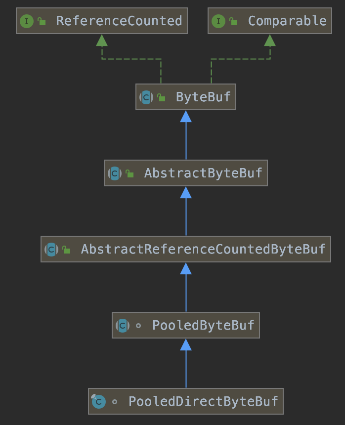

#### 一、Netty高性能分析

1）使用NIO多路复用技术，使其能高效的支持大量的客户端连接

2）使用主从Reactor模型，BossGroup和WorkerGroup分工明确，BossGroup只负责接收Channel，加快了客户端建立连接的速度。

3）使用多线程Reactor模型，WorkerGroup分配多个NioEventLoop，使CPU和IO达到一个更好的平衡，提升了CPU利用率，加快了客户端的响应效率

4）采用单线程处理客户端请求，避免同步带来的开销（无锁串行化思想）

5）支持高性能序列化协议，也体现了Netty的扩展性

6）采用零拷贝技术，减少内存拷贝开销（参考：[零拷贝](../8.linux/2.零拷贝.md)）

7）ByteBuf内存池化设计，减少了分配和销毁Direct Buffer带来的开销

8）灵活的TCP配置

#### 二、io.netty.buffer.ByteBuf对DirectByteBuffer的池化

##### 1. PooledDirectByteBuf继承结构



##### 2. PooledDirectByteBuf分配的工具类

1）PooledByteBufAllocator


2）ByteBufUtil（配置`io.netty.allocator.type=pooled`）

```java
public final class ByteBufUtil {				
	static {
        String allocType = SystemPropertyUtil.get("io.netty.allocator.type", "unpooled").toLowerCase(Locale.US).trim();
        ByteBufAllocator alloc;
        if ("unpooled".equals(allocType)) {
            alloc = UnpooledByteBufAllocator.DEFAULT;
            logger.debug("-Dio.netty.allocator.type: {}", allocType);
        } else if ("pooled".equals(allocType)) {
            alloc = PooledByteBufAllocator.DEFAULT;
            logger.debug("-Dio.netty.allocator.type: {}", allocType);
        } else {
            alloc = UnpooledByteBufAllocator.DEFAULT;
            logger.debug("-Dio.netty.allocator.type: unpooled (unknown: {})", allocType);
        }
  }
}
```

#### # Netty对Select空循环Bug的修复

参考代码：*io.netty.channel.nio.NioEventLoop#select*，该方法内部会对空轮训进行计数，默认达到512次后会调用rebuildSelector()方法重新构建一个新的Selector。

```java
private void select() throws IOException {
  Selector selector = this.selector;
  try {
    int selectCnt = 0;
    long currentTimeNanos = System.nanoTime();
    long selectDeadLineNanos = currentTimeNanos + delayNanos(currentTimeNanos);
    for (;;) {
      long timeoutMillis = (selectDeadLineNanos - currentTimeNanos + 500000L) / 1000000L;
      if (timeoutMillis <= 0) {
        if (selectCnt == 0) {
          selector.selectNow();
          selectCnt = 1;
        }
        break;
      }

      int selectedKeys = selector.select(timeoutMillis);
      selectCnt ++;
			
      // 有事件发生，被唤醒或者任务队列非空时跳出循环
      if (selectedKeys != 0 || oldWakenUp || wakenUp.get() || hasTasks()) {
        break;
      }
      if (selectedKeys == 0 && Thread.interrupted()) {
        // Thread was interrupted so reset selected keys and break so we not run into a busy loop.
        // As this is most likely a bug in the handler of the user or it's client library we will
        // also log it.  See https://github.com/netty/netty/issues/2426
        if (logger.isDebugEnabled()) {
          logger.debug("Selector.select() returned prematurely because " +
                       "Thread.currentThread().interrupt() was called. Use " +
                       "NioEventLoop.shutdownGracefully() to shutdown the NioEventLoop.");
        }
        selectCnt = 1;
        break;
      }
      if (SELECTOR_AUTO_REBUILD_THRESHOLD > 0 &&
          selectCnt >= SELECTOR_AUTO_REBUILD_THRESHOLD) {
        // The selector returned prematurely many times in a row. Rebuild the selector to work around the problem.
        logger.warn("Selector.select() returned prematurely {} times in a row; rebuilding selector.", selectCnt);

        rebuildSelector();
        selector = this.selector;

        // Select again to populate selectedKeys.
        selector.selectNow();
        selectCnt = 1;
        break;
      }

      currentTimeNanos = System.nanoTime();
    }

    if (selectCnt > MIN_PREMATURE_SELECTOR_RETURNS) {
      if (logger.isDebugEnabled()) {
        logger.debug("Selector.select() returned prematurely {} times in a row.", selectCnt - 1);
      }
    }
  } catch (CancelledKeyException e) {
    if (logger.isDebugEnabled()) {
      logger.debug(CancelledKeyException.class.getSimpleName() + " raised by a Selector - JDK bug?", e);
    }
    // Harmless exception - log anyway
  }
}
```

