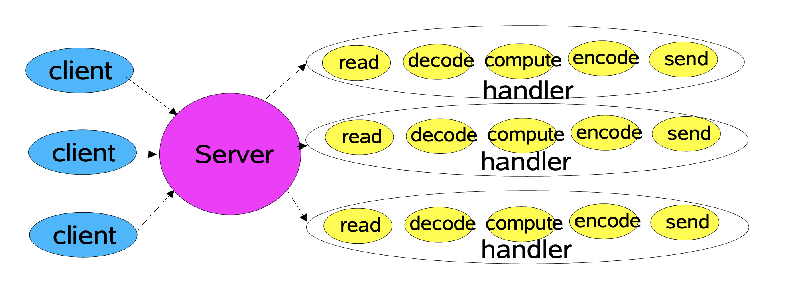
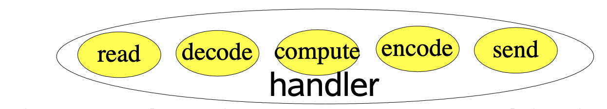
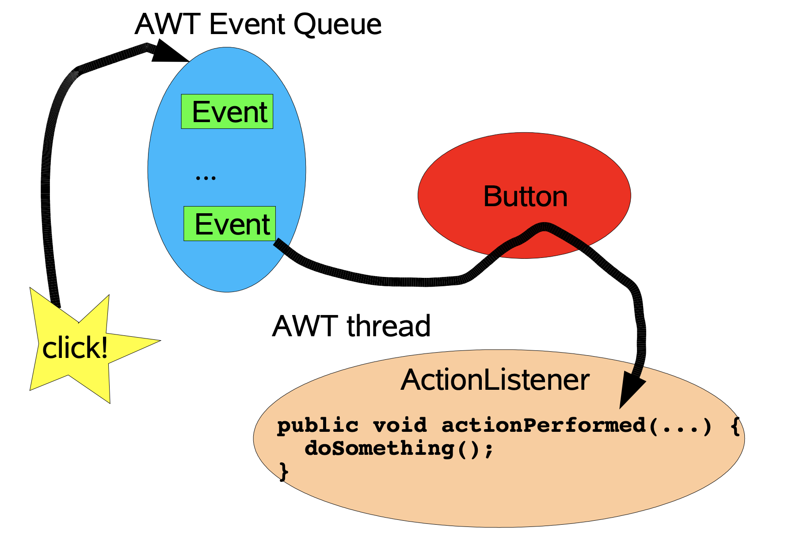
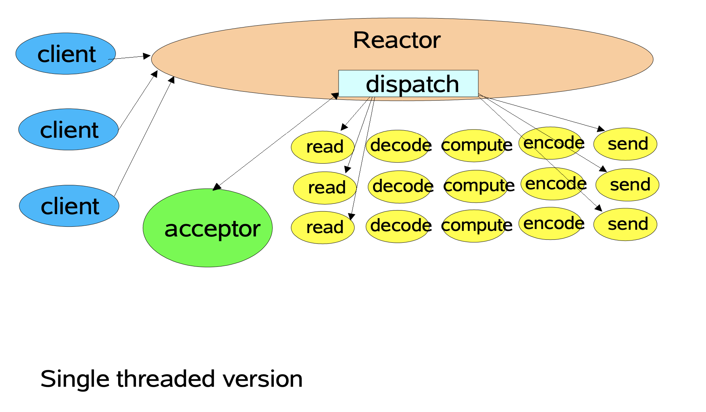
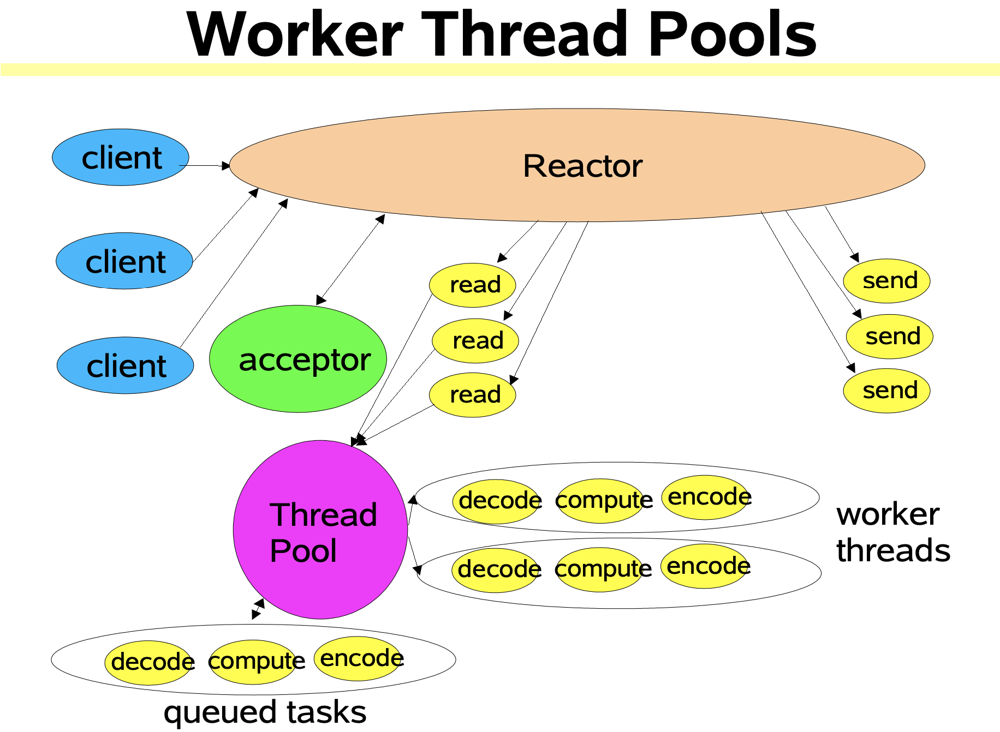
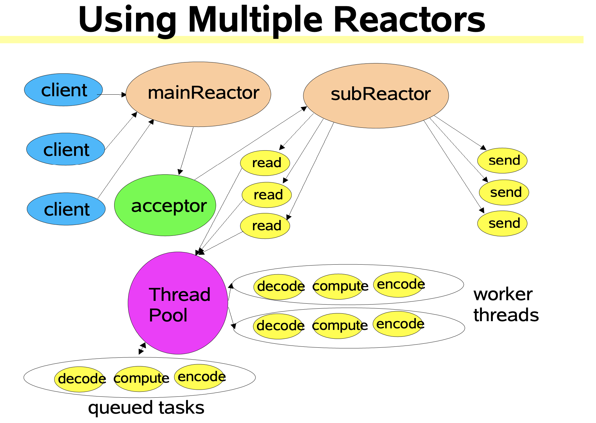

> 本文是**Scalable IO in Java**的翻译，旨在了解java中IO的React模式。为了更清晰的理解，我调整了文章的部分顺序。

### 大纲

* 可扩展的网络服务

* 事件驱动处理
* 反应器模式
  * 基础版本
  * 多线程版本
  * 其他变种
* java nio包非阻塞IO api一览

### 一、网络服务

Web服务，分布式对象等，大都有相同的结构：

* 读请求
* 解码请求
* 服务处理
* 编码响应
* 返回响应

但每一步的性质和成本不同，如Xml解析，文件传输，页面渲染，服务处理，等等。

#### 1. 典型的服务设计



1）每个handler由单独的线程调用执行。

2）典型的ServerSocketLoop程序：

```java
class Server implements Runnable {
  public void run() {
    try {
        ServerSocket ss = new ServerSocket(PORT);
        while (!Thread.interrupted())
          new Thread(new Handler(ss.accept())).start();
        // or, single-threaded, or a thread pool
      } catch (IOException ex) { /* ... */ }
  }
  
  static class Handler implements Runnable {
    final Socket socket;
    
    Handler(Socket s) { socket = s; }
    
    public void run() {
			try {
        byte[] input = new byte[MAX_INPUT];
        socket.getInputStream().read(input);
        byte[] output = process(input);
        socket.getOutputStream().write(output);
      } catch (IOException ex) { /* ... */ }
    }
    
    private byte[] process(byte[] cmd) { /* ... */ }
  }
}
```

NOTE：代码示例中忽略了异常处理。

#### 2. 可扩展性的目标

* 负载增加时的优雅降级（更多客户端）
* 随着资源（CPU、内存、磁盘、带宽）的增加而不断改进（即，可水平扩容）
* 满足可用性和性能目标
  * 低延迟
  * 满足峰值需求
  * 可调服务质量
* 分而治之通常是实现任何可伸缩性目标的最佳方法
  * 将处理划分为小任务，每个任务执行一个动作而不阻塞
  * 任务条件满足时开始执行，通常IO事件作为触发器




### 二、事件驱动设计

>  java.nio提供了基础机制的支持来实现可扩展性的目标：
>
> 1）**非阻塞**的读和写
>
> 2）**分派**与监听到的IO事件给关联的任务
>
> 他们有一系列的事件驱动设计的变种实现，事件驱动IO的思路大致相同，但是实现各有不同。

#### 1. 背景：AWT的事件



#### 2. 事件驱动的优劣

* 通常比其他方法更有效
  * 更少的资源
    * 通常不需要每个客户端都有一个线程来处理
  * 更小的负载
    * 更少的上下文切换，且更少的锁定场景
  * 但是分发可能会慢一点
    * 必须手动绑定动作到事件上
* 通常增加了编程的难度
  * 必须切分为简单的非阻塞任务
    * 类似GUI的事件驱动
    * 无法消除所有的阻塞：GC，页面失效，等
  * 必须跟踪服务的逻辑状态

### 三、反应器模式（Reactor Pattern）

#### 1. 反应器三部曲

* **反应器（Reactor）**对IO事件做出响应，把他们分发给合适的处理器。  类似AWT thread。
* **处理器（Handler）**执行非阻塞操作。
* 把反应器和处理器进行关联。类似AWT addActionListener。

#### 2. java.nio支持

* Channels
  * 连接文件，socket等，支持非阻塞读取
* Buffers
  * 类似数组的对象，可供Channel读写
* Selectors
  * 分辨哪些Channel有IO事件发生
* SelctionKeys
  * 维护IO事件状态和绑定

#### 3. 基础反应器设计



```java
class Reactor implements Runnable {
  final Selector selector;
  final ServerSocketChannel serverSocket;
  
  //1. Setup
  Reactor(int port) throws IOException {
    selector = Selector.open();
    serverSocket = ServerSocketChannel.open(); 
    serverSocket.socket().bind(new InetSocketAddress(port)); 
    serverSocket.configureBlocking(false);
    SelectionKey sk = serverSocket.register(selector, SelectionKey.OP_ACCEPT);
    sk.attach(new Acceptor());
}
/*
  Alternatively, use explicit SPI provider: 
  SelectorProvider p = SelectorProvider.provider(); 
  selector = p.openSelector();
  serverSocket = p.openServerSocketChannel();
 */
  
  // 2. Dispatch Loop
  public void run() {  // normally in a new Thread
    try {
      while (!Thread.interrupted()) {
        selector.select();
        Set selected = selector.selectedKeys(); 
        Iterator it = selected.iterator(); 
        while (it.hasNext())
          dispatch((SelectionKey)(it.next()); 
        selected.clear();
      }
    } catch (IOException ex) { /* ... */ }
  }
                   
  void dispatch(SelectionKey k) {
    Runnable r = (Runnable)(k.attachment()); 
    if (r != null)
      r.run();
  }
   
  // 3. Acceptor                  
  class Acceptor implements Runnable { // inner
    public void run() {
      try {
        SocketChannel c = serverSocket.accept();
        if (c != null)
          new Handler(selector, c);
      } catch(IOException ex) { /* ... */ }
    }
  }
}
```


```java
final class Handler implements Runnable {
  final SocketChannel socket;
  final SelectionKey sk;
  ByteBuffer input = ByteBuffer.allocate(MAXIN); 
  ByteBuffer output = ByteBuffer.allocate(MAXOUT); 
  static final int READING = 0, SENDING = 1;
  int state = READING;
  
  // 4. Handler Setup
  Handler(Selector sel, SocketChannel c) throws IOException {
    socket = c; 
    c.configureBlocking(false);
    // Optionally try first read now
    sk = socket.register(sel, 0); 
    sk.attach(this); 
    sk.interestOps(SelectionKey.OP_READ); 
    sel.wakeup();
  }
  
  boolean inputIsComplete() { /* ... */ } 
  boolean outputIsComplete() { /* ... */ } 
  void process() { /* ... */ }
  
  // 5. Request handling
  public void run() {
    try {
      if      (state == READING) read();
      else if (state == SENDING) send();
    } catch (IOException ex) { /* ... */ }
  }
  
  void read() throws IOException {
    socket.read(input);
    if (inputIsComplete()) {
      process();
      state = SENDING;
      // Normally also do first write now 
      sk.interestOps(SelectionKey.OP_WRITE);
    } 
  }
  
  void send() throws IOException { 
    socket.write(output);
    if (outputIsComplete()) 	
      sk.cancel();
  } 
}
```


#### 4. 变种 -  状态关联对应处理器

Gof状态模式简单使用，把Handler作为附件绑定给SelectionKey。

```java
class Handler { // ...
  public void run() { // initial state is reader 
    socket.read(input);
    if (inputIsComplete()) {
      process();
      sk.attach(new Sender()); 
      sk.interest(SelectionKey.OP_WRITE); 
      sk.selector().wakeup();
    } 
  }
  
  class Sender implements Runnable { 
    public void run(){ 
      // ...
      socket.write(output);
      if (outputIsComplete()) 
        sk.cancel(); 
    }
  }
}
```

#### 5. 变种 - 多线程设计

##### 1）多线程设计思路

* 按策略添加线程以实现可扩展性
  * 主要适用于多处理器
* 工作线程
  * 反应器应该快速触发处理器（然后返回）
    * 处理器执行过程会减慢反应器速度
  * 将非IO处理逻辑转移到其他线程（反应器线程）
* 多反应器线程
  * 单反应器线程处理IO时，可能会饱和
  * 将负荷分配给其他反应堆
    * 负载平衡以匹配CPU和IO速率

##### 2）多线程 - 工作线程
* 避免非IO处理以加速反应器线程，类似POSA2 Proactor designs

* 比将计算绑定处理重写为事件驱动形式更简单
  * 应该保持纯粹的非阻塞计算
  * 足够的处理量以超过开销
  
* 但很难对IO进行重复处理
  
  * 最好在第一次读取时，把所有输入写入缓冲区
  
* 使用线程池以便可以调整和控制

  * 通常需要比客户端少很多的线程

  



```java
class Handler implements Runnable {
  // uses util.concurrent thread pool
  static PooledExecutor pool = new PooledExecutor(...);
  static final int PROCESSING = 3;
  // ...
  synchronized void read() { // ...
    socket.read(input);
    if (inputIsComplete()) {
      state = PROCESSING;
      pool.execute(new Processer());
    } 
  }
  
  synchronized void processAndHandOff() {
    process();
    state = SENDING; // or rebind attachment
    sk.interest(SelectionKey.OP_WRITE);
  }
  
  class Processer implements Runnable {
    public void run() { processAndHandOff(); }
  }
}
```


##### 3）多线程 - 反应器线程

* 反应器使用线程池
  * 匹配CPU，IO速率
  * 静态或动态构造
    * 每个反应器有单独的Selector, Thread, dispatch loop
  * 通过Acceptor分发给其他反应器

```java
Selector[] selectors; // also create threads 
int next = 0;
class Acceptor { // ...
  public synchronized void run() { ...
    Socket connection = serverSocket.accept(); 
    if (connection != null)
      new Handler(selectors[next], connection); 
      if (++next == selectors.length) 
        next = 0;
  } 
}
```



##### 4）任务间协调

* 传递
  * 每个任务启用、触发或调用下一个任务；这通常最快，但可能很脆弱
* 回调 - 每个处理器的分发器
  * 设置状态，附件等
  * Gof调停模式的变种
* 队列
  * 例如，跨阶段传递缓冲区
* Futures
  * 当每个任务产生一个结果时，在join或wait/notify之上分层协调

##### 附：线程池参数

* 可调节工作线程池
* Main method **execute(Runnable r)**
* 可设置的参数
  * 任务队列的类型
  * 最大线程数
  * 最小线程数
  * 初始线程
  * 空闲线程的最大存活时间
    * 必要时会被新的线程代替
  * 饱和策略/拒绝策略
    * 阻塞，丢弃，producer-run等

#### 6. 使用java.nio的其他特性

* 每个反应器使用多个Selector
  * 不同的IO事件绑定不同的处理器
  * 需要小心进行同步协调处理
* 文件传输
  * 自动文件到网络或网络到文件复制
* 内存映射文件（Memory-mapped file）
  * 通过缓冲区访问文件
* 直接缓冲区
  * 有时可实现零拷贝
  * 但是设置和完成开销很大
  * 最适合长连接的应用程序

#### 7. 基于连接的扩展

* 替代单次请求
  * 客户端连接
  * 客户端发送批量请求数据
  * 客户端断开连接
* 示例
  * 数据库和事务监视器
  * 多人游戏，聊天等
* 可扩展的基础网络模式
  * 处理许多相对长寿命的客户
  * 记录客户端和会话状态
  * 分发服务给多个主机

### # 参考

1. [nio.pdf ——doug lea](http://gee.cs.oswego.edu/dl/cpjslides/nio.pdf)  [本仓库副本](../../../reference/nio_douge_lea.pdf)

