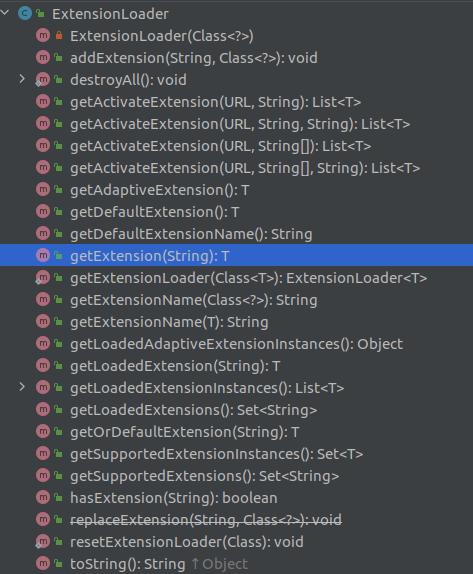
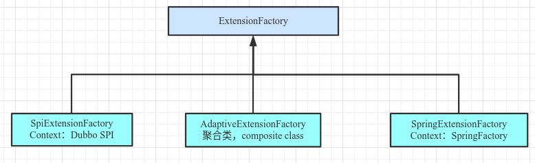

## 一、Dubbo扩展点

### 1、Dubbo扩展点来源

Dubbo 的扩展点加载从 JDK 标准的 SPI (Service Provider Interface) 扩展点发现机制加强而来。

Dubbo 改进了 JDK 标准的 SPI 的以下问题：

1）ServideLoader获取全集扩展点时会对扩展点进行实例化。

如果有扩展实现初始化很耗时，但如果没用上也加载，会很浪费资源。

2）ServiceLoader扩展点实例化异常时，会吞异常信息。

```java
private class LazyIterator implements Iterator<S> {
    private S nextService() {
        try {
            c = Class.forName(cn, false, loader);
        } catch (ClassNotFoundException x) {
            fail(service, "Provider " + cn + " not found");
        }
    }
    ...
}
```

3）扩展点内依赖其他扩展点的自动注入问题需要研发自己解决。

Dubbo扩展点增加了对扩展点 IoC 和 AOP 的支持，一个扩展点可以直接 setter 注入其它扩展点。

4）扩展点没有二级分类，无法根据分类指定要获取的实现。

Dubbo扩展点增加了type。

### 2、Dubbo扩展点的一种声明方式

*/META-INF/dubbo*下声明扩展点，如文件：*org.apache.dubbo.common.extension.ExtensionFactory*

```properties
adaptive=org.apache.dubbo.common.extension.factory.AdaptiveExtensionFactory
spi=org.apache.dubbo.common.extension.factory.SpiExtensionFactory
```

* 文件名是接口，文件内容里一行是一个实现。

* 每行里，“=”左侧是type（类型），右侧是具体类。

* 可通过ExtensionLoader.getExtension(type)，获取扩展点的对应类型的实现类。

## 二、Dubbo扩展点的关键类解析

### 1、ExtensionLoader

扩展点加载器，其在实例化时绑定了某个固定扩展点。其主要用来根据指定的type来获取扩展点实例。如果扩展点依赖了其他扩展点，则会通过ExtensionFactory获取需要注入的扩展点并注入。

下图为ExtensionLoader的公共方法列表。



### 2、ExtensionFactory

用于扩展点中依赖的其他扩展点的加载。其主要用来根据某个扩展点的类型来获取扩展点。一般通过AdatptiveExtensionFactory类进行调用，该类是一个composite class，即其包含了本扩展点（ExtensionFactory扩展点）的其他非Adaptive扩展点，参考如下源码。



附：AdaptiveExtensionFactory源码

```java
@Adaptive
public class AdaptiveExtensionFactory implements ExtensionFactory {

    private final List<ExtensionFactory> factories;

    public AdaptiveExtensionFactory() {
        ExtensionLoader<ExtensionFactory> loader = ExtensionLoader.getExtensionLoader(ExtensionFactory.class);
        List<ExtensionFactory> list = new ArrayList<ExtensionFactory>();
        for (String name : loader.getSupportedExtensions()) {
            list.add(loader.getExtension(name));
        }
        factories = Collections.unmodifiableList(list);
    }

    @Override
    public <T> T getExtension(Class<T> type, String name) {
        for (ExtensionFactory factory : factories) {
            T extension = factory.getExtension(type, name);
            if (extension != null) {
                return extension;
            }
        }
        return null;
    }

}
```

值得注意的是SpiExtensionFactory会在Dubbo配置的扩展点中寻找。并且其返回的是一个Adaptive（自适应）扩展点实例。该实例同刚才介绍的AdatpiveExtensionFactory一样，是一个composite类。由@Adaptive注解声明或者由ExtensionLoader自动生成。

### 3、Adaptive扩展点

Adaptive扩展点，也成为自适应扩展点。它从成员来看，是本扩展点的一个composite类，包含了其他所有的扩展点。其由@Adaptive注解声明或者由ExtensionLoader自动生成。

附，ExtensionLoader自动生成Adataptive扩展点代码如下。

```java
package org.apache.dubbo.common.extension.adaptive;

import org.apache.dubbo.common.extension.ExtensionLoader;
import org.apache.dubbo.common.extension.adaptive.HasAdaptiveExt;
import org.apache.dubbo.common.URL;

public class HasAdaptiveExt$Adaptive implements HasAdaptiveExt {
    public String echo(URL arg0, String arg1) {
        if (arg0 == null) 
            throw new IllegalArgumentException("url == null");
        URL url = arg0;
        String extName = url.getParameter("has.adaptive.ext", "adaptive");
        if (extName == null)
            throw new IllegalStateException("Failed to get extension (HasAdaptiveExt) name from url (" + url.toString() + ") use keys([has.adaptive.ext])");

        HasAdaptiveExt extension = (HasAdaptiveExt) ExtensionLoader.getExtensionLoader(HasAdaptiveExt.class).getExtension(extName);
        return extension.echo(arg0, arg1);
    }
}
```

由以上源码可看出，如果一个扩展点需要支持自适应时，则扩展点的方法需要由URL参数（或是参数有URL成员）。

Adaptive类可认为是一个简单工厂，根据方法传入的URL，定位到对应的实例，然后再调用方法。

## # 参考

1. https://dubbo.apache.org/zh/docs/v2.7/dev/spi/