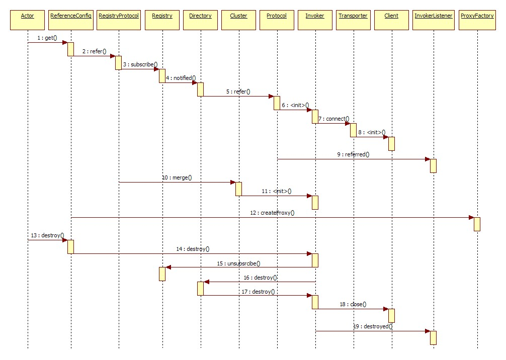
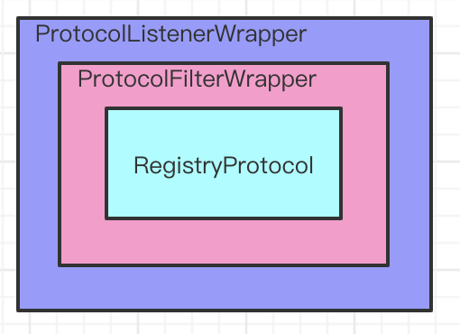

### 一、服务引入整体流程



### 二、ReferenceConfig#get

ReferenceConfig.get方法首次调用会调用init方法对ref初始化。

```java
public class ReferenceConfig<T> extends ReferenceConfigBase<T> {
    public synchronized void init() {
        if (initialized) {
            return;
        }

        // 初始化启动器，主要用于获取配置中心配置放到environment，以及根据配置初始化RegistryConfig,ProtocolConfig
        if (bootstrap == null) {
            bootstrap = DubboBootstrap.getInstance();
            bootstrap.init();
        }

        // 获取Reference注解和本机的Dubbo配置，并设置配置优先级。
        checkAndUpdateSubConfigs();

        // 初始化serivceMetadata
        serviceMetadata.setVersion(version);
        serviceMetadata.setGroup(group);
        serviceMetadata.setDefaultGroup(group);
        serviceMetadata.setServiceType(getActualInterface());
        serviceMetadata.setServiceInterfaceName(interfaceName);
        serviceMetadata.setServiceKey(URL.buildKey(interfaceName, group, version));

        checkStubAndLocal(interfaceClass);
        ConfigValidationUtils.checkMock(interfaceClass, this);

        // === BEGIN：根据配置优先级构建初始化参数的Map ===
        Map<String, String> map = new HashMap<String, String>();
        map.put(SIDE_KEY, CONSUMER_SIDE);

        ReferenceConfigBase.appendRuntimeParameters(map);
        if (!ProtocolUtils.isGeneric(generic)) {
            String revision = Version.getVersion(interfaceClass, version);
            if (revision != null && revision.length() > 0) {
                map.put(REVISION_KEY, revision);
            }

            String[] methods = Wrapper.getWrapper(interfaceClass).getMethodNames();
            if (methods.length == 0) {
                logger.warn("No method found in service interface " + interfaceClass.getName());
                map.put(METHODS_KEY, ANY_VALUE);
            } else {
                map.put(METHODS_KEY, StringUtils.join(new HashSet<String>(Arrays.asList(methods)), COMMA_SEPARATOR));
            }
        }
        map.put(INTERFACE_KEY, interfaceName);
        AbstractConfig.appendParameters(map, getMetrics());
        AbstractConfig.appendParameters(map, getApplication());
        AbstractConfig.appendParameters(map, getModule());
        AbstractConfig.appendParameters(map, consumer);
        AbstractConfig.appendParameters(map, this);
        Map<String, Object> attributes = null;
        if (CollectionUtils.isNotEmpty(getMethods())) {
            attributes = new HashMap<>();
            for (MethodConfig methodConfig : getMethods()) {
                AbstractConfig.appendParameters(map, methodConfig, methodConfig.getName());
                String retryKey = methodConfig.getName() + ".retry";
                if (map.containsKey(retryKey)) {
                    String retryValue = map.remove(retryKey);
                    if ("false".equals(retryValue)) {
                        map.put(methodConfig.getName() + ".retries", "0");
                    }
                }
                ConsumerModel.AsyncMethodInfo asyncMethodInfo = AbstractConfig.convertMethodConfig2AsyncInfo(methodConfig);
                if (asyncMethodInfo != null) {
                    attributes.put(methodConfig.getName(), asyncMethodInfo);
                }
            }
        }

        String hostToRegistry = ConfigUtils.getSystemProperty(DUBBO_IP_TO_REGISTRY);
        if (StringUtils.isEmpty(hostToRegistry)) {
            hostToRegistry = NetUtils.getLocalHost();
        } else if (isInvalidLocalHost(hostToRegistry)) {
            throw new IllegalArgumentException("Specified invalid registry ip from property:" + DUBBO_IP_TO_REGISTRY + ", value:" + hostToRegistry);
        }
        map.put(REGISTER_IP_KEY, hostToRegistry);

        serviceMetadata.getAttachments().putAll(map);

        ServiceRepository repository = ApplicationModel.getServiceRepository();
        ServiceDescriptor serviceDescriptor = repository.registerService(interfaceClass);
        repository.registerConsumer(
                serviceMetadata.getServiceKey(),
                attributes,
                serviceDescriptor,
                this,
                null,
                serviceMetadata);
        // === END：根据配置优先级构建初始化参数的Map ===
      
        // 创建ref代理对象
        ref = createProxy(map);

        // 更新serviceMetadata
        serviceMetadata.setTarget(ref);
        serviceMetadata.addAttribute(PROXY_CLASS_REF, ref);
        repository.lookupReferredService(serviceMetadata.getServiceKey()).setProxyObject(ref);

        initialized = true;
        // dispatch a ReferenceConfigInitializedEvent since 2.7.4
        dispatch(new ReferenceConfigInitializedEvent(this, invoker));
    }
}  
```

#### ReferenceConfig#checkAndUpdateSubConfigs设置配置优先级

checkAndUpdateSubConfigs里调用`this.refresh();`方法进行配置优先级设定。

```java
public void refresh() {
        Environment env = ApplicationModel.getEnvironment();
        try {
            CompositeConfiguration compositeConfiguration = env.getConfiguration(getPrefix(), getId());
            Configuration config = new ConfigConfigurationAdapter(this);
            if (env.isConfigCenterFirst()) {
                // The sequence would be: SystemConfiguration -> AppExternalConfiguration -> ExternalConfiguration -> AbstractConfig -> PropertiesConfiguration
                compositeConfiguration.addConfiguration(4, config);
            } else {
                // The sequence would be: SystemConfiguration -> AbstractConfig -> AppExternalConfiguration -> ExternalConfiguration -> PropertiesConfiguration
                compositeConfiguration.addConfiguration(2, config);
            }
}
```

其中，Environment#getConfiguration

```java
public class Environment extends LifecycleAdapter implements FrameworkExt {    
    public CompositeConfiguration getConfiguration(String prefix, String id) {
        CompositeConfiguration compositeConfiguration = new CompositeConfiguration();
        // Config center has the highest priority
        // From System.getProperty
        compositeConfiguration.addConfiguration(this.getSystemConfig(prefix, id));
        // From System.getenv
        compositeConfiguration.addConfiguration(this.getEnvironmentConfig(prefix, id));
        // From ConfigCenter
        compositeConfiguration.addConfiguration(this.getAppExternalConfig(prefix, id));
        // From ConfigCenter
        compositeConfiguration.addConfiguration(this.getExternalConfig(prefix, id));
        // From dubbo.properties
        compositeConfiguration.addConfiguration(this.getPropertiesConfig(prefix, id));
        return compositeConfiguration;
    }
}  
```

### 三、ReferenceConfig#createProxy（一）

```java
public class ReferenceConfig<T> extends ReferenceConfigBase<T> {
    private static final Protocol REF_PROTOCOL = ExtensionLoader.getExtensionLoader(Protocol.class).getAdaptiveExtension();
  
    private T createProxy(Map<String, String> map) {
        // JVM内直接Refer
        if (shouldJvmRefer(map)) {
            URL url = new URL(LOCAL_PROTOCOL, LOCALHOST_VALUE, 0, interfaceClass.getName()).addParameters(map);
            invoker = REF_PROTOCOL.refer(interfaceClass, url);
        } else {
            urls.clear();
            if (url != null && url.length() > 0) {  // 使用用户指定的URL，可能是通过IP直调的URL，或者是注册中心地址
                String[] us = SEMICOLON_SPLIT_PATTERN.split(url);
                if (us != null && us.length > 0) {
                    for (String u : us) {
                        URL url = URL.valueOf(u);
                        if (StringUtils.isEmpty(url.getPath())) {
                            url = url.setPath(interfaceName);
                        }
                        if (UrlUtils.isRegistry(url)) {
                            urls.add(url.addParameterAndEncoded(REFER_KEY, StringUtils.toQueryString(map)));
                        } else {
                            urls.add(ClusterUtils.mergeUrl(url, map));
                        }
                    }
                }
            } else { // 从注册中心的配置构建URL
                if (!LOCAL_PROTOCOL.equalsIgnoreCase(getProtocol())) {
                    checkRegistry();
                    List<URL> us = ConfigValidationUtils.loadRegistries(this, false);
                    if (CollectionUtils.isNotEmpty(us)) {
                        for (URL u : us) {
                            URL monitorUrl = ConfigValidationUtils.loadMonitor(this, u);
                            if (monitorUrl != null) {
                                map.put(MONITOR_KEY, URL.encode(monitorUrl.toFullString()));
                            }
                            urls.add(u.addParameterAndEncoded(REFER_KEY, StringUtils.toQueryString(map)));
                        }
                    }
                    if (urls.isEmpty()) {
                        throw new IllegalStateException("No such any registry to reference, please config <dubbo:registry address=\"...\" /> to your spring config.");
                    }
                }
            }

            if (urls.size() == 1) { // 单注册中心
                // === 重点，通过PROTOCOL扩展点对制定接口执行refer ===
                invoker = REF_PROTOCOL.refer(interfaceClass, urls.get(0));
            } else { // 多注册中心
                List<Invoker<?>> invokers = new ArrayList<Invoker<?>>();
                URL registryURL = null;
                for (URL url : urls) {
                    invokers.add(REF_PROTOCOL.refer(interfaceClass, url));
                    if (UrlUtils.isRegistry(url)) {
                        registryURL = url; // use last registry url
                    }
                }
                if (registryURL != null) { // registry url is available
                    // for multi-subscription scenario, use 'zone-aware' policy by default
                    URL u = registryURL.addParameterIfAbsent(CLUSTER_KEY, ZoneAwareCluster.NAME);
                    // The invoker wrap relation would be like: ZoneAwareClusterInvoker(StaticDirectory) -> FailoverClusterInvoker(RegistryDirectory, routing happens here) -> Invoker
                    invoker = CLUSTER.join(new StaticDirectory(u, invokers));
                } else { // not a registry url, must be direct invoke.
                    invoker = CLUSTER.join(new StaticDirectory(invokers));
                }
            }
        }

        if (shouldCheck() && !invoker.isAvailable()) {
            throw new IllegalStateException("No provider available for the service");
        }

        // create service proxy
        return (T) PROXY_FACTORY.getProxy(invoker);
    }
}  
```

### 四、REF_PROTOCOL#refer

REF_PROTOCOL是Protoco扩展点的自适应类。其会根据URL的protocol属性获取实现类

```java
Protocol REF_PROTOCOL = ExtensionLoader.getExtensionLoader(Protocol.class).getAdaptiveExtension();
```

正常通过注册中心进行refer时，url格式类似，其会获取RegistryProtocol类并调用refer方法：

```java
registry://127.0.0.1:2181/org.apache.dubbo.registry.RegistryService?application=dubbo-demo-api-consumer&dubbo=2.0.2&pid=52071&refer=application%3Ddubbo-demo-api-consumer%26dubbo%3D2.0.2%26interface%3Dorg.apache.dubbo.demo.DemoService%26methods%3DsayHello%2CsayHelloAsync%26pid%3D52071%26register.ip%3D192.168.199.172%26side%3Dconsumer%26sticky%3Dfalse%26timestamp%3D1622282108905&registry=zookeeper&timestamp=1622282151493
```




RegistryProtocol#refer方法，会对URL进行重写，然后调用doRefer。

```java
public class RegistryProtocol implements Protocol {
    public <T> Invoker<T> refer(Class<T> type, URL url) throws RpcException {
        // 重写URL，提取出真实的注册中心类型
        url = getRegistryUrl(url);
        // 然后根据URL获取对应类型的Registry，例如url为"zookeeper://"时类型为ZookeeperRegistry
        Registry registry = registryFactory.getRegistry(url);
        if (RegistryService.class.equals(type)) {
            return proxyFactory.getInvoker((T) registry, type, url);
        }

        // group="a,b" or group="*"
        Map<String, String> qs = StringUtils.parseQueryString(url.getParameterAndDecoded(REFER_KEY));
        String group = qs.get(GROUP_KEY);
        if (group != null && group.length() > 0) {
            if ((COMMA_SPLIT_PATTERN.split(group)).length > 1 || "*".equals(group)) {
                return doRefer(getMergeableCluster(), registry, type, url);
            }
        }
        return doRefer(cluster, registry, type, url);
    }
}    
```

重写后的URL为：

```java
zookeeper://127.0.0.1:2181/org.apache.dubbo.registry.RegistryService?application=dubbo-demo-api-consumer&dubbo=2.0.2&pid=52071&refer=application%3Ddubbo-demo-api-consumer%26dubbo%3D2.0.2%26interface%3Dorg.apache.dubbo.demo.DemoService%26methods%3DsayHello%2CsayHelloAsync%26pid%3D52071%26register.ip%3D192.168.199.172%26side%3Dconsumer%26sticky%3Dfalse%26timestamp%3D1622282108905&timestamp=1622282151493
```

而根据URL获取的Registry为：


### 五、RegistryProtocol#doRefer

```java
public class RegistryProtocol implements Protocol {
    private <T> Invoker<T> doRefer(Cluster cluster, Registry registry, Class<T> type, URL url) {
        RegistryDirectory<T> directory = new RegistryDirectory<T>(type, url);
        directory.setRegistry(registry);
        directory.setProtocol(protocol);
        // all attributes of REFER_KEY
        Map<String, String> parameters = new HashMap<String, String>(directory.getUrl().getParameters());
        URL subscribeUrl = new URL(CONSUMER_PROTOCOL, parameters.remove(REGISTER_IP_KEY), 0, type.getName(), parameters);
        if (!ANY_VALUE.equals(url.getServiceInterface()) && url.getParameter(REGISTER_KEY, true)) {
            directory.setRegisteredConsumerUrl(getRegisteredConsumerUrl(subscribeUrl, url));
            registry.register(directory.getRegisteredConsumerUrl());
        }
        directory.buildRouterChain(subscribeUrl);
        directory.subscribe(subscribeUrl.addParameter(CATEGORY_KEY,
                PROVIDERS_CATEGORY + "," + CONFIGURATORS_CATEGORY + "," + ROUTERS_CATEGORY));

        Invoker invoker = cluster.join(directory);
        return invoker;
    }
}    
```

该方法会根据前面获取的注册中心示例Regitry，URL等信息构建RegistryDirectory，然后调用RegistryDirectory#subscribe向注册中心注册Consumer信息，获取并持续监听Provider信息。

此时设置进RegistryDirectory的URL格式为：

```java
consumer://192.168.199.172/org.apache.dubbo.demo.DemoService?application=dubbo-demo-api-consumer&dubbo=2.0.2&interface=org.apache.dubbo.demo.DemoService&methods=sayHello,sayHelloAsync&pid=52071&side=consumer&sticky=false&timestamp=1622282108905
```

#### 1.RegistryDirectory#subscribe


该方法内会调用注册中心实例的subscribe方法，并把自己作为Listener传入。自此当前的调用链如上图。

```java
public class RegistryDirectory<T> extends AbstractDirectory<T> implements NotifyListener {    
    public void subscribe(URL url) {
        setConsumerUrl(url);
        CONSUMER_CONFIGURATION_LISTENER.addNotifyListener(this);
        serviceConfigurationListener = new ReferenceConfigurationListener(this, url);
        registry.subscribe(url, this);
    }
}  
```

#### 2.ZookeeperRegistry#doSubcribe

```java
public class ZookeeperRegistry extends FailbackRegistry {
    public void doSubscribe(final URL url, final NotifyListener listener) {
        try {
            if (ANY_VALUE.equals(url.getServiceInterface())) {
                String root = toRootPath();
                ConcurrentMap<NotifyListener, ChildListener> listeners = zkListeners.get(url);
                if (listeners == null) {
                    zkListeners.putIfAbsent(url, new ConcurrentHashMap<>());
                    listeners = zkListeners.get(url);
                }
                ChildListener zkListener = listeners.get(listener);
                if (zkListener == null) {
                    listeners.putIfAbsent(listener, (parentPath, currentChilds) -> {
                        for (String child : currentChilds) {
                            child = URL.decode(child);
                            if (!anyServices.contains(child)) {
                                anyServices.add(child);
                                subscribe(url.setPath(child).addParameters(INTERFACE_KEY, child,
                                        Constants.CHECK_KEY, String.valueOf(false)), listener);
                            }
                        }
                    });
                    zkListener = listeners.get(listener);
                }
                zkClient.create(root, false);
                List<String> services = zkClient.addChildListener(root, zkListener);
                if (CollectionUtils.isNotEmpty(services)) {
                    for (String service : services) {
                        service = URL.decode(service);
                        anyServices.add(service);
                        subscribe(url.setPath(service).addParameters(INTERFACE_KEY, service,
                                Constants.CHECK_KEY, String.valueOf(false)), listener);
                    }
                }
            } else {
                List<URL> urls = new ArrayList<>();
                // 根据传入的URL“consumer://*”,构建需要监听的PATH
                for (String path : toCategoriesPath(url)) {
                    ConcurrentMap<NotifyListener, ChildListener> listeners = zkListeners.get(url);
                    if (listeners == null) {
                        zkListeners.putIfAbsent(url, new ConcurrentHashMap<>());
                        listeners = zkListeners.get(url);
                    }
                    ChildListener zkListener = listeners.get(listener);
                    if (zkListener == null) {
                        // 把自己作为监听器，监听三个目录
                        listeners.putIfAbsent(listener, (parentPath, currentChilds) -> ZookeeperRegistry.this.notify(url, listener, toUrlsWithEmpty(url, parentPath, currentChilds)));
                        zkListener = listeners.get(listener);
                    }
                    zkClient.create(path, false);
                    List<String> children = zkClient.addChildListener(path, zkListener);
                    if (children != null) {
                        urls.addAll(toUrlsWithEmpty(url, path, children));
                    }
                }
              
                // 手动触发notify
                notify(url, listener, urls);
            }
        } catch (Throwable e) {
            throw new RpcException("Failed to subscribe " + url + " to zookeeper " + getUrl() + ", cause: " + e.getMessage(), e);
        }
    }
}    
```

其中，toCategoriesPath(url)会构建三个监听的URL，当以下Zookeeper的三个目录发生变化时，会触发ZookeeperRegistry#notify方法。

```java
0 = "/dubbo/org.apache.dubbo.demo.DemoService/providers"
1 = "/dubbo/org.apache.dubbo.demo.DemoService/configurators"
2 = "/dubbo/org.apache.dubbo.demo.DemoService/routers"
```

#### 3.ZookeeperRegistry#notify

该方法最终会调用其父类AbstractRegistry的notify方法，该方法中会遍历上面传入的三个Path，调用listener#notify。而listener即是RegistryDirectory。

```java
public abstract class AbstractRegistry implements Registry {
    protected void notify(URL url, NotifyListener listener, List<URL> urls) {
        // keep every provider's category.
        Map<String, List<URL>> result = new HashMap<>();
        for (URL u : urls) {
            if (UrlUtils.isMatch(url, u)) {
                String category = u.getParameter(CATEGORY_KEY, DEFAULT_CATEGORY);
                List<URL> categoryList = result.computeIfAbsent(category, k -> new ArrayList<>());
                categoryList.add(u);
            }
        }
        if (result.size() == 0) {
            return;
        }
        Map<String, List<URL>> categoryNotified = notified.computeIfAbsent(url, u -> new ConcurrentHashMap<>());
        for (Map.Entry<String, List<URL>> entry : result.entrySet()) {
            String category = entry.getKey();
            List<URL> categoryList = entry.getValue();
            categoryNotified.put(category, categoryList);
            // 调用RegistryDirectory#notify
            listener.notify(categoryList);

            saveProperties(url);
        }
    }
}
```

当前调用链为：


#### 4. RegistryDirectory#notify

该方法最终会根据Provider目录的URL，调用RegistryDirectory#toInvoker构建Invoker实例的Map，provider的URL示例如下：

```java
dubbo://192.168.199.172:20880/org.apache.dubbo.demo.DemoService?anyhost=true&application=dubbo-demo-api-consumer&check=false&default=true&deprecated=false&dubbo=2.0.2&dynamic=true&generic=false&interface=org.apache.dubbo.demo.DemoService&methods=sayHello,sayHelloAsync&pid=55345&register.ip=192.168.199.172&release=&remote.application=dubbo-demo-api-provider&side=consumer&sticky=false&timestamp=1622281889692
```

构建Inovker语句如下：

```Java
invoker = new InvokerDelegate<>(protocol.refer(serviceType, url), url, providerUrl);
```


调用链为：


####  5.DubboProtocol#refer

##### 1）两个包装类

调用DubboProtocol#refer前会调用其两个包装类，对其返回的Invoker进行封装。

```java
public class ProtocolListenerWrapper implements Protocol {
  public <T> Invoker<T> refer(Class<T> type, URL url) throws RpcException {
    if (UrlUtils.isRegistry(url)) {
        return protocol.refer(type, url);
    }
    return new ListenerInvokerWrapper<T>(protocol.refer(type, url),
            Collections.unmodifiableList(
              ExtensionLoader.getExtensionLoader(InvokerListener.class).getActivateExtension(url, INVOKER_LISTENER_KEY)));
  }
}
```

```java
public class ProtocolFilterWrapper implements Protocol {
  public <T> Invoker<T> refer(Class<T> type, URL url) throws RpcException {
    if (UrlUtils.isRegistry(url)) {
        return protocol.refer(type, url);
    }
    return buildInvokerChain(protocol.refer(type, url), REFERENCE_FILTER_KEY, CommonConstants.CONSUMER);
  }
}
```


##### 2） DubboProtocol#refer

```java
public abstract class AbstractProtocol implements Protocol {    
    public <T> Invoker<T> refer(Class<T> type, URL url) throws RpcException {
        return new AsyncToSyncInvoker<>(protocolBindingRefer(type, url));
    }
}

public class DubboProtocol extends AbstractProtocol {
    public <T> Invoker<T> protocolBindingRefer(Class<T> serviceType, URL url) throws RpcException {
        optimizeSerialization(url);

        // create rpc invoker.
        DubboInvoker<T> invoker = new DubboInvoker<T>(serviceType, url, getClients(url), invokers);
        invokers.add(invoker);

        return invoker;
    }
}  
```

根据以上代码可知，最终生成的Invoker结构为：


#### 6. DubboProcotol#getClients

该方法最终会调用Exchanges#connect，和服务的Provider建立连接。

```
Exchangers.connect(url, requestHandler);
```

而，Exchanges会调用HeaderExchanger进行connet。

```java
public class HeaderExchanger implements Exchanger {
    public ExchangeClient connect(URL url, ExchangeHandler handler) throws RemotingException {
        return new HeaderExchangeClient(Transporters.connect(url, new DecodeHandler(new HeaderExchangeHandler(handler))), true);
    }
}
```

### 六、RegistryProtocol#doRefer（二）

RegistryDirectory#subscribe执行结束后，会调用如下方法，此处cluster是扩展点自动注入的Cluster扩展点的自适应类。

```
Invoker invoker = cluster.join(directory);
```

cluster扩展点的包装如下：


```java
public class MockClusterWrapper implements Cluster {
    private Cluster cluster;

    public MockClusterWrapper(Cluster cluster) {
        this.cluster = cluster;
    }

    @Override
    public <T> Invoker<T> join(Directory<T> directory) throws RpcException {
        return new MockClusterInvoker<T>(directory, this.cluster.join(directory));
    }
}

public class FailoverCluster extends AbstractCluster {
    public final static String NAME = "failover";

    @Override
    public <T> AbstractClusterInvoker<T> doJoin(Directory<T> directory) throws RpcException {
        return new FailoverClusterInvoker<>(directory);
    }
}
```

经过cluster#join后，Invoker结构如下：


其中，FailoverCluster中包含负载均衡算法，在调用时选择合适的Invoker进行调用。

### 七、ReferenceConfig#createProxy（二）

ReferenceConfig会对REF_PROTOCOL#refer的invoker，调用ProxyFactory扩展点生成引用接口的代理。

```java
PROXY_FACTORY.getProxy(invoker);
```

消费者在Zookeeper注册信息如下：

```java
/dubbo/org.apache.dubbo.demo.DemoService/consumers/consumer%3A%2F%2F192.168.199.172%2Forg.apache.dubbo.demo.DemoService%3Fapplication%3Ddubbo-demo-api-consumer%26category%3Dconsumers%26check%3Dfalse%26dubbo%3D2.0.2%26interface%3Dorg.apache.dubbo.demo.DemoService%26methods%3DsayHello%2CsayHelloAsync%26pid%3D59082%26side%3Dconsumer%26sticky%3Dfalse%26timestamp%3D1622342348716
```

URL Decode：

```java
/dubbo/org.apache.dubbo.demo.DemoService/consumers/consumer://192.168.199.172/org.apache.dubbo.demo.DemoService?application=dubbo-demo-api-consumer&category=consumers&check=false&dubbo=2.0.2&interface=org.apache.dubbo.demo.DemoService&methods=sayHello,sayHelloAsync&pid=59082&side=consumer&sticky=false&timestamp=1622342348716
```


