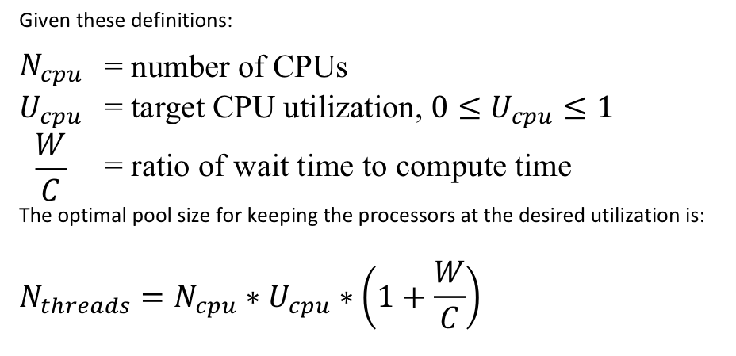

#### 写在前面的话

一个RPC服务在发布时不可避免的要设置其线程池大小，而我们往往却只根据经验来设置，需知不同场景不同业务下其需要配置不同的值方能使系统更稳定。以下内容是我认为应该去考虑的因素和具体的一些步骤，留待慢慢验证。

#### 一、评估单机最佳线程数

根据该RPC服务提供的具体业务场景，设置不同线程池数量，进行单机压测。观察在不同的压力梯度下，单机系统资源的运行情况，包括CPU使用率，内存使用率，GC频率，网络流量，IO繁忙度等。

需要注意的是抛开具体场景去压测是毫无意义的，不同的业务场景下CPU，IO的开销比例是不同的（即下面公式的W/C）。只有限定业务场景，进行压测，才能找到适合该CPU，IO比例的线程池设置。

图、一种线程池计算公式。

#### 二、评估单机最佳TPS

根据上面得出的线程池，测试在不同的TPS下，单机系统状态。找到如下区间的TPS：

1）CPU使用率：40% ～ 70%

2）内存使用率：40% ～ 60%

3）网络TCP重传数较低

4）磁盘使用率稳定

#### 三、评估集群规模

假设上一步单机下得出的最佳单机NodeTPS，接下来考虑集群的规模。一般遵循以下步骤：

1）通过历史监控数据，找到RPC服务每秒接收的峰值请求数，记为ClusterTPS。

2）初步估算集群规模为：ClusterNum = ClusterTPS / NodeTPS

3）考虑集群滚动更新比例，记为P，则 ClusterNum = ClusterNum / (1 - P) 

4）增加安全系数Secure(值大于1)，ClusterNum = ClusterNum * Secure

5）大促时流量成倍增加，要保证SLA的话，则集群数量也需要相应倍增。

#### 四、评估示例

假设有RPC服务经过压测，历史数据采集和整理，得出以下信息

1）单机线程池最优为500，最佳TPS为200

2）集群TPS为：3000

3）初步估算集群规模：3000/200 = 15

4）集群滚动更新比例为20%，则集群规模为：15 / (1 - 0.2) = 18.75

5）安全系数为1.2，则集群规模为：18.75 * 1.2 = 22.5

6）若大促是平时4倍流量，则大促时集群规模应为：22.5 * 4 = 90

#### 写在后面的话

此评估模型不一定精准，但是可提供一种思路去科学的设置线程池参数和选择集群规模。至于精准性，本着先有而后优，非一蹴而就。需要在实践中不断迭代总结，优化思路和方法。

