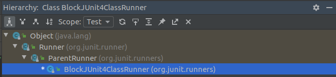
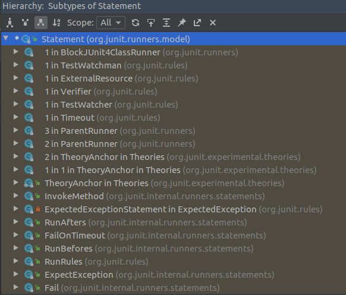

#### 1. 前置问题
1. 为什么每执行一次被@Test注解的方法都会重新构建实例？
#### 2. 执行流程
执行流程：
1. 执行BlockJUnit4ClassRunner#run方法，由于没有复写该方法，所以调用ParentRunner#run;
2. ParentRunner#run中通过装饰器模式构造执行语句，并执行以下步骤：
1. 执行类级别前置方法；
2. 执行测试方法；
```java
// 伪代码
foreach methods by @Test
    instance TestClass
    build decorator statement by @BeforeTest, @AfterTest
    run statement
```
3）执行类级别后置方法；
#### 3. 关键类注释

```java
public abstract class ParentRunner<T> extends Runner implements Filterable, Orderable {
    public void run(final RunNotifier notifier) {
        EachTestNotifier testNotifier = new EachTestNotifier(notifier, getDescription());
        testNotifier.fireTestSuiteStarted();
        try {
            Statement statement = classBlock(notifier);
            statement.evaluate();
        } catch (AssumptionViolatedException e) {
            testNotifier.addFailedAssumption(e);
        } catch (StoppedByUserException e) {
            throw e;
        } catch (Throwable e) {
            testNotifier.addFailure(e);
        } finally {
            testNotifier.fireTestSuiteFinished();
        }
    }

   protected Statement classBlock(final RunNotifier notifier) {
         // 执行所有被@Test标记的方法
        Statement statement = childrenInvoker(notifier); 
        if (!areAllChildrenIgnored()) {
            // 前置处理装饰器，执行@BeforeClass标记的方法
            statement = withBeforeClasses(statement);
            // 后置处理装饰器，执行@AfterClass标记的方法 
            statement = withAfterClasses(statement);  
            statement = withClassRules(statement);
            statement = withInterruptIsolation(statement);
        }
        return statement;
    }

   protected Statement childrenInvoker(final RunNotifier notifier) {
        return new Statement() {
            @Override
            public void evaluate() {
                runChildren(notifier);
            }
        };
    }

    private void runChildren(final RunNotifier notifier) {
        final RunnerScheduler currentScheduler = scheduler;
        try {
            for (final T each : getFilteredChildren()) {
                currentScheduler.schedule(new Runnable() {
                    public void run() {
                        // 调用BlockJUnit4ClassRunner#methodBlock方法，来执行被@Test标记的方法
                        ParentRunner.this.runChild(each, notifier); 
                    }
                });
            }
        } finally {
            currentScheduler.finished();
        }
    }
    ......
}
```
```java
public class BlockJUnit4ClassRunner extends ParentRunner<FrameworkMethod> {
    protected Statement methodBlock(final FrameworkMethod method) {
        Object test;
        // 每次执行一个被@Test标记的方法时都构建一个新的实例对象
        try {
            test = new ReflectiveCallable() {
                @Override
                protected Object runReflectiveCall() throws Throwable {
                    return createTest(method);
                }
            }.run(); 
        } catch (Throwable e) {
            return new Fail(e);
        }

        // 根据反射调用被@Test标记的方法
        Statement statement = methodInvoker(method, test); 
        statement = possiblyExpectingExceptions(method, test, statement);
        statement = withPotentialTimeout(method, test, statement);
        // 前置处理装饰器，执行@Before标记的语句
        statement = withBefores(method, test, statement); 
        // 后置处理装饰器，执行@After标记的语句
        statement = withAfters(method, test, statement);
        statement = withRules(method, test, statement);
        statement = withInterruptIsolation(statement);
        return statement;
    }

    protected Statement withBefores(FrameworkMethod method, Object target, Statement statement) {
        List<FrameworkMethod> befores = getTestClass().getAnnotatedMethods(Before.class);
        return befores.isEmpty() ? statement : new RunBefores(statement, befores, target);
    }

     ....
}
```
```java
public class RunBefores extends Statement {
    private final Statement next;

    private final Object target;

    private final List<FrameworkMethod> befores;

    public RunBefores(Statement next, List<FrameworkMethod> befores, Object target) {
        this.next = next;
        this.befores = befores;
        this.target = target;
    }

    @Override
    public void evaluate() throws Throwable {
        for (FrameworkMethod before : befores) {
            invokeMethod(before);
        }
        next.evaluate();
    }

    /**
     * @since 4.13
     */
    protected void invokeMethod(FrameworkMethod method) throws Throwable {
        method.invokeExplosively(target);
    }

```
#### 附：类图


maven