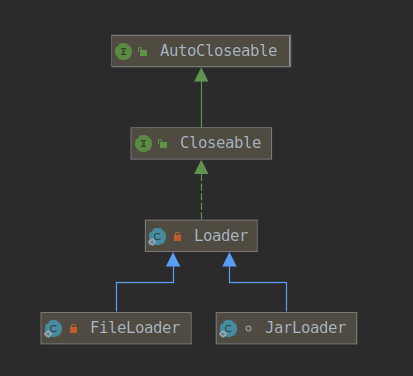
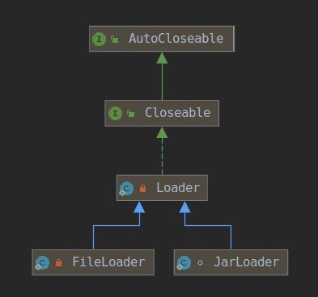

#### 一、前置问题
1. URLClassLoader和URLClassPath的关系？
1. URLClassPath的用处？
1. 如何处理不同类型的资源，如zip,jar和普通文件夹？
#### 二、URLClassLoader
URLClassLoader的作用是依赖URLClassPath来定位读取资源，可参考文章[类加载机制](../3.Java虚拟机/1.类加载机制.md)




关键代码：

```java
public class URLClassLoader extends SecureClassLoader implements Closeable {
    /* The search path for classes and resources */
    private final URLClassPath ucp;
   
    public URL findResource(final String name) {
        /*
         * The same restriction to finding classes applies to resources
         */
        URL url = AccessController.doPrivileged(
            new PrivilegedAction<URL>() {
                public URL run() {
                    return ucp.findResource(name, true);
                }
            }, acc);

        return url != null ? ucp.checkURL(url) : null;
    }

    protected Class<?> findClass(final String name) throws ClassNotFoundException {
        final Class<?> result;
        try {
            result = AccessController.doPrivileged(
                new PrivilegedExceptionAction<Class<?>>() {
                    public Class<?> run() throws ClassNotFoundException {
                        String path = name.replace('.', '/').concat(".class");
                        Resource res = ucp.getResource(path, false);
                        if (res != null) {
                            try {
                                return defineClass(name, res);
                            } catch (IOException e) {
                                throw new ClassNotFoundException(name, e);
                            }
                        } else {
                            return null;
                        }
                    }
                }, acc);
        } catch (java.security.PrivilegedActionException pae) {
            throw (ClassNotFoundException) pae.getException();
        }
        if (result == null) {
            throw new ClassNotFoundException(name);
        }
        return result;
    }
}
```
#### 三、URLClassPath
URLClassPath根据URL的协议类型创建不同的Loader来解析不同的资源类型。




```java
/**
 * This class is used to maintain a search path of URLs for loading classes
 * and resources from both JAR files and directories.
 *
 * @author  David Connelly
 */
public class URLClassPath {
   public URL findResource(String name, boolean check) {
        Loader loader;
        int[] cache = getLookupCache(name);
        for (int i = 0; (loader = getNextLoader(cache, i)) != null; i++) {
            URL url = loader.findResource(name, check);
            if (url != null) {
                return url;
            }
        }
        return null;
    }

    private synchronized Loader getNextLoader(int[] cache, int index) {
        if (closed) {
            return null;
        }
        if (cache != null) {
            if (index < cache.length) {
                Loader loader = loaders.get(cache[index]);
                if (DEBUG_LOOKUP_CACHE) {
                    System.out.println("HASCACHE: Loading from : " + cache[index]
                                       + " = " + loader.getBaseURL());
                }
                return loader;
            } else {
                return null; // finished iterating over cache[]
            }
        } else {
            return getLoader(index);
        }
    }

    private synchronized Loader getLoader(int index) {
        if (closed) {
            return null;
        }
         // Expand URL search path until the request can be satisfied
         // or the URL stack is empty.
        while (loaders.size() < index + 1) {
            // Pop the next URL from the URL stack
            URL url;
            synchronized (urls) {
                if (urls.empty()) {
                    return null;
                } else {
                    url = urls.pop();
                }
            }
            // Skip this URL if it already has a Loader. (Loader
            // may be null in the case where URL has not been opened
            // but is referenced by a JAR index.)
            String urlNoFragString = URLUtil.urlNoFragString(url);
            if (lmap.containsKey(urlNoFragString)) {
                continue;
            }
            // Otherwise, create a new Loader for the URL.
            Loader loader;
            try {
                loader = getLoader(url);
                // If the loader defines a local class path then add the
                // URLs to the list of URLs to be opened.
                URL[] urls = loader.getClassPath();
                if (urls != null) {
                    push(urls);
                }
            } catch (IOException e) {
                // Silently ignore for now...
                continue;
            } catch (SecurityException se) {
                // Always silently ignore. The context, if there is one, that
                // this URLClassPath was given during construction will never
                // have permission to access the URL.
                if (DEBUG) {
                    System.err.println("Failed to access " + url + ", " + se );
                }
                continue;
            }
            // Finally, add the Loader to the search path.
            validateLookupCache(loaders.size(), urlNoFragString);
            loaders.add(loader);
            lmap.put(urlNoFragString, loader);
        }
        if (DEBUG_LOOKUP_CACHE) {
            System.out.println("NOCACHE: Loading from : " + index );
        }
        return loaders.get(index);
    }

    /*
     * Returns the Loader for the specified base URL.
     */
    private Loader getLoader(final URL url) throws IOException {
        try {
            return java.security.AccessController.doPrivileged(
                new java.security.PrivilegedExceptionAction<Loader>() {
                public Loader run() throws IOException {
                    String file = url.getFile();
                    if (file != null && file.endsWith("/")) {
                        if ("file".equals(url.getProtocol())) {
                            return new FileLoader(url);
                        } else {
                            return new Loader(url);
                        }
                    } else {
                        return new JarLoader(url, jarHandler, lmap, acc);
                    }
                }
            }, acc);
        } catch (java.security.PrivilegedActionException pae) {
            throw (IOException)pae.getException();
        }
    }
}
```

