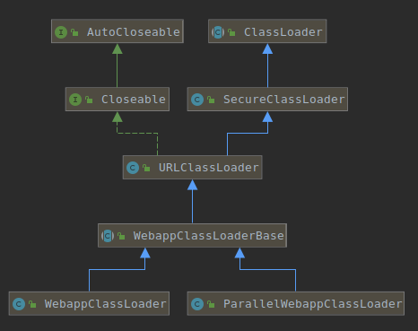
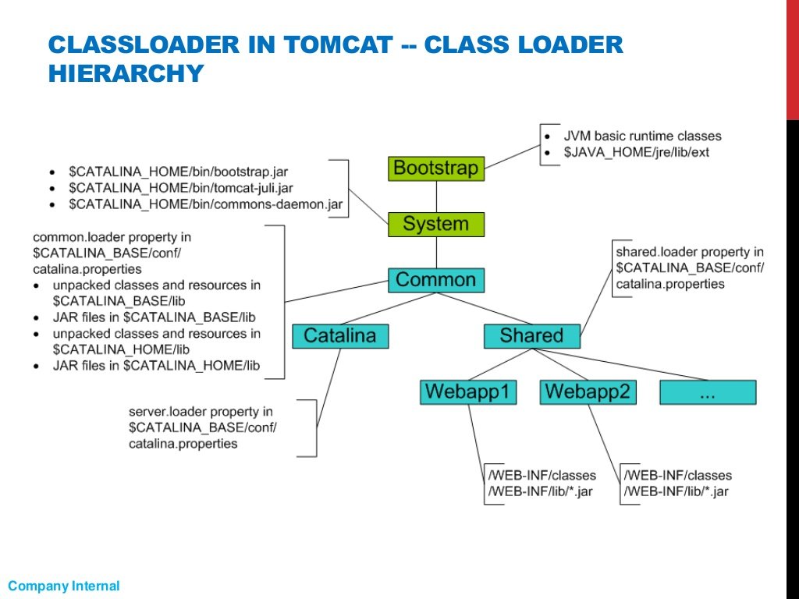
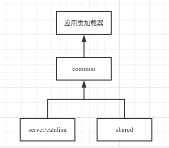

<!-- date: 2020.07.09 11:23 -->

> 1. springboot实现定义了一个符合双亲委派的类TomcatEmbeddedWebappClassLoader extends WebappClassLoader，因为springboot只针对一个应用运行的场景，所以无需打破双亲委派。
> 2. 使用IDEA调试Tomcat代码时，在Project Settings - Libraries里把tomcat/lib加进来就可以了。

#### 一、前置问题

1. tomcat的类加载破坏了双亲委派吗？

2. 为什么要破坏双亲委派？

3. tomcat的类加载器的继承关系？

4. tomcat的类加载层级和机制？
   
#### 二、Tomcat的类加载器类图
   


说明：
1）WebappClassLoaderBase及其子类是Tomcat自己实现的类加载器；
2）其默认打破了双亲委派机制，用来实现Tomcat多应用间的隔离；

#### 三、Tomcat类加载层级



说明：
1）Bootstrap类加载器：JDK的启动类加载器和扩展类加载器
2）System类加载器：JDK的应用类加载器
3）Common,Catalina,Shared类加载器：是三个URLClassLoader实例，分别指定了不同的path；
4）Webapp类加载器：Tomcat定义的类加载器WebappClassLoaderBase及其自类；

#### 四、Tomcat类加载器创建

##### 1. 执行tomcat启动脚本catalina.sh，运行主类**org.apache.catalina.startup.Bootstrap#main**；

##### 2. Bootstrap#main会执行以下操作

###### 2.1 实例化Bootstrap并调用其init方法（此处暂不考虑以service运行）；

```java
  /**
     * Main method and entry point when starting Tomcat via the provided
     * scripts.
     *
     * @param args Command line arguments to be processed
     */
    public static void main(String args[]) {
      if (daemon == null) {
            // Don't set daemon until init() has completed
            Bootstrap bootstrap = new Bootstrap();
            try {
                bootstrap.init();
            } catch (Throwable t) {
                handleThrowable(t);
                t.printStackTrace();
                return;
            }
            daemon = bootstrap;
        } else {
            // When running as a service the call to stop will be on a new
            // thread so make sure the correct class loader is used to prevent
            // a range of class not found exceptions.
            Thread.currentThread().setContextClassLoader(daemon.catalinaLoader);
        }
        ...
    }
```

Bootstrap#init方法会执行以下操作：

```java
    public void init() throws Exception {
        initClassLoaders();
        Thread.currentThread().setContextClassLoader(catalinaLoader);

        SecurityClassLoad.securityClassLoad(catalinaLoader);
        // Load our startup class and call its process() method
        if (log.isDebugEnabled())
            log.debug("Loading startup class");
        Class<?> startupClass = catalinaLoader.loadClass("org.apache.catalina.startup.Catalina");
        Object startupInstance = startupClass.newInstance();

        // Set the shared extensions class loader
        if (log.isDebugEnabled())
            log.debug("Setting startup class properties");
        String methodName = "setParentClassLoader";
        Class<?> paramTypes[] = new Class[1];
        paramTypes[0] = Class.forName("java.lang.ClassLoader");
        Object paramValues[] = new Object[1];
        paramValues[0] = sharedLoader;
        Method method = startupInstance.getClass().getMethod(methodName, paramTypes);
        method.invoke(startupInstance, paramValues);

        catalinaDaemon = startupInstance;
    }
```

###### 2.1.1 初始化类加载器：common,server,shared。

1）类型为URLClassLoader，未打破双亲委派；
2）其path从catalina.properties中读取common.loader，server.loader，shared.loader的键值；
3）指定parent关系


```java
private void initClassLoaders() {
        try {
            commonLoader = createClassLoader("common", null);
            if( commonLoader == null ) {
                // no config file, default to this loader - we might be in a 'single' env.
                commonLoader=this.getClass().getClassLoader();
            }
            catalinaLoader = createClassLoader("server", commonLoader);
            sharedLoader = createClassLoader("shared", commonLoader);
        } catch (Throwable t) {
            handleThrowable(t);
            log.error("Class loader creation threw exception", t);
            System.exit(1);
        }
```

Note: tomcat-8.5.56里把common, server, shared合成了一个。

```java
private ClassLoader createClassLoader(String name, ClassLoader parent) throws Exception {
        // 因为catalina.properties的server.loader和shared.loader的值都为空，所以catalinaLoader,sharedLoader都指向commonLoader。
        String value = CatalinaProperties.getProperty(name + ".loader");
        if (value != null && !value.equals("")) {
        } else{
            return parent;
        }
}
```

###### 2.1.2 设置server类加载器为当前线程的ContextClassLoader

###### 2.1.3 实例化org.apache.catalina.startup.Catalina，并把shared类加载器设为其父类加载器

##### 2.2 Bootstrap#main接收到startd命令时会调用bootstrap#load，bootstrap#start

```java
  if (command.equals("startd")) {
      args[args.length - 1] = "start";
      daemon.load(args);
      daemon.start();
  }
```

###### 2.2.1 load方法

1）通过Digester读取server.xml来初始化Catalina#server；

```java
digester.addRuleSet(new HostRuleSet("Server/Service/Engine/"));
digester.addRuleSet(new ContextRuleSet("Server/Service/Engine/Host/"));
// 设置HOST的parentClassLoader为catalina的parentClassLoader，即shared类加载器
digester.addRule("Server/Service/Engine",new SetParentClassLoaderRule(parentClassLoader));
```

2）HostRuleSet里设置

```java
// prefix = "Server/Service/Engine/"
digester.addObjectCreate(prefix + "Host",
                                 "org.apache.catalina.core.StandardHost",
                                 "className");
digester.addSetNext(prefix + "Host",
                            "addChild",
                            "org.apache.catalina.Container");
```

3）ContextRuleSet里设置设置Host的Context为StarndardContext，然后设置StandardContext的loader为WebappLoader

```java
// prefix ="Server/Service/Engine/Host/"
digester.addObjectCreate(prefix + "Context",
                    "org.apache.catalina.core.StandardContext", "className");
digester.addObjectCreate(prefix + "Context/Loader",
                            "org.apache.catalina.loader.WebappLoader",
                            "className");
```

4）StandardContext把WebappLoader的context设为自身

```java
loader.setContext(this);
```

5）WebappLoader里把StandardContext的parentClassLoader设为应用类加载器的parent。而StandardContext的parentClassLoader为空，继续找其parent（StandardHOST）的paretClassLoader，即shared类加载器。

```java
private String loaderClass = ParallelWebappClassLoader.class.getName();
private WebappClassLoaderBase createClassLoader()
        throws Exception {

        Class<?> clazz = Class.forName(loaderClass);
        WebappClassLoaderBase classLoader = null;

        if (parentClassLoader == null) {
            parentClassLoader = context.getParentClassLoader();
        }
        Class<?>[] argTypes = { ClassLoader.class };
        Object[] args = { parentClassLoader };
        Constructor<?> constr = clazz.getConstructor(argTypes);
        classLoader = (WebappClassLoaderBase) constr.newInstance(args);

        return classLoader;
    }
```

#### 五、应用类加载器加载机制

1. 不开启委托（默认情况，delegate=false），**破坏了双亲委派**
   1）检查类是否被加载；有则返回，没有则继续执行；
   2）使用JavaSE类加载器加载类；若成功则返回，否则继续执行；
   3）应用类加载器尝试加载类；若成功则返回，否则继续执行；
   4）应用类加载器委托给父加载器（shared类加载器）加载；若成功则返回，否则抛出ClassNotFoundException;

2. 开启委托（delegate=true）， **符合双亲委派**
   1）检查类是否被加载；有则返回，没有则继续执行；
   2）使用JavaSE类加载器加载类；若成功则返回，否则继续执行；
   3）应用类加载器委托给父加载器（shared类加载器）加载；若成功则返回，否则继续执行；
   4）应用类加载器尝试加载类；若成功则返回，否则抛出ClassNotFoundException;

Note: JavaSE类加载器默认为启动类加载器。（应用类加载器的构造器里指定了其指向String.class.getClassLoader();）

```java
public Class<?> loadClass(String name, boolean resolve) throws ClassNotFoundException {
            Class<?> clazz = null;

            // 检查类是否被加载过
            clazz = findLoadedClass0(name);
            if (clazz != null) {
                if (resolve)
                    resolveClass(clazz);
                return (clazz);
            }
            clazz = findLoadedClass(name);
            if (clazz != null) {
                if (resolve)
                    resolveClass(clazz);
                return (clazz);
            }

            // 优先使用JavaSE类加载器加载类
            String resourceName = binaryNameToPath(name, false);
            ClassLoader javaseLoader = getJavaseClassLoader();
            boolean tryLoadingFromJavaseLoader;
            try {
                tryLoadingFromJavaseLoader = (javaseLoader.getResource(resourceName) != null);
            } catch (Throwable t) {
                tryLoadingFromJavaseLoader = true;
            }
            if (tryLoadingFromJavaseLoader) {
                try {
                    clazz = javaseLoader.loadClass(name);
                    if (clazz != null) {
                        if (resolve)
                            resolveClass(clazz);
                        return (clazz);
                    }
                } catch (ClassNotFoundException e) {
                    // Ignore
                }
            }


            boolean delegateLoad = delegate || filter(name, true);

            // 委托开启的话，使用委托给parent类加载器（在自身尝试加载前）
            if (delegateLoad) {
                try {
                    clazz = Class.forName(name, false, parent);
                    if (clazz != null) {
                        if (resolve)
                            resolveClass(clazz);
                        return (clazz);
                    }
                } catch (ClassNotFoundException e) {
                    // Ignore
                }
            }

            // 自身去加载类
            try {
                clazz = findClass(name);
                if (clazz != null) {
                    if (resolve)
                        resolveClass(clazz);
                    return (clazz);
                }
            } catch (ClassNotFoundException e) {
                // Ignore
            }

            // 如果委托没有开启的话，委托给parent去加载（在自身尝试加载后）
            if (!delegateLoad) {
                try {
                    clazz = Class.forName(name, false, parent);
                    if (clazz != null) {
                        if (resolve)
                            resolveClass(clazz);
                        return (clazz);
                    }
                } catch (ClassNotFoundException e) {
                    // Ignore
                }
            }

        throw new ClassNotFoundException(name);
    }
```

#### 参考

1. [https://tomcat.apache.org/tomcat-8.5-doc/class-loader-howto.html](https://tomcat.apache.org/tomcat-8.5-doc/class-loader-howto.html)
2. [https://pt.slideshare.net/wptree/class-loader-incloud/5](https://pt.slideshare.net/wptree/class-loader-incloud/5)