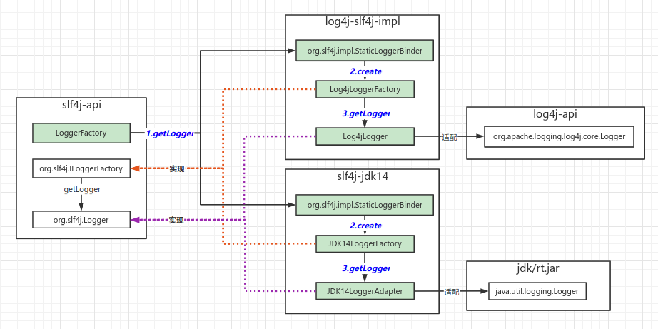

## 一、源码

### 1、入口

```java
import org.slf4j.Logger;
import org.slf4j.LoggerFactory;

Logger logger = LoggerFactory.getLogger(Demo.class);
```

### 2、LoggerFactory#getLogger

```java
public static Logger getLogger(String name) {
    ILoggerFactory iLoggerFactory = getILoggerFactory();
    return iLoggerFactory.getLogger(name);
}

public static ILoggerFactory getILoggerFactory() {
    // 绑定Slf4j的具体实现
    bind();
    // 返回slf4j实现的ILoggerFactory代理
    return StaticLoggerBinder.getSingleton().getLoggerFactory();
}

private final static void bind() {
    // 找到slf4j的所有实现，并按顺序返回
    Set<URL> staticLoggerBinderPathSet = findPossibleStaticLoggerBinderPathSet();

    // print所有实现
    reportMultipleBindingAmbiguity(staticLoggerBinderPathSet);

    // 通过类加载进行绑定，一般为返回顺序的第一个
    StaticLoggerBinder.getSingleton();

    // print最终绑定的实现
    reportActualBinding(staticLoggerBinderPathSet);
}
```

NOTE：

此处需要说明下，slf4j编译问题。即StaticLoggerBinder在实现包里，而slf4j仍然在自己包里正常引用。

1）slf4j-api源码包里存在一个默认实现

```java
public class StaticLoggerBinder {
    private static final StaticLoggerBinder SINGLETON = new StaticLoggerBinder();

    public static final StaticLoggerBinder getSingleton() {
        return SINGLETON;
    }

    public static String REQUESTED_API_VERSION = "1.6.99"; // !final

    private StaticLoggerBinder() {
        throw new UnsupportedOperationException("This code should have never made it into slf4j-api.jar");
    }

    public ILoggerFactory getLoggerFactory() {
        throw new UnsupportedOperationException("This code should never make it into slf4j-api.jar");
    }

    public String getLoggerFactoryClassStr() {
        throw new UnsupportedOperationException("This code should never make it into slf4j-api.jar");
    }
}
```

2）maven编译后从jar中移除了此实现，“target/classes/org/slf4j/impl”

```xml
<plugin>
    <groupId>org.apache.maven.plugins</groupId>
    <artifactId>maven-antrun-plugin</artifactId>
    <executions>
        <execution>
            <phase>process-classes</phase>
            <goals>
                <goal>run</goal>
            </goals>
        </execution>
    </executions>
    <configuration>
        <tasks>
            <echo>Removing slf4j-api's dummy StaticLoggerBinder and StaticMarkerBinder</echo>
            <delete dir="target/classes/org/slf4j/impl"/>
        </tasks>
    </configuration>
</plugin>
```

### 3、LoggerFactory#findPossibleStaticLoggerBinderPathSet

```java
static String STATIC_LOGGER_BINDER_PATH = "org/slf4j/impl/StaticLoggerBinder.class";


// slf4j的实现包中需要具有绑定类：org.slf4j.impl.StaticLoggerBinder。
// slf4j会扫描classpath下该类。
static Set<URL> findPossibleStaticLoggerBinderPathSet() {
    Set<URL> staticLoggerBinderPathSet = new LinkedHashSet<URL>();
    try {
        ClassLoader loggerFactoryClassLoader = LoggerFactory.class.getClassLoader();
        Enumeration<URL> paths;
        if (loggerFactoryClassLoader == null) {
            paths = ClassLoader.getSystemResources(STATIC_LOGGER_BINDER_PATH);
        } else {
            paths = loggerFactoryClassLoader.getResources(STATIC_LOGGER_BINDER_PATH);
        }
        while (paths.hasMoreElements()) {
            URL path = paths.nextElement();
            staticLoggerBinderPathSet.add(path);
        }
    } catch (IOException ioe) {
        Util.report("Error getting resources from path", ioe);
    }
    return staticLoggerBinderPathSet;
}
```

## 二、图谱

