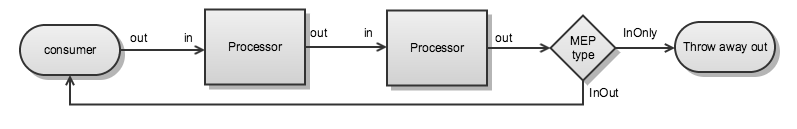
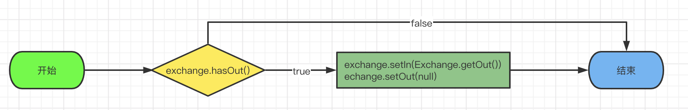
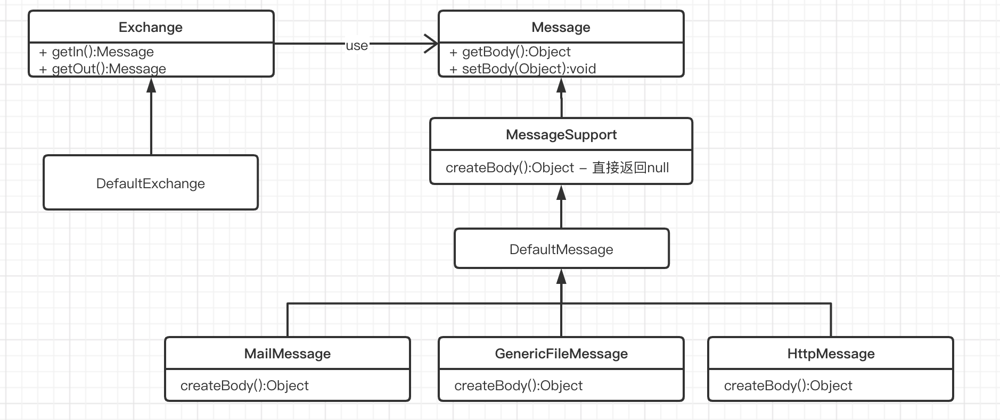

> 本文基于Camel版本2.20.1。

#### 一、Exchange在Route中传递

地址：https://camel.apache.org/manual/latest/faq/using-getin-or-getout-methods-on-exchange.html



- The out message from each step is used as the in message for the next step
- if there is no out message then the in message is used instead
- For the InOut MEP the out from the last step in the route is returned to the producer. In case of InOnly the last out is thrown away

NOTE：关于Exchange类型InOnly和InOut的区别只在末端处理。

#### 二、Exchange的In和Out交换逻辑

##### 1. Pipeline#process

org.apache.camel.processor.Pipeline#process(org.apache.camel.Exchange, org.apache.camel.AsyncCallback)

```java
public boolean process(Exchange exchange, AsyncCallback callback) {
        Iterator<Processor> processors = getProcessors().iterator();
        Exchange nextExchange = exchange;
        boolean first = true;

        while (continueRouting(processors, nextExchange)) {
            if (first) {
                first = false;
            } else {
                // prepare for next run
                nextExchange = createNextExchange(nextExchange);
            }

            // get the next processor
            Processor processor = processors.next();

            AsyncProcessor async = AsyncProcessorConverterHelper.convert(processor);
            boolean sync = process(exchange, nextExchange, callback, processors, async);

            // continue as long its being processed synchronously
            if (!sync) {
                LOG.trace("Processing exchangeId: {} is continued being processed asynchronously", exchange.getExchangeId());
                // the remainder of the pipeline will be completed async
                // so we break out now, then the callback will be invoked which then continue routing from where we left here
                return false;
            }

            LOG.trace("Processing exchangeId: {} is continued being processed synchronously", exchange.getExchangeId());

            // check for error if so we should break out
            if (!continueProcessing(nextExchange, "so breaking out of pipeline", LOG)) {
                break;
            }
        }

        // logging nextExchange as it contains the exchange that might have altered the payload and since
        // we are logging the completion if will be confusing if we log the original instead
        // we could also consider logging the original and the nextExchange then we have *before* and *after* snapshots
        LOG.trace("Processing complete for exchangeId: {} >>> {}", exchange.getExchangeId(), nextExchange);

        // copy results back to the original exchange
        ExchangeHelper.copyResults(exchange, nextExchange);

        callback.done(true);
        return true;
}

protected Exchange createNextExchange(Exchange previousExchange) {
        return PipelineHelper.createNextExchange(previousExchange);
 }
```

Pipeline中的Processors是Route中的Processor链，其中*createNextExchange*方法用来处理Exchange在Processor调用前的准备操作。

##### 2. PipelineHelper#createNextExchange

org.apache.camel.processor.PipelineHelper#createNextExchange

```java
public static Exchange createNextExchange(Exchange previousExchange) {
        Exchange answer = previousExchange;

        // now lets set the input of the next exchange to the output of the
        // previous message if it is not null
        if (answer.hasOut()) {
            answer.setIn(answer.getOut());
            answer.setOut(null);
        }
        return answer;
    }
```

从上面源码可知，在进行下一个Processor调用前会重置In。



#### 三、Exchange的类图



#### 四、message.setBody(null)后取值问题

当通过*exchange.getIn().setBody(null)*或者*exchange.getOut().setBody(null)*后。

* 当Message类型为DefaultMessage时，通过message.getBody可以正常取出null值。

* 当Message类型为MailMessage,GenericFileMessage,HttpMessage时，由于他们重写了createBody方法，调用message.getBody时会重新初始化body为非null。

```java
// GenericFileMessage#createBody
@Override
protected Object createBody() {
        return file != null ? file.getBody() : super.createBody();
}
```

举例来说，Consumer为FTP时，其会初始化Message为GenericFileMessage类型，一但其中某个processor把Message的Body设置为null，那么在此获取body时会重置为文件内容。

#### # 其他、关于exchange.getOut()

```java
// DefaultExchange#getOut
public Message getOut() {
        // lazy create
        if (out == null) {
            out = (in != null && in instanceof MessageSupport)
                ? ((MessageSupport)in).newInstance() : new DefaultMessage(getContext());
            configureMessage(out);
        }
        return out;
}
```

当Out不存在时，会使用In的内容创建Out。