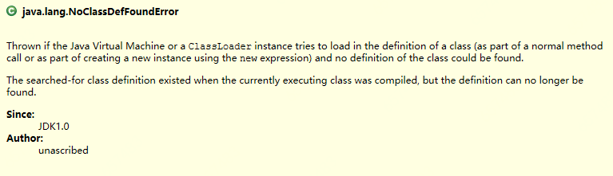
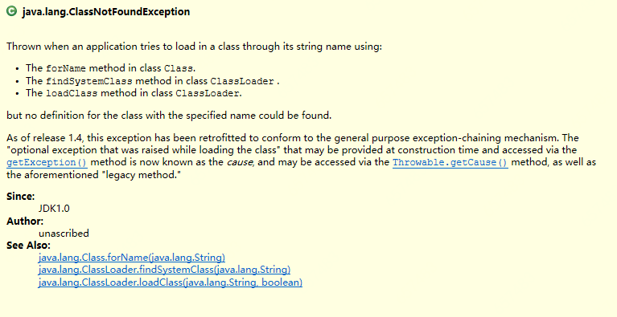

>  Jar包冲突的说法其实比较笼统，具体而言是类冲突。两个JAR包内包含了某个完全限定名相同的类。

## 一、Jar包冲突的场景

### 1、GA相同，V不同

#### 1）ClassPath存在一个错误版本Jar

I、可能原因

Maven依赖调停 - 错误版本的JAR短路了正确版本JAR

II、产生影响

类，类方法，类属性找不到等

#### 2）ClassPath存在两个不同版本Jar

I、可能原因

* 未使用Maven进行依赖管理
* ClassPath包含SingleJar，SingleJar内嵌入了错误JAR

II、产生影响

可能由于Jar包的加载顺序，导致加载了`错误的依赖类`。类方法，类属性找不到等

### 2、A相同，GV不同

#### 1）JAR包G发生变化，但缺少relocation

I、产生影响

可能由于Jar包的加载顺序，导致加载了`错误的依赖类`。类方法，类属性找不到等

II、案例：[commons-io依赖冲突](../../1.TroubleShooting/4.流程分析/11.commons-io依赖冲突.md)

### 3、GAV都不同

#### 1）Slf4j此类SPI框架，依赖了多种实现

> 使用slf4j的框架依赖某种顺序，去加载指定类（如org.slf4j.impl.StaticLoggerBinder）所在的某个实现包。参考：[slf4j加载实现源码分析](../../9.源码/7.slf4j加载实现.md)

I、产生影响

可能会导致加载错误实现，导致外部配置的日志配置不生效，导致：

* 没有日志输出
* 没有日志级别控制，可能导致打印大量Debug级别日志，导致CPU飚高。

II、案例：[CPU飚高案例](../../1.TroubleShooting/4.流程分析/10.CPU飚高排查.md)

附，日志冲突时关键日志

```
SF4J: Class path contains multiple SLF4J bindings.                                                                                                                                                        
SLF4J: Found binding in [jar:file:/home/kivi/Downloads/edi-rest_253244_T_7c14b96_2019.09.18-11.36.43/lib/slf4j-simple-1.7.22.jar!/org/slf4j/impl/StaticLoggerBinder.class]
SLF4J: Found binding in [jar:file:/home/kivi/Downloads/edi-rest_253244_T_7c14b96_2019.09.18-11.36.43/lib/log4j-slf4j-impl-2.9.1.jar!/org/slf4j/impl/StaticLoggerBinder.class]
SLF4J: See http://www.slf4j.org/codes.html#multiple_bindings for an explanation.
SLF4J: Actual binding is of type [org.slf4j.impl.SimpleLoggerFactory]
```
#### 2）GAV都不同的JAR包，存在同名类

I、产生影响

可能由于Jar包的加载顺序，导致加载了`错误的依赖类`。类方法，类属性找不到等

II、案例：[发现冲突，解决冲突](../../1.TroubleShooting/1.观察日志/6.发现冲突，解决冲突.md)

## 二、ClassNotFoundException vs NoClassDefFoundError

### 1、两者对比

| 类别 | ClassNotFoundException                         | NoClassDefFoundError                                         |
| ---- | ---------------------------------------------- | ------------------------------------------------------------ |
| 含义 | 找不到类定义                                   | 找不到类定义                                                 |
| 继承 | extends ReflectiveOperationException           | extends LinkageError                                         |
| 类型 | 反射操作引起的一种**异常**                     | 一种链接**错误**                                             |
| 捕获 | catch Exception/Throwable                      | catch Error/Throwable                                        |
| 原因 | 通过反射根据指定类名无法找到类时，会引起该异常 | 编译时有类定义，运行时丢失类定义会引起该异常。运行时类定义丢失往往有两种情况：1）类不在ClassPath内，导致无法加载类定义，即由ClassNotFoundException引起。2）类初始化失败，导致加载不到类定义，此时会伴随着一个初始化异常（ExceptionInInitializerError）。 |

### 2、两者关系

NoClassDefFoundError可由ClassNotFoundException引起。

### 3、两者定义



> 当JVM或类加载器去加载一个类定义（无论是通过普通的方法调用，还是用new语句去创建该类的实例所触发的类加载），如果该类的定义丢失，那么就会抛出NoClassDefFoundError.
>
> **被加载的类定义**在**当前执行类**编译时是存在的，但是再也找不到了。




>当应用使用类的字符串名，通过以下方式尝试去加载类，但是根据指定的名称无法找到类定义时会抛出ClassNotFoundException：
>
>1）Class.forName()
>
>2）ClassLoader.findSystemClass()
>
>3）ClassLoader.loadClass()

### 4、实例

#### 1）ClassNotFoundExcption

```java
package qiweiTest;

public class ClassNotFoundExcptionTest {
	public static void main(String[] args) {
		Class.forName("anyNoexistClassName"); // 任何一个不存在的className
	}
}
```

#### 2）NoClassDefError

##### I、类不在ClassPath引发的异常

```java
package qiweiTest;

public class NoClassDefErrorTest {
     // 运行时，删除ClassPath中的ClassNotFoundExceptionTest.class
	public static void main(String[] args) {
		ClassNotFoundExceptionTest.class.getClass();
	}
}
```

输出：

```java
Exception in thread "main" java.lang.NoClassDefFoundError: qiweiTest/ClassNotFoundExceptionTest
	at qiweiTest.NoClassDefErrorTest.main(NoClassDefErrorTest.java:9)
Caused by: java.lang.ClassNotFoundException: qiweiTest.ClassNotFoundExceptionTest
	at java.net.URLClassLoader.findClass(Unknown Source)
	at java.lang.ClassLoader.loadClass(Unknown Source)
	at sun.misc.Launcher$AppClassLoader.loadClass(Unknown Source)
	at java.lang.ClassLoader.loadClass(Unknown Source)
	... 1 more
```

##### II、类初始化失败引发的异常

```java
package qiweiTest;

public class NoClassDefErrorTest2 {
       	public static void main(String[] args) {
		int tmp;
		try {
			tmp = InterClass.a;
		} catch (Throwable e) {
            // 异常类型：ExceptionInInitializerError
			e.printStackTrace();
		}
		try {
			tmp = InterClass.a;
		} catch (Throwable e) {
            // 异常类型：NoClassDefFoundError
			e.printStackTrace();
		}
	}

	static class InterClass {
		static int a;
		static {
			a = 1 / 0;
		}
	}
```

输出：

```java
java.lang.ExceptionInInitializerError
	at qiweiTest.NoClassDefErrorTest2.main(NoClassDefErrorTest2.java:8)
Caused by: java.lang.ArithmeticException: / by zero
	at qiweiTest.NoClassDefErrorTest2$InterClass.<clinit>(NoClassDefErrorTest2.java:22)
	... 1 more
java.lang.NoClassDefFoundError: Could not initialize class qiweiTest.NoClassDefErrorTest2$InterClass
	at qiweiTest.NoClassDefErrorTest2.main(NoClassDefErrorTest2.java:13)
```
