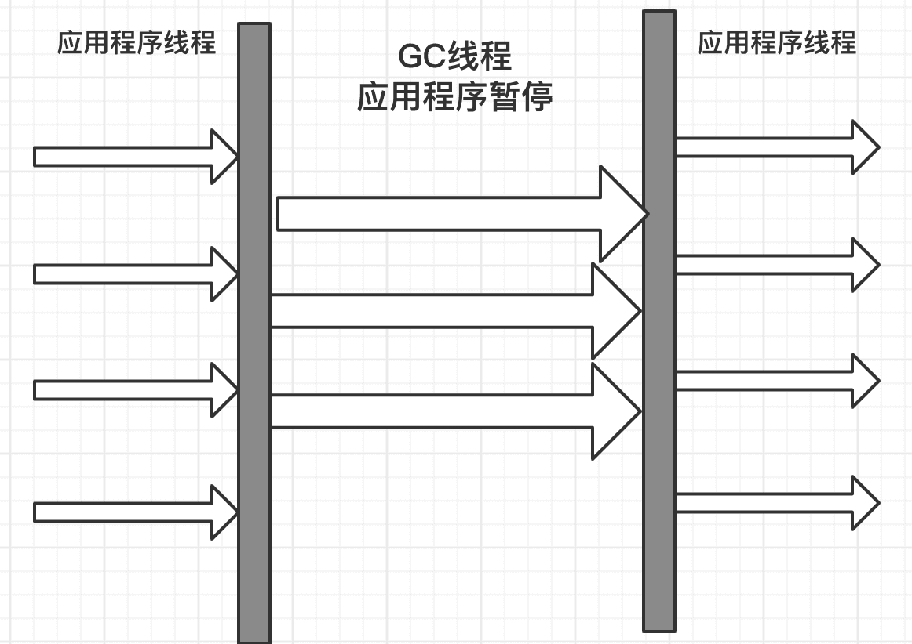
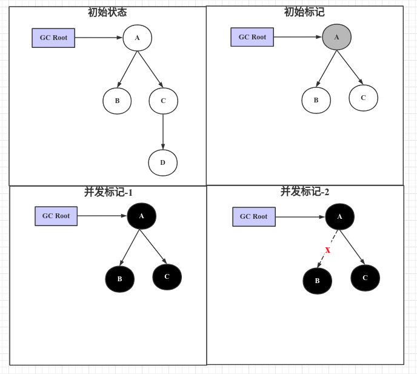
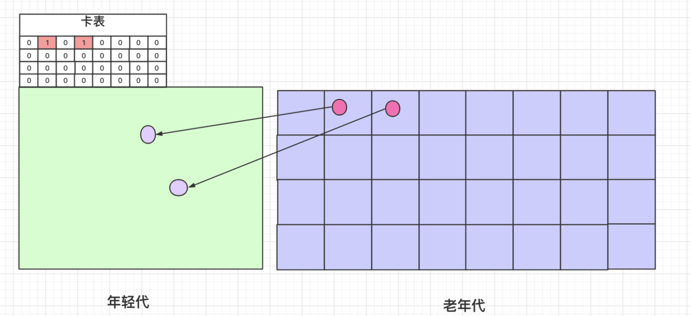

## 一、垃圾收集器简介

### 1、垃圾收集器搭配图谱


### 2、垃圾收集器的发展史

1）单核时代 - 串行垃圾收集器

2）多核时代 - 小内存

* *CMS*是老年代的多线程收集器，遵循了分代框架；

* ParNew是Serial的多线程版本，从Exact VM移植到HotSpot与CMS搭配使用

* Parallel，Parallel Old是新框架下的并行垃圾收集器，考虑到维护成本，没有遵循之前的分代框架，所以与CMS无法搭配使用。

3）多核时代 - 大内存

* G1取消了逻辑分代，支持更大内存；

### 3、垃圾收集器的性能指标
1）吞吐量

2）响应时间

### 4、垃圾收集器的主流算法
1）复制：主要用于年轻代，其中的跨带引用通过卡表来解决

2）标记整理：用于老年代

3）标记清除：用于老年代

### 5、JDK的默认垃圾收集器

1. JDK8：Parallel
1. JDK9：G1

### 6、常用垃圾收集器组合

1. ParNew + CMS + Serial Old：偏向响应
2. Parallel：偏向吞吐

## 二、Serial垃圾收集器


### 1、开启参数
1）年轻代：-XX:+UseSerialGC，采用复制算法

2）老年代：-XX:+UseSerialOldGC，采用标记整理算法

### 2、串行垃圾收集器特点
1）单线程执行，无法利用多核资源；

2）单线程执行时STW工作线程；

## 三、Parallel垃圾收集器


Parallel是Serial垃圾收集器的多线程版本，也被称为Throughput GC，是吞吐量优先的垃圾收集器。没有实现老的分代框架，无法与CMS搭配使用。

### 1、开启参数
1）年轻代：-XX:+UseParallelGC，采用复制算法

2）老年代：-XX:+UseParallelOldGC，采用标记整理算法

### 2、高级参数
1）设置并行线程数：-XX:ParallelGCThreads，默认当前CPU核数。
### 3、parallel圾收集器特点
1）多线程执行GC，吞吐量高；

2）多线程执行时依然STW工作线程；

## 四、ParNew垃圾收集器


只负责新生代垃圾收集，功能与Parallel Scavenge(Parallel年轻代)的收集器类似，但是可以与CMS搭配使用。

### 1、开启参数
1）年轻代：-XX:+UseParNewGC，采用复制算法

## 五、CMS垃圾收集器

CMS只回收老年代，注重响应时间。但是在Oracle内部不受重视，优化项不如Parallel，至此到终都没有称为默认垃圾收集器。

### 1、开启参数
1）老年代：-XX:+UseConcMarkSweepGC，采用标记清除算法
### 2、高级参数
1）开启整理：

```java
-XX:+UseCMSCompactAtFullCollection
-XX:CMSFullGCsBeforeCompaction # 多少次FullGC后压缩
```

2）并发线程数：

```java
-XX:ConcGCThreads
```

3）触发FullGC的老年代使用比例：

```java
-XX:CMSInitiatingOccupancyFraction #指定老年代触发FullGC的比例，默认92%；
-XX:+UseCMSInitiatingOccupancyOnly #开启时使用使用上面的设置，否则只有第一次使用；
```

4）初始标记是否使用多线程：

```java
-XX:+CMSParallelInitiatingMarkEnable
```

5）执行FullGC前是否执行MinorGC

```java
-XX:+CMSScavengeBeforeRemark
```

### 3、CMS执行过程
1. 初始标记：STW，扫描GC Root的直接关联对象；
1. 并发标记：遍历所有对象，使用三色标记法+增量更新来实现
1. 重新标记：STW，修正并发标记期间变化的对象引用关系

1. 并发清除：清理没有被标记到的对象；若此时有新加入老年代的对象一律设置为黑色，不作清理。
1. 并发重置：重置标记状态；
### 4、特点
1）注重响应时间，清理时用户线程和垃圾收集线程可以同时运行；

2）复杂度高，标记过程比较复杂；

3）如果不开启整理选项，容易出现内存碎片；

4）无法处理浮动垃圾；

5）会出现concurrent mode failure，然后STW，使用serial进行收集；

## 六、G1
取消物理分代，取而代之的是分块的region，其保留逻辑分代。可回收年轻代和老年代；
### 1、参数
1）设置Region大小：

```java
-XX:G1HeapRegionSize
```

2）设置年轻代大小：

```java
-XX:G1NewSizePercent # 默认5%
-XX:MaxG1NewSizePercent # 默认60%
```

3）设置GC时最大停顿时间：

```java
-XX:MaxGGPauseMillis
```

### 2、过程
1）初始标记：STW

2）并发标记：同CMS

3）最终标记：STW

4）筛选回收：STW

### 3、gc类型
1）young GC：优先新增Young Region（Eden + Survior），如果达到阈值则回收；

2）MixGC：回收Young Region，Old Region，大对象区域

3）FullGC：单线程回收所有区域，类似Serial垃圾收集器。

## 七、三色标记

### 1、并法标记期间出现的问题

1）漏标：需要处理，不然误回收


2）多标：浮动垃圾，下次回收；



### 2、漏标的解决方案

#### 1）漏标发生时操作

并法标记过程中产生漏标时，会执行以下两个逻辑：

I、建立新关联 - **通过增量更新记录新关联对象，供重新标记时重新扫描**

 未扫描到的对象被已扫描过的黑对象引用，而黑对象不会再扫描标记其关联对象；

II、删除旧关联 - **通过原始快照记录被删除对象，供重新标记时标为黑色**

把此对象从其旧关联删除，导致此对象只被黑对象关联，无法再被标记，而产生漏标；

#### 2）增量更新

在并发标记期间，新赋值的对象作为增量记录下来，再重新标记时扫描。

I、实现：

通过写屏障（写后屏障），把`建立新关联的左值对象`维护到一个表，在重新标记节点重新扫描表中的对象；黑色对象一旦新插入了指向白色对象的引用之后， 它就变回灰色对象了。

II、特点：

* 所有在并发标记过程中变化的引用导致由黑变灰的对象都需要重新遍历标记；

* 性能开销大，小内存时适用；

#### 3）原始快照

在并发标记期间，引用关系发生变化的对象一律标记为黑对象，本次不回收。

I、实现：

通过写屏障（写前屏障），把`删除旧关联时的右值对象`维护到一张表，重新标记时标为黑色。本次不回收。此时，表中对象有可能是被引用的对象，也有可能是垃圾对象（浮动垃圾）。

II、特点：

* 所有在并发标记过程中变化的节点都做标记，本次垃圾回收不处理。

* 性能开销小，大内存时适用；

### 3、CMS和G1的实现

1）CMS：写屏障 + 增量更新

2）G1：写屏障 + 原始快照

## 八、记忆集和卡表



年轻代收集时，在扫描GCRoot时，可能会出现跨带引用，即老年代引用年轻代。为了避免扫描整个老年代，通过卡表来标记老年代的某个区域是否有对年轻代的引用。

### 1、基于前提

跨带引用的量较小，所以通过老年代分块来粗化区域，提高效率。

### 2、实现

1）把老年代分块，512字节为大小；

2）年轻代维护卡表，与老年代的块一一对应；

3）通过写屏障维护卡表（字节数组，一个字节对应一个老年代的块），如果发现老年代引用了年轻代则把对应的bit置为1；

4）年轻代收集时通过遍历年轻代的GCRoot和老年代的脏块中的对象，其中不可达的对象则视为垃圾，不作复制。

### 3、为什么不需要年轻代对应的卡表

卡表只在内存分代且部分收集时需要。FullGC时会整体回收，包含方法区、老年代和年轻代，而不是单独回收老年代。也正因为此老年代和年轻代的垃圾回收器需要进行协同，而CMS无法和Parrallel协同，所以搞出来一个ParNew来和CMS协同。

## # 参考

1. [https://hllvm-group.iteye.com/group/topic/37095#post-242695](https://hllvm-group.iteye.com/group/topic/37095#post-242695)
2. [https://blogs.oracle.com/jonthecollector/our-collectors](https://blogs.oracle.com/jonthecollector/our-collectors)
3. [https://en.wikipedia.org/wiki/Java_version_history](https://en.wikipedia.org/wiki/Java_version_history)