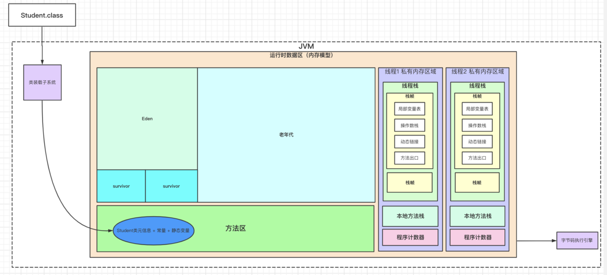
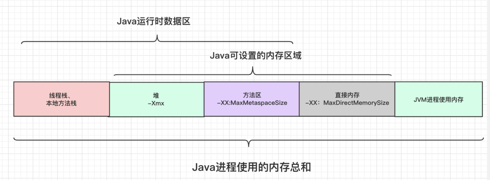
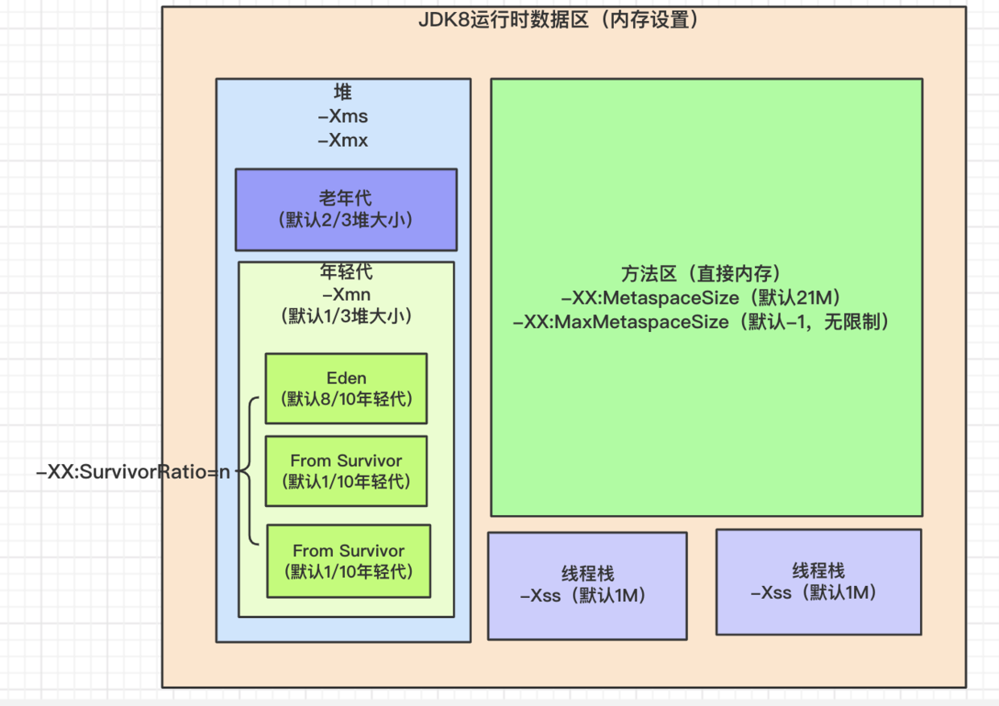
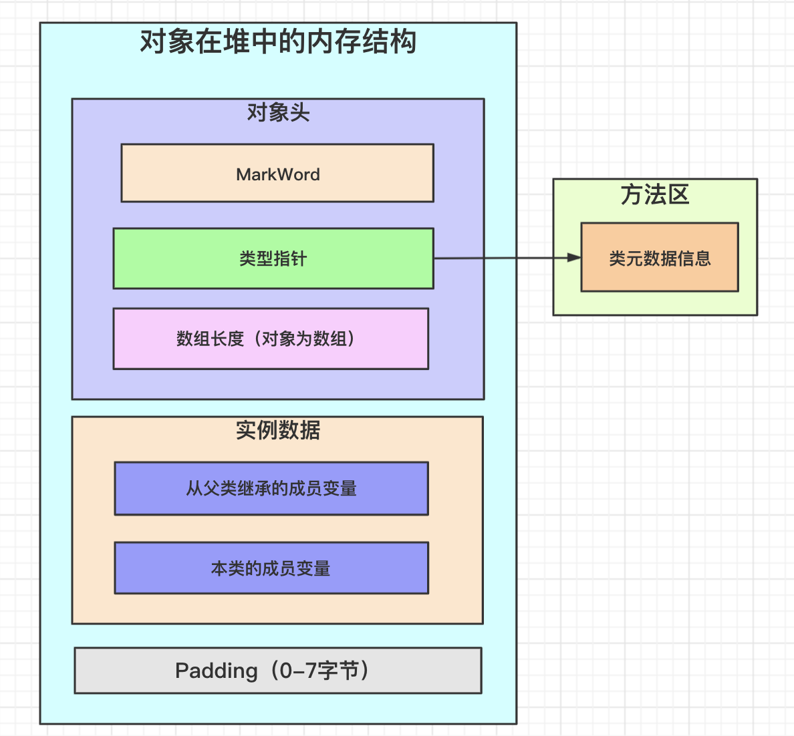

#### 一、运行时数据区
Java虚拟机规范规定的运行时内存主要有以下区域：
1）堆：对象存储区域
2）方法区：类元信息，运行时常量池
3）线程栈和本地方法栈：方法执行时的栈帧信息
4）程序计数器：记录当前线程要执行下一行代码的位置，执行native方法时为空。

Note：栈帧中的动态链接指向当前方法在方法区的地址；
##### 方法区结构（JDK1.6及以下版本）

##### HotSpot虚拟机实现
在HotSpot实现时会有些许差别，例如：
1）合并本地方法栈和线程栈
2）方法区的实现

#### 二、内存设置
java启动时可以配置运行参数，主要含：
*   [JVM通用参数](https://www.oracle.com/java/technologies/javase/vmoptions-jsp.html#BehavioralOptions) 
*   [垃圾回收器参数](https://www.oracle.com/java/technologies/javase/vmoptions-jsp.html#G1Options): 可设置JVM运行时各区域内存的大小等
*   [性能调优参数](https://www.oracle.com/java/technologies/javase/vmoptions-jsp.html#PerformanceTuning) 
*   [Debug参数](https://www.oracle.com/java/technologies/javase/vmoptions-jsp.html#DebuggingOptions)

Note：
1）-X前缀的参数：非标准参数，不保证所有虚拟机实现都支持。删改不会通知；
2）-XX前缀的参数：非稳定参数。删改不会通知；
##### Java常用内存设置参数

例子：如下命令会进行如下设置：
1）设置堆大小为512m
2）设置年轻代中Eden区和Survivor区比例`Eden : From Survivor : To Survivor=8:1:1`。
> java -Xms512m -Xmx512m -XX:SurvivorRatio=8 person/kivi/MainTest
##### Java进程的内存
直接内存受限于进程在当前系统下可使用的内存。例如32位系统，应用使用上线为4GB。

#### 三、类装载过程

详见：[https://www.jianshu.com/p/aeadf6c31b53](https://www.jianshu.com/p/aeadf6c31b53)
#### 四、对象创建过程

#### 五、对象结构

Note:
1）MarkWord的长度是一个字，与指针压缩无关。字是CPU一次能并行处理的二进制位数，一般为系统的位数。
2）指针压缩的对象是oop，即对象的引用地址。
* 地址<=32位，无需启动压缩；
* 地址在区间(32,35]（4G-32G间）可以通过压缩算法，把地址压缩到32位。
* 地址>32位，压缩失效
#### 六、变量在内存的映射

#### 七、类，类对象，类元信息的关联

#### 参考
1. [https://www.oracle.com/java/technologies/javase/vmoptions-jsp.html](https://www.oracle.com/java/technologies/javase/vmoptions-jsp.html)
1. [https://docs.oracle.com/javase/specs/](https://docs.oracle.com/javase/specs/)
1. [https://zhuanlan.zhihu.com/p/108668874](https://zhuanlan.zhihu.com/p/108668874)
1. [https://www.breakyizhan.com/javamianshiti/2839.html](https://www.breakyizhan.com/javamianshiti/2839.html)