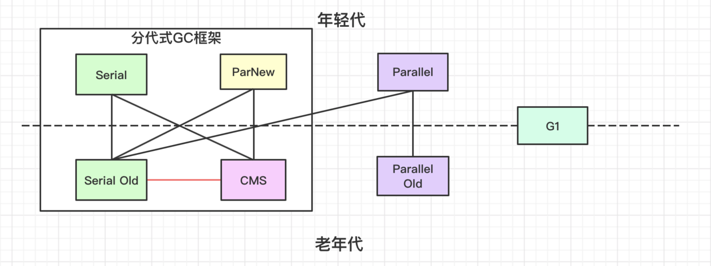

#### 一、垃圾收集器组合图

#### 二、垃圾收集器的发展史

1. 单核时代 - 串行垃圾收集器
2. 多核时代 - 小内存
1）*CMS*是老年代的多线程收集器，遵循了分代框架；
2）ParNew是Serial的多线程版本，从Exact VM移植到HotSpot与CMS搭配使用；
3）Parallel，Parallel Old是新框架下的并行垃圾收集器，考虑到维护成本，没有遵循之前的分代框架，所以与CMS无法搭配使用。
2. 多核时代 - 大内存
1）G1取消了逻辑分代，支持更大内存；
#### 三、垃圾收集器的性能指标
1）吞吐量
2）响应时间
#### 四、垃圾收集器的主流算法
1）复制：主要用于年轻代，其中的跨带应用通过[卡表](./8.卡表.md)来解决
2）标记整理：用于老年代
3）标记清除：用于老年代

#### 五、Serial垃圾收集器

##### 开启参数
1）年轻代：-XX:+UseSerialGC，采用复制算法
2）老年代：-XX:+UseSerialOldGC，采用标记整理算法
##### 串行垃圾收集器特点：
1）单线程执行，无法利用多核资源；
2）单线程执行时STW工作线程；

#### 六、Parallel垃圾收集器

Parallel是Serial垃圾收集器的多线程版本，也被称为Throughput GC，是吞吐量优先的垃圾收集器。没有实现老的分代框架，无法与CMS搭配使用。
##### 开启参数
1）年轻代：-XX:+UseParallelGC，采用复制算法
2）老年代：-XX:+UseParallelOldGC，采用标记整理算法
#### 高级参数
1）设置并行线程数：-XX:ParallelGCThreads，默认当前CPU核数。
##### parallel圾收集器特点：
1）多线程执行GC，吞吐量高；
2）多线程执行时依然STW工作线程；

#### 六、ParNew垃圾收集器

只负责新生代垃圾收集，功能与Parallel Scavenge(Parallel年轻代)的收集器类似，但是可以与CMS搭配使用。

##### 开启参数
1）年轻代：-XX:+UseParNewGC，采用复制算法
#### 七、CMS垃圾收集器

CMS只回收老年代，注重响应时间。但是在Oracle内部不受重视，优化项不如Parallel，至此到终都没有称为默认垃圾收集器。

##### 开启参数
1）老年代：-XX:+UseConcMarkSweepGC，采用标记清除算法
##### 高级参数
1）开启整理：
-XX:+UseCMSCompactAtFullCollection
-XX:CMSFullGCsBeforeCompaction:多少次FullGC后压缩
2）并发线程数：-XX:ConcGCThreads
3）触发FullGC的老年代使用比例：
-XX:CMSInitiatingOccupancyFraction:指定老年代触发FullGC的比例，默认92%；
-XX:+UseCMSInitiatingOccupancyOnly：开启时使用使用上面的设置，否则只有第一次使用；
4）初始标记是否使用多线程：
-XX:+CMSParallelInitiatingMarkEnable
5）执行FullGC前是否执行MinorGC
-XX:+CMSScavengeBeforeRemark
#### CMS执行过程
1. 初始标记：STW，扫描GC Root的直接关联对象；
1. 并发标记：遍历所有对象；
1. 重新标记：STW，修正并发标记期间变化的对象引用关系，使用[三色标记法](./7.三色标记.md)（增量更新）来实现。

1. 并发清除：清理没有被标记到的对象；若此时有新加入老年代的对象一律设置为黑色，不作清理。
1. 并发重置：重置标记状态；
##### 特点
1）注重响应时间，清理时用户线程和垃圾收集线程可以同时运行；
2）复杂度高，标记过程比较复杂；
3）如果不开启整理选项，容易出现内存碎片；
4）无法处理浮动垃圾；
5）会出现concurrent mode failure，然后STW，使用serial进行收集；
#### 八、G1
取消物理分代，取而代之的是分块的region，其保留逻辑分代。可回收年轻代和老年代；
##### 参数
1）设置Region大小：-XX:G1HeapRegionSize
2）设置年轻代大小：
-XX:G1NewSizePercent，默认5%
-XX:MaxG1NewSizePercent，默认60%
3）设置GC时最大停顿时间：-XX:MaxGGPauseMillis
##### 过程
1）初始标记：STW
2）并发标记：同CMS
3）最终标记：STW
4）筛选回收：STW

##### gc类型
1）young GC：优先新增Young Region（Eden + Survior），如果达到阈值则回收；
2）MixGC：回收Young Region，Old Region，大对象区域
3）FullGC：单线程回收所有区域，类似Serial垃圾收集器。
#### 九、各个JDK的默认垃圾收集器
1. JDK8：Parallel
1. JDK9：G1
#### 十、常用垃圾收集器组合
1. ParNew + CMS + Serial Old
2. Parallel

#### # 参考

1. [https://hllvm-group.iteye.com/group/topic/37095#post-242695](https://hllvm-group.iteye.com/group/topic/37095#post-242695)
2. [https://blogs.oracle.com/jonthecollector/our-collectors](https://blogs.oracle.com/jonthecollector/our-collectors)
3. [https://en.wikipedia.org/wiki/Java_version_history](https://en.wikipedia.org/wiki/Java_version_history)