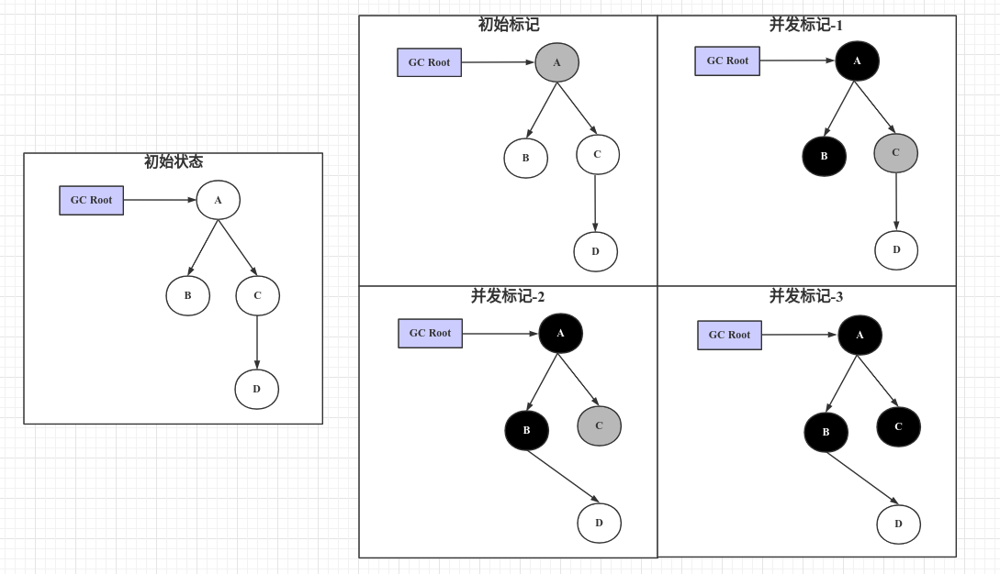
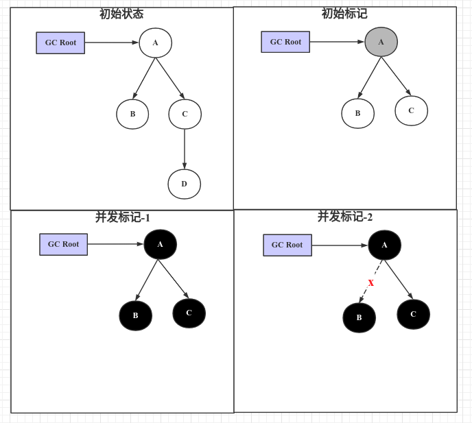

#### 一、并法标记期间出现的问题
1）漏标：需要处理，不然误回收

2）多标：浮动垃圾，下次回收；

#### 二、漏标的解决方案
并法标记过程中产生漏标时，会执行以下两个逻辑：
1）建立新关联

 未扫描到的对象被已扫描过的黑对象引用，而黑对象不会再扫描标记其关联对象；

2）删除旧关联

把此对象从其旧关联删除，导致此对象只被黑对象关联，无法再被标记，而产生漏标；

#### 增量更新
在并发标记期间，新赋值的对象作为增量记录下来，再重新标记时扫描。

实现：

通过写屏障（写后屏障），把`建立新关联的左值对象`维护到一个表，在重新标记节点重新扫描表中的对象；黑色对象一旦新插入了指向白色对象的引用之后， 它就变回灰色对象了。

特点：

1）所有在并发标记过程中变化的引用导致由黑变灰的对象都需要重新遍历标记；

2）性能开销大，小内存时适用；

#### 原始快照
在并发标记期间，引用关系发生变化的对象一律标记为黑对象，本次不回收。

实现：

通过写屏障（写前屏障），把`删除旧关联时的右值对象`维护到一张表，重新标记时标为黑色。本次不回收。此时，表中对象有可能是被引用的对象，也有可能是垃圾对象（浮动垃圾）。

特点：

1）所有在并发标记过程中变化的节点都做标记，本次垃圾回收不处理。

2）性能开销小，大内存时适用；

#### 三、CMS和G1的实现
1. CMS：写屏障 + 增量更新
1. G1：写屏障 + 原始快照