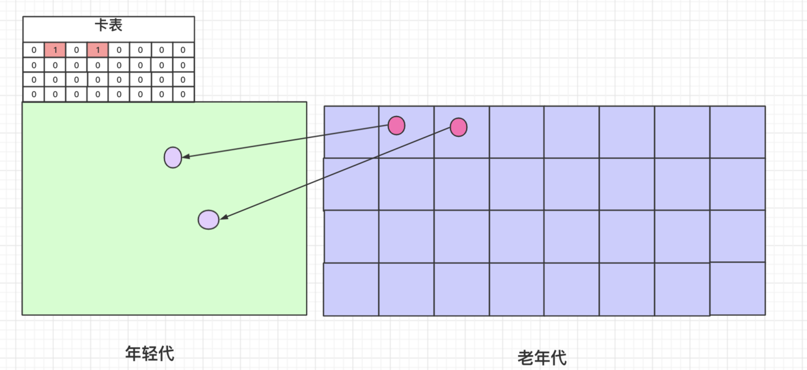

年轻代收集时，在扫描GCRoot时，可能会出现跨带引用，即老年代引用年轻代。为了避免扫描整个老年代，通过卡表来标记老年代的某个区域是否有对年轻代的引用。
#### 基于前提
跨带引用的量较小，所以通过老年代分块来粗化区域，提高效率。
#### 实现
1）把老年代分块，512字节为大小；
2）年轻代维护卡表，与老年代的块一一对应；
3）通过写屏障维护卡表（字节数组，一个字节对应一个老年代的块），如果发现老年代引用了年轻代则把对应的bit置为1；
4）年轻代收集时通过遍历年轻代的GCRoot和老年代的脏块中的对象，其中不可达的对象则视为垃圾，不作复制。

> 以上为个人理解，如果偏差，欢迎指正。