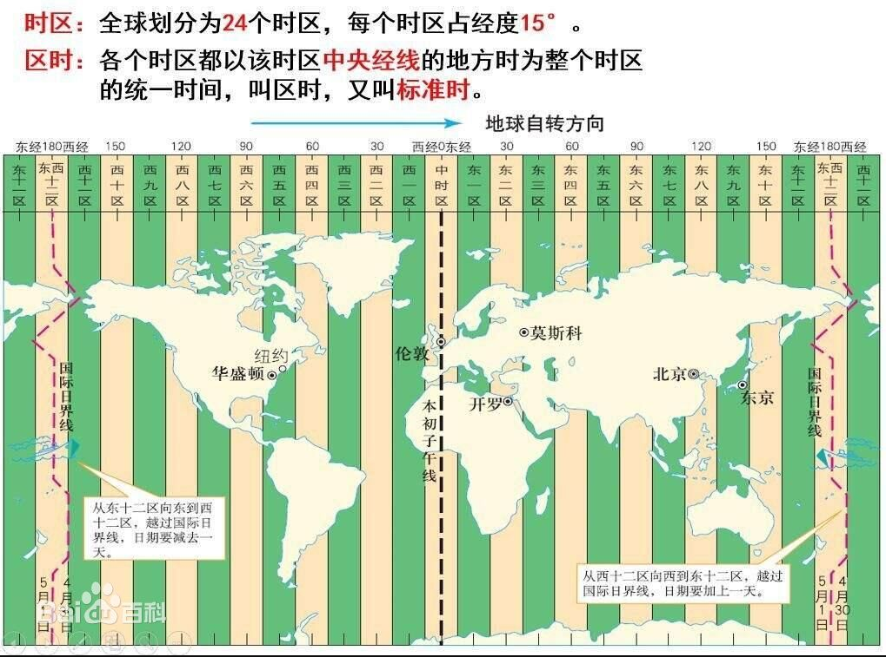

### 0. Mysql的TimeStamp、DateTime

##### 1）TimeStamp

* 时间范围：'1970-01-01 00:00:01' UTC to '2038-01-19 03:14:07' UTC.
* 以整数格式存储，代表自epoch后的秒数。
* 存储大小为4个字节（不考虑小数部分），即4*8=32位，除去最高位的符号位，所能表达的最大数为2^31=2,147,483,648；

##### 2）DateTime

* 时间范围：'1000-01-01 00:00:00' to '9999-12-31 23:59:59'

* 存储占用5个字节
  
  ```shell
  1 bit  sign           (1= non-negative, 0= negative)
  17 bits year*13+month  (year 0-9999, month 0-12)
  5 bits day            (0-31)
  5 bits hour           (0-23)
  6 bits minute         (0-59)
  6 bits second         (0-59)
  ```

---------------------------

40 bits = 5 bytes   //来源：mysql官网

```
##### 3）时区对DateTime和TimeStamp的影响

> 以下为mysql官网11.2.2的测试案例
> 说明：unix_timestamp是当前时区相对于1970年的秒数；
```shell
mysql> CREATE TABLE ts (
    ->     id INTEGER NOT NULL AUTO_INCREMENT PRIMARY KEY,
    ->     col TIMESTAMP NOT NULL
    -> ) AUTO_INCREMENT = 1;

mysql> CREATE TABLE dt (
    ->     id INT NOT NULL AUTO_INCREMENT PRIMARY KEY,
    ->     col DATETIME NOT NULL
    -> ) AUTO_INCREMENT = 1;

mysql> SET @@time_zone = 'SYSTEM';

mysql> INSERT INTO ts (col) VALUES ('2020-01-01 10:10:10'),
    ->     ('2020-01-01 10:10:10+05:30'), ('2020-01-01 10:10:10-08:00');

mysql> SET @@time_zone = '+00:00';

mysql> INSERT INTO ts (col) VALUES ('2020-01-01 10:10:10'),
    ->     ('2020-01-01 10:10:10+05:30'), ('2020-01-01 10:10:10-08:00');

mysql> SET @@time_zone = 'SYSTEM';

mysql> INSERT INTO dt (col) VALUES ('2020-01-01 10:10:10'),
    ->     ('2020-01-01 10:10:10+05:30'), ('2020-01-01 10:10:10-08:00');

mysql> SET @@time_zone = '+00:00';

mysql> INSERT INTO dt (col) VALUES ('2020-01-01 10:10:10'),
    ->     ('2020-01-01 10:10:10+05:30'), ('2020-01-01 10:10:10-08:00');

mysql> SET @@time_zone = 'SYSTEM';

mysql> SELECT @@system_time_zone;
+--------------------+
| @@system_time_zone |
+--------------------+
| EST                |
+--------------------+

mysql> SELECT col, UNIX_TIMESTAMP(col) FROM dt ORDER BY id;
+---------------------+---------------------+
| col                 | UNIX_TIMESTAMP(col) |
+---------------------+---------------------+
| 2020-01-01 10:10:10 |          1577891410 |
| 2019-12-31 23:40:10 |          1577853610 |
| 2020-01-01 13:10:10 |          1577902210 |
| 2020-01-01 10:10:10 |          1577891410 |
| 2020-01-01 04:40:10 |          1577871610 |
| 2020-01-01 18:10:10 |          1577920210 |
+---------------------+---------------------+

mysql> SELECT col, UNIX_TIMESTAMP(col) FROM ts ORDER BY id;
+---------------------+---------------------+
| col                 | UNIX_TIMESTAMP(col) |
+---------------------+---------------------+
| 2020-01-01 10:10:10 |          1577891410 |
| 2019-12-31 23:40:10 |          1577853610 |
| 2020-01-01 13:10:10 |          1577902210 |
| 2020-01-01 05:10:10 |          1577873410 |
| 2019-12-31 23:40:10 |          1577853610 |
| 2020-01-01 13:10:10 |          1577902210 |
+---------------------+---------------------+
```

解释说明：
a）若不指定时区偏移

* DateTime与时区无关，存储和查询的操作不会做时区转换，即查询的值等于存储时的字符串表示的时间
* TimeStamp与时区有关，存储时根据当前时区转为相对GMT的时间戳，查询时根据当前时区解析时间戳为当前时区的时间。

b）若指定时区偏移（since mysql 8.0.19）

* DateTime存储时把指定时区的Date Time转为当前时区的Date和Time，然后存储，查询时原样取出，不做时区转换。即只在存储时转换。
  例如：设置当前时区为System(ESG, -05:00)，insert时指定DateTime为`2020-01-01 10:10:10+05:30`，根据时区的`东加西减`算法，需要减去*10:30*, 得到`2019-12-31 23:40:10-05:00`。存储`2019-12-31 23:40:10`

* TimeStamp存储时根据指定的时区转为相对GMT的时间戳，查询时根据当前时区解析时间戳为当前时区的时间。
  
### 1. MysqlWorkbench/Navicat
  
1）数据库客户端可以通过命令设置session时区；
  
### 2. JDBC
  
1）JDBC的三个配置项：useLegacyDatetimeCode，useTimezone，serverTimezone
  
  >  useLegacyDatetimeCode: (驱动8.0已废弃)
  >  Default: true
  >  Since: 5.1.6
  >  Use code for DATE/TIME/DATETIME/TIMESTAMP handling in result sets and statements that consistently handles time zone conversions from client to server and back again, or use the legacy code for these datatypes that has been in the driver for backwards-compatibility? Setting this property to 'false' voids the effects of "useTimezone," "useJDBCCompliantTimezoneShift," "useGmtMillisForDatetimes," and "useFastDateParsing."

> useTimezone:  (驱动8.0已废弃)
> Default:   false
> Since: 3.0.2
> Convert time/date types between client and server time zones (true/false, defaults to 'false')? This is part of the legacy date-time code, thus the property has an effect only when "useLegacyDatetimeCode=true."

> serverTimezone：
> Since version: 3.0.2
> Override detection/mapping of time zone. Used when time zone from server doesn't map to Java time zone

2）JDBC调解时区
以timestamp为例，如果数据源的url时区配置为`serverTimezone=GMT`，则会对读取到的timestamp进行时区转换。若果当前时区为东八区，则会对时间+8；



### 3. 结论

* 不考虑SQL中指定时区，则mysql在读取或写入时不会对datetime根据时区来做转换；

* JDBC会调解时区，所以要保证mysql服务器和serverTimezone一致；
  
#### 参考资料
  
###### 1.Mysql 官网

[11.2.2 The DATE, DATETIME, and TIMESTAMP Types](https://dev.mysql.com/doc/refman/8.0/en/datetime.html)
[10.9 Date and Time Data Type Representation（存储格式）](https://dev.mysql.com/doc/internals/en/date-and-time-data-type-representation.html)
[5.1.14 MySQL Server Time Zone Support](https://dev.mysql.com/doc/refman/8.0/en/time-zone-support.html)
[5.3 Configuration Properties for Connector/J](https://dev.mysql.com/doc/connector-j/5.1/en/connector-j-reference-configuration-properties.html)
[6.3 Configuration Properties](https://dev.mysql.com/doc/connector-j/8.0/en/connector-j-reference-configuration-properties.html)
[https://dev.mysql.com/doc/index-connectors.html](https://dev.mysql.com/doc/index-connectors.html)
[函数unix-timestamp](https://dev.mysql.com/doc/refman/8.0/en/date-and-time-functions.html#function_unix-timestamp)
[6.5 Java, JDBC, and MySQL Types](https://dev.mysql.com/doc/connector-j/8.0/en/connector-j-reference-type-conversions.html)

###### 2.其他

[https://stackoverflow.com/questions/7605953/how-to-change-mysql-timezone-in-a-database-connection-using-java](https://stackoverflow.com/questions/7605953/how-to-change-mysql-timezone-in-a-database-connection-using-java)
[How to Set the JVM Time Zone](https://www.baeldung.com/java-jvm-time-zone)
https://stackoverflow.com/questions/26515700/mysql-jdbc-driver-5-1-33-time-zone-issue
https://stackoverflow.com/questions/930900/how-do-i-set-the-time-zone-of-mysql/16066034
[一次JDBC与MySQL因“CST”时区协商误解导致时间差了14或13小时的排错经历](https://juejin.cn/post/6844903476225376264)
 [时间戳（UnixTimestamp）与 《2038年问题》](https://www.cnblogs.com/chinaboyzzy/p/4597193.html)
[Java与MySQL时间戳传递/存储/协调问题--userLegacyDatetimeCode--userTimezone--serverTimezone](https://www.jianshu.com/p/0adaef17d93a)