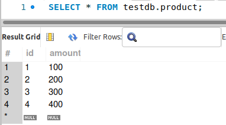
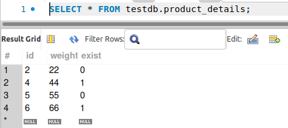
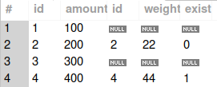
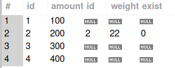
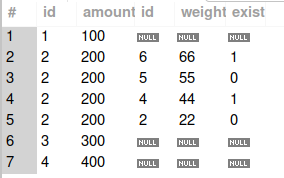
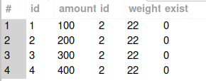

#### 一、left join的ON中多条件AND

1）left join的on条件一般只写一个主键关联的字段，例如：

```mysql
SELECT * FROM product LEFT JOIN product_details ON product.id = product_details.id;
```

2）当left join的on条件有多个时，大部分是要通过多个条件限制结果集，应改用inner join，例如：

```mysql
SELECT * FROM product LEFT JOIN product_details ON product.id = product_details.id AND product_details.weight > 30
```

#### 二、实例演示

1）准备两个表及初始化数据（[语句来源](https://blog.csdn.net/guofang110/article/details/90444880)）

```sql
CREATE TABLE `product` (
  `id` int(10) unsigned NOT NULL auto_increment,
  `amount` int(10) unsigned default NULL,
  PRIMARY KEY  (`id`)
) ENGINE=MyISAM AUTO_INCREMENT=5 DEFAULT CHARSET=latin1;

CREATE TABLE `product_details` (
  `id` int(10) unsigned NOT NULL,
  `weight` int(10) unsigned default NULL,
  `exist` int(10) unsigned default NULL,
  PRIMARY KEY  (`id`)
) ENGINE=MyISAM DEFAULT CHARSET=latin1;

INSERT INTO product (id,amount) VALUES (1,100),(2,200),(3,300),(4,400);
INSERT INTO product_details (id,weight,exist) VALUES (2,22,0),(4,44,1),(5,55,0),(6,66,1);
```

表数据如下：





2）执行以下SQL查询

```mysql
# 结果符合预期
SELECT * FROM product LEFT JOIN product_details 
    ON product.id=product_details.id;
```



```mysql
# ON的多个条件进行AND，括号不影响结果
SELECT * FROM product LEFT JOIN product_details 
    ON product.id=product_details.id AND product.id=2;

SELECT * FROM product LEFT JOIN product_details 
    ON (product.id=product_details.id AND product.id=2);
```



```mysql
SELECT * FROM product LEFT JOIN product_details
    ON product.id=product_details.id AND product_details.id=2;

SELECT * FROM product LEFT JOIN product_details
    ON (product.id=product_details.id AND product_details.id=2);
```


```mysql
SELECT * FROM product LEFT JOIN product_details ON product.id=2;
```



```mysql
SELECT * FROM product LEFT JOIN product_details ON product_details.id=2;
```



#### 三、left join匹配原理

1）从结果集来看，[参考链接](https://www.codeproject.com/Articles/33052/Visual-Representation-of-SQL-Joins)：


2）匹配顺序（NLJ为例）

```mysql
SELECT * FROM A left join B ON condition1 AND condition2;
```

如上的LEFT 左侧表A为驱动表，右侧为被驱动表。假设当前使用NLJ的嵌套关联方法，其执行伪代码可简化如下：

```java
List rows = new ArrayList();

for rowA in table A {
      List rowAMatchList = new ArrayList();
    for rowB in table B {
        joinRow = rowA join rowB;
        if (joinRow match (condition1 AND condition2)) {
            rowAMatchList.add(joinRow);
        }
    }
    if (empty rowAMatchList) {
      rowAMathList.add(rowA join null);
    }

    rows.addAll(rowAMatchList);
}        
```

#### # 参考

1. https://stackoverflow.com/questions/14660330/mysql-left-join-with-multiple-tables
2. https://www.codeproject.com/Articles/33052/Visual-Representation-of-SQL-Joins
