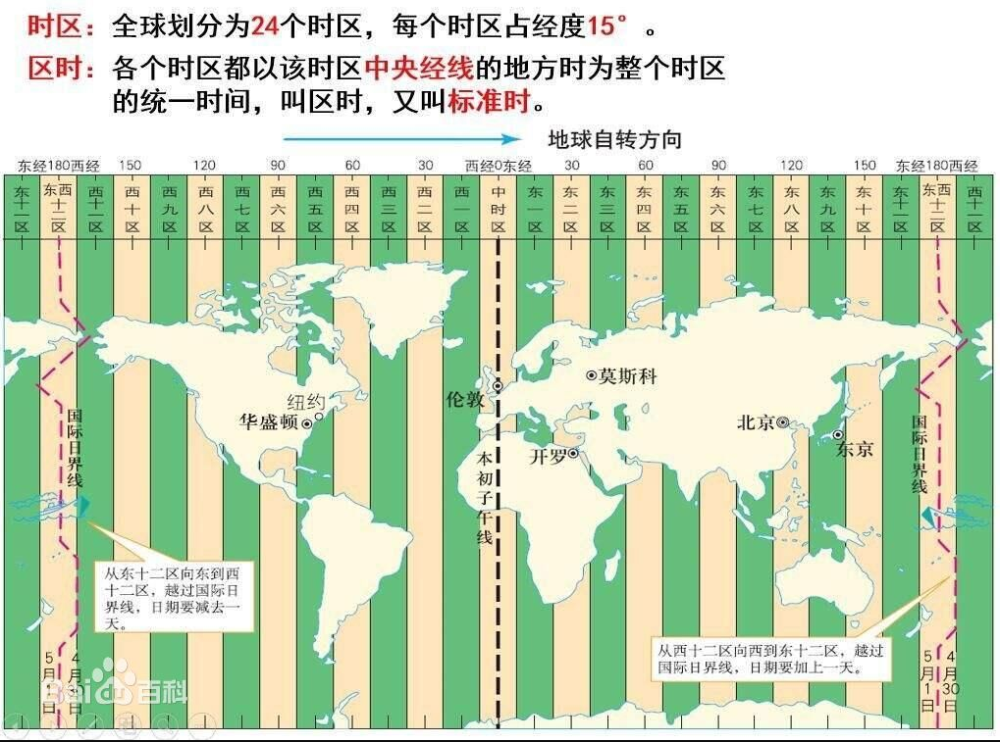
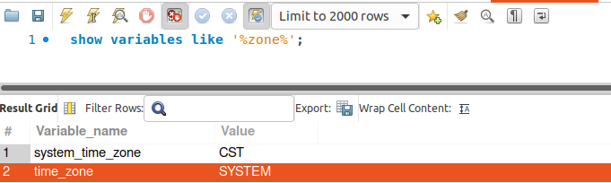

#### 一、背景描述

java通过jdbc连接远程数据库插入一条数据，类似如下：

`insert into tableA (updateTime) values (now());`，其中updateTime是timestamp类型。但是jdbc查询的结果确比当前多8个小时。

#### 二、操作

1）先查询数据库时区：`show variables like '%zone%';`

显示CST，而CST可能有四种可能：

* 美国中部时间 Central Standard Time (USA) UTC-06:00 
* 澳大利亚中部时间 Central Standard Time (Australia) UTC+09:30 
* 中国标准时 China Standard Time UTC+08:00 
* 古巴标准时 Cuba Standard Time UTC-04:00
  此时需要进一步查看当前系统的时区。

2）查看数据库所在系统时区：`date -R`

由此，可知道数据库的时区是东八区。

3）查看JDBC的数据库连接设置的时区，如下：

`url : jdbc:mysql://192.168.170.151:3358/edi-platform?useUnicode=true&characterEncoding=utf-8&useSSL=false&serverTimezone=GMT`

4）java应用所在时区为东八区

#### 三、原因

1）数据库执行now()，获取当前时区（东八区）的时间存储到数据库（真实存储是相对GMT的时间，读取时再转换为数据库时区的时间）；

2）jdbc读取到的时间已经是东八区时间，但是却根据jdbc的url设置把他认为是GMT时间，又对他进行了+8，所以jdbc调停后的时间晚了8个小时；

#### 四、其他

如果把jdbc里的时区设置去掉，则自动使用数据库的时区。此时数据库的时区是CST(+8)，但是JDBC却把误认为是CST(-6)，此时读取的最终结果则是差距：8-(-6) = 14小时;