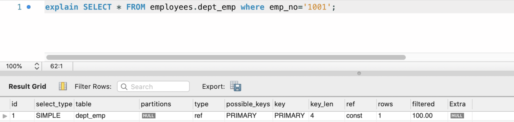

> mysql5.7以上版本在查看explain时需关闭衍生表优化：`set session optimizer_switch='derived_merge=off'`，否则会隐藏衍生表的信息；

#### 一、explain概述

explain可以显示SQL执行的相关信息，如使用哪个索引，执行顺序等。具体如下：

| 列名            | 含义               | 解释                 |
| ------------- | ---------------- | ------------------ |
| id            | select的标识        | id大的先执行，id相等由上到下执行 |
| select type   | 查询类型             |                    |
| table         | 查询的表名            |                    |
| partitios     | 匹配的分区名           | 分库时使用              |
| type          | 联表类型             | 描述表之间是如何关联（join）的  |
| ref           | 与实际索引进行比较的列或常量   |                    |
| possible_keys | 可选的索引            |                    |
| key           | 实际选择的索引          |                    |
| key_len       | 实际选择的索引的长度       | 一般用于判断联合索引         |
| rows          | 待检查行的预估值         |                    |
| filtered      | 根据条件筛选的行数在表中的百分比 |                    |
| Extra         | 附加信息             |                    |

#### 二、select type

| 值        | 含义             |
| -------- | -------------- |
| SIMPLE   | 简单查询，没使用联表或子查询 |
| PRIMARY  | 最外层查询          |
| SUBQUERY | 子查询            |
| DRIVDE   | 衍生表            |

#### 三、type

```sql
// 假设有如下表定义：
CREATE TABLE `employees` (
  `id` int(11) NOT NULL,
  `first_name` varchar(14) NOT NULL,
  `last_name` varchar(16) NOT NULL,
  `gender` enum('M','F') NOT NULL,
  `hire_date` date NOT NULL,
  PRIMARY KEY (`emp_no`),
  KEY `idx_name` (`first_name`)
) ENGINE=InnoDB DEFAULT CHARSET=utf8mb4
```

效率：system > const > eq_ref > ref > range > index > all

| 值      | 含义                               | 解释                                               | 简化理解                     | 举例                                                                      |
| ------ | -------------------------------- | ------------------------------------------------ | ------------------------ | ----------------------------------------------------------------------- |
| system | 表中只有一行数据，是const的特例               | 表中只有一行数据，一般指衍生表                                  | 表只有一行记录                  |                                                                         |
| const  | 表中最多只有一行数据符合匹配条件                 | `将主键`或`唯一索引的所有部分`与`常量值`进行比较时为const，结果集最多有一条      | 查询条件为主键或唯一索引全部，ref为const | select * from employees where id=1                                      |
| eq_ref | 根据前表的每行数据在当前表只能关联一行数据            | 一般为两个表的链接字段为`主键列`或`唯一索引的所有部分`，使得两张表的记录一一对应       | 联表场景，主键或唯一索引全部，ref为联表字段  | select * from employees as a left join dept_emp as b on a.id = b.emp_id |
| ref    | 对于前一个表中的每个行组合，将从该表中读取具有匹配索引值的所有行 | 联表时使用`键的左边前缀`，或者`键不是主键或唯一索引全部`，使得两张表的记录会出现一对多的情况 | 查询条件非主键或唯一索引的全部，ref为联表字段 | select * from employees where first_name='wang'                         |
| range  | 使用索引检索给定范围内的行                    | 如使用<>,>,>=,<,<=,in,like,between                  | 走索引，范围查询                 |                                                                         |
| index  | 扫描索引数                            | 常见于不加查询条件的覆盖索引查询                                 | 走索引，全表扫描                 |                                                                         |
| all    | 扫描全表                             | 常见于不加查询条件，或查询条件没有加索引                             | 不走索引，全表扫描                |                                                                         |

#### 四、Extra

| 值                     | 含义                           |
| --------------------- | ---------------------------- |
| Using index           | 只查询索引数即可获得结果集，无需回表           |
| Using index condition | 使用索引下推，延迟回表；且减少了需要回表的结果集     |
| Using temporary       | 解析结果集时需要用到临时表                |
| Using filesort        | 使用文件排序，数量小时使用内存排序，数量大时使用磁盘排序 |

#### 参考

1. [https://dev.mysql.com/doc/refman/5.7/en/explain-output.html](https://dev.mysql.com/doc/refman/5.7/en/explain-output.html)