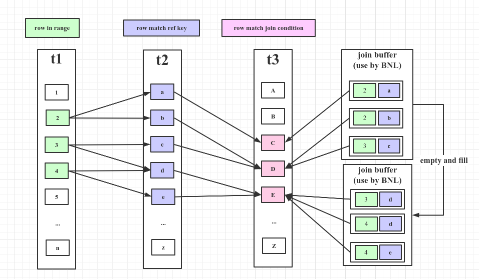
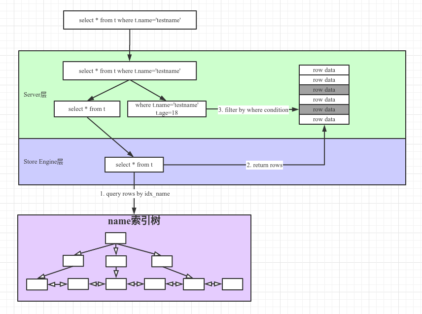
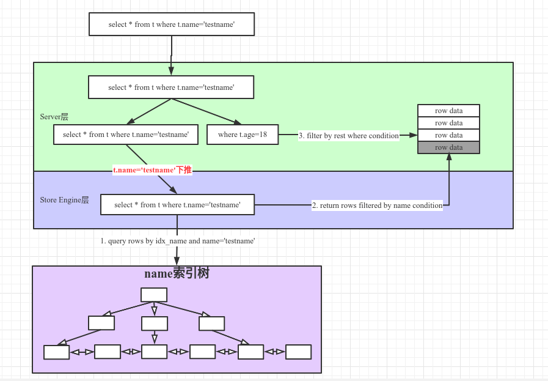
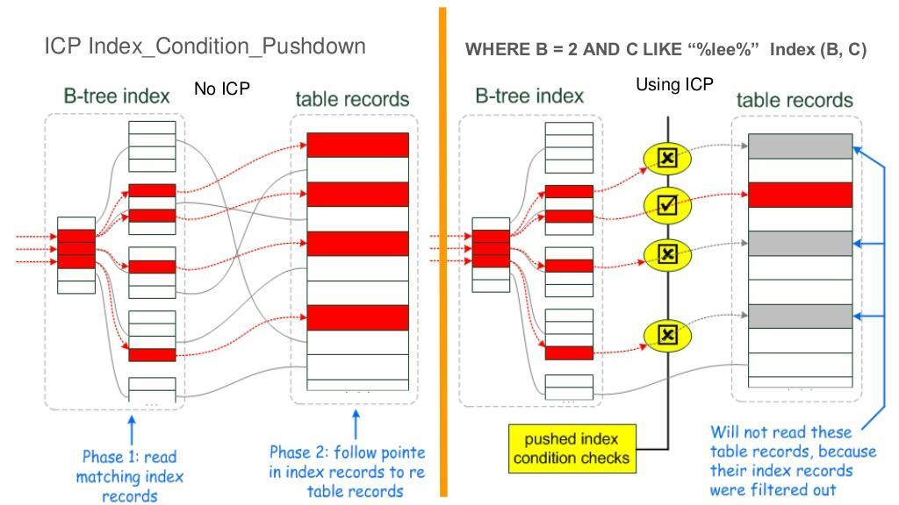

<!-- date: 2020.08.03 21:42 -->
## 一、filesort

> filesort用于order by或group by语句，要求返回的结果集有序或分组。如果结果集不大则完全可以在内存中排序，否则需要借助磁盘来完成排序。

### 1、filesort与索引

1）如果explain的Extra中不含`using filesort`，说明使用索引，且不执行filesort操作；

2）如果explain的Extra中包含`using filesort`，说明不使用索引，且执行filesort操作；

若执行了filesort，则trace中显示如下信息：

```sql
"filesort_summary": {
  "rows": 100,
  "examined_rows": 100,
  "number_of_tmp_files": 0,
  "sort_buffer_size": 25192,
  "sort_mode": "<sort_key, packed_additional_fields>"
}
```

### 2、关键参数

1）max_length_for_sort_data

用于决定使用哪种排序算法的值，如果需要排序的列的总大小加上order by列的大小超过了 max_length_for_sort_data定义的字节使用双路排序，否则使用单路排序。如果增大该值，同时应该适当增加sort_buffer_size的值。

NOTE：如果该值设置的过大，将导致磁盘IO增多，cpu使用下降。

2）max_sort_lenght

一般用于对text，blob列排序，通过该值指定需要排序的前缀长度并忽略剩余的值，以减少内存使用。

3）sort_buffer_size

排序的内存缓冲区大小，该值应该尽可能的大，以便排序的结果集能尽量被容纳进去。可在会话级别进行控制。

### 3、单路排序和双路排序

1）单路排序

一次性取出所有查询的字段，进行排序，无需回表。

2）双路排序

取出排序字段和改行指针值进行排序，排序结束后再根据指针回表查询所有查询的字段。归并排序

## 二、NLJ和BNL

> MySQL使用嵌套循环算法或其变种来实现表之间的关联。

假设有三张表如下；

```sql
Table   Join Type
t1      range
t2      ref
t3      ALL
```

### 1、NLJ（Nested-Loop Join Algorithm）

NLJ可以理解为关联多表时，执行循环遍历和嵌套操作来筛选结果集。
假如t1,t2,t3的行数分别为x,y,z，那么扫描行数`n=xyz`。

```shell
// 官网伪代码
for each row in t1 matching range {
  for each row in t2 matching reference key {
    for each row in t3 {
      if row satisfies join conditions, send to client
    }
  }
}
```

### 2、BNL（Block Nested-Loop Join Algorithm）

BNL可以理解为在NLJ的基础上的变种，通过引入join buffer来缓存一批外层的行，减少遍历的次数。
假如t1,t2,t3的行数分别为x,y,z，joinbuffer一次可容纳j条记录，那么扫描行数`n=xyz/j`。

```shell
// 官方伪代码
for each row in t1 matching range {
  for each row in t2 matching reference key {
    store used columns from t1, t2 in join buffer
    if buffer is full {
      for each row in t3 {
        for each t1, t2 combination in join buffer {
          if row satisfies join conditions, send to client
        }
      }
      empty join buffer
    }
  }
}

if buffer is not empty {
  for each row in t3 {
    for each t1, t2 combination in join buffer {
      if row satisfies join conditions, send to client
    }
  }
}
```



## 三、ICP索引条件下推

ICP(Index Condition Pushdown)，索引条件下推是Mysql针对使用索引检索时的一种优化手段。索引下推中`下推的是where中有关索引的条件`，`由服务层下推到存储引擎层`，使之返回更小的数据行到服务层。

### 1、不使用ICP场景

1）存储引擎遍历`table t`的索引，对每一个索引执行后续操作；

2）根据索引从`table t`中取出行（如果是二级索引需要回表），返回服务器；

3）服务器通过where条件中针对`table t`的条件来过滤行；



### 2、使用ICP场景

1）存储引擎遍历`table t`的索引，对每一个索引执行后续操作；

2）存储引擎根据where中针对`table t`条件中当前索引列的查询条件，对索引进行检查，

- 如果满足，则根据索引从`table t`中取出行并将其返回至mysql服务器层，继续执行后续操作
- 否则，返回第1）步获取下一个索引；

3）服务器根据剩余的条件过滤引擎返回的数据行；



### 3、优点

1）减少存储引擎访问表的次数；

2）减少mysql服务器访问存储引擎的次数；

### 4、参考图片




## # 参考

1. [https://dev.mysql.com/doc/refman/5.7/en/order-by-optimization.html](https://dev.mysql.com/doc/refman/5.7/en/order-by-optimization.html)
2. [https://dev.mysql.com/doc/internals/en/optimizer-tracing.html](https://dev.mysql.com/doc/internals/en/optimizer-tracing.html)
3. [https://dev.mysql.com/doc/refman/8.0/en/nested-loop-joins.html#nested-loop-join-algorithm](https://dev.mysql.com/doc/refman/8.0/en/nested-loop-joins.html#nested-loop-join-algorithm)
4. [https://dev.mysql.com/doc/refman/8.0/en/index-condition-pushdown-optimization.html]([https://dev.mysql.com/doc/refman/8.0/en/index-condition-pushdown-optimization.html)