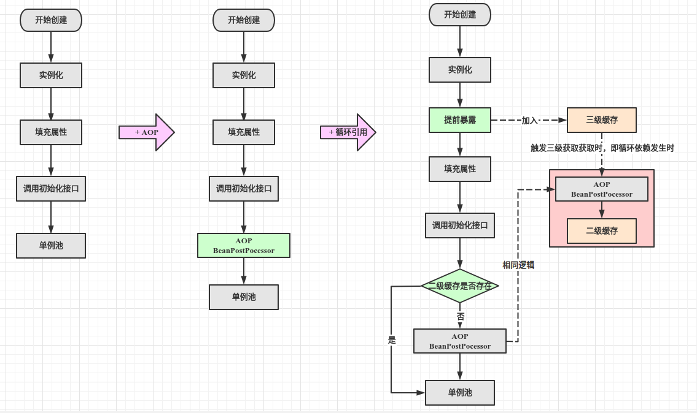

## 一、前置问题

1. Bean创建流程？
1. 什么是循环依赖？
1. 三级缓存可以解决哪些循环依赖场景？
1. 二级缓存可以解决循环依赖吗？如果可以，为什么不使用？
1. Bean创建的场景？二维：循环依赖和代理

## 二、循环依赖

Spring循环依赖相关的代码现在比较繁琐，如果阅读时不考虑版本的变迁，很难理解解决循环依赖的流程。

我把Spring依赖的解决方案认为是三个迭代版本的最终版，这样理解起来会更清晰。
| 版本   | 目的                                    |
| ------ | --------------------------------------- |
| 版本一 | 解决普通bean的创建，不涉及AOP和循环引用 |
| 版本二 | 版本一 + AOP支持                        |
| 版本三 | 版本二 + 循环依赖支持                   |

### 分析

1）Spring的Bean创建的正常逻辑是初始化后在生成潜在代理对象。

2）若不需要生成代理，则二级缓存即可，也不会破坏正常创建流程。

3）若需要生成代理对象

I、若只使用二级缓存，无论是否存在循环依赖，都会破坏正常初始化逻辑。需要在Bean实例化后-注入属性前，生成代理对象放入缓存。

II、若使用三级缓存，

* 无循环依赖时，会执行正常的初始化逻辑；
* 有循环依赖时，则会在注入属性时生成代理逻辑；

### 结论

* 如果只是解决循环依赖问题，使用二级缓存即可，在实例化时提前创建代理对象仿佛缓存。

* 但是为了最大限度保证Bean创建的正常逻辑，使用了三级缓存。即非必要不破坏正常逻辑。

## 三、源码解析

AbstractBeanFactory#doGetBean

1）getSingleton(beanName)

`尝试从一级缓存singletonObjects、二级缓存earlySingletonObjects、三级缓存singletonFactories中获取Bean对象`。

如果找到则返回Bean对象：`在三级缓存中获取到时，调用ObjectFactory（调用SmartInstantiationAwareBeanPostProcessor#getEarlyBeanReference可提前生成代理），则把原始对象或代理对象移入二级缓存`。

否则执行下一步 =》getSingleton(beanName, ObjectFactory)

2）getSingleton(beanName, ObjectFactory)

设置bean为创建中，singletonsCurrentlyInCreation#add(beanName)

调用objectFacotry#getObject =》 AbstractAutowireCapableBeanFactory#createBean

设置bean创建完毕，singletonsCurrentlyInCreation#remove(beanName)

`清空二、三级缓存，把Bean对象加入一级缓存`

3）AbstractAutowireCapableBeanFactory#createBean

调用InstantiationAwareBeanPostProcessor，可潜在生成代理对象，若生成则返回。

调用doCreateBean，进行Bean创建 =》AbstractAutowireCapableBeanFactory#doCreateBean

4）AbstractAutowireCapableBeanFactory#doCreateBean

调用createBeanInstance，创建Bean对象

调用addSingletonFactory，把Bean对象封装为ObjectFactory加入`三级缓存singletonFactories`

调用singletonFactories，初始化Bean对象，如属性注入

调用initializeBean，执行Bean对象的初始化方法，并在其前后调用BeanPostProcessor，可潜在生成动态代理（若之前执行过getEarlyBeanReference则不再执行，避免生成不同代理对象）

调用getSingleton，把Bean对象由`三级缓`存移到`二级缓存earlySingletonObjects`，并返回