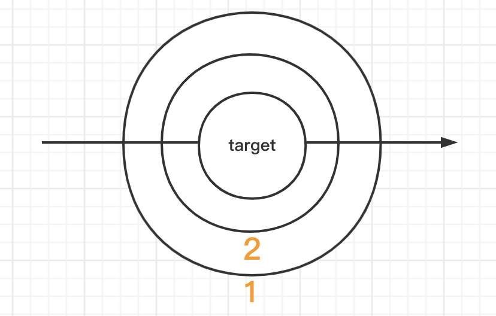

## 一、Spring AOP

### 1、动态代理实现

1）如果使用接口，则使用JDK动态代理

2）如果没使用接口，则使用CGLib动态代理

### 2、AspectJ关系

使用AspectJ的切点表达式和解析逻辑

### 3、三种渐进实现方式

1）通过ProxyFactoryBean生成

设置target和拦截器，生成target接口的代理类。拦截逻辑被放入AdvisedSupport构成拦截链，在JdkDynamicAopProxy#invoke执行时会选择合适的拦截器执行。

虽然是构成了拦截链，但仍是栈式调用。

缺点：每个需要代理类都需要手动装配，无法方便的声明针对细粒度对方法进行拦截。

2）通过ProxyFactoryBean + xxxAdvisor

可针对方法进行细粒度声明增强。

缺点：每个代理类都需要手动装配

3）通过BeanNameAutoProxyCreator + xxxAdvisor

可针对指定类表达式

4）AspectJ

注解式声明。第一个BeanPostProcessor来解析含AspectJ注解的所有BeanDefinition生成Advisor，最后一个BeanPostProcessor生成动态代理。

入口类EnableAspectJAutoProxy。

## 二、图示

## 三、AOP执行顺序

先执行order小的AOP。

