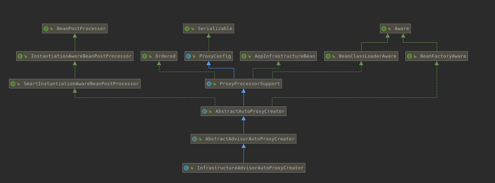
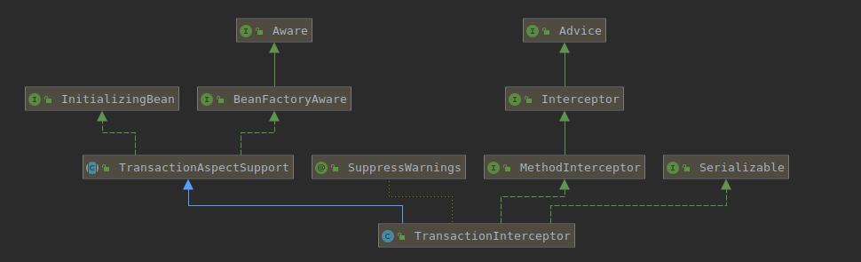

#### 一、关键类

##### 1. org.springframework.transaction.annotation.EnableTransactionManagement

```java
@Target(ElementType.TYPE)
@Retention(RetentionPolicy.RUNTIME)
@Documented
@Import(TransactionManagementConfigurationSelector.class)
public @interface EnableTransactionManagement {
}
```

##### 2.org.springframework.transaction.annotation.TransactionManagementConfigurationSelector

```java
public class TransactionManagementConfigurationSelector extends AdviceModeImportSelector<EnableTransactionManagement> {

	@Override
	protected String[] selectImports(AdviceMode adviceMode) {
		switch (adviceMode) {
			case PROXY:
				return new String[] {AutoProxyRegistrar.class.getName(), ProxyTransactionManagementConfiguration.class.getName()};
			case ASPECTJ:
				return new String[] {TransactionManagementConfigUtils.TRANSACTION_ASPECT_CONFIGURATION_CLASS_NAME};
			default:
				return null;
		}
	}

}
```
##### 3. AutoProxyRegistrar会注册生成动态代理的BeanPostProcessor

org.springframework.context.annotation.AutoProxyRegistrar#registerBeanDefinitions调用org.springframework.aop.config.AopConfigUtils#registerAutoProxyCreatorIfNecessary(org.springframework.beans.factory.support.BeanDefinitionRegistry)把org.springframework.aop.framework.autoproxy.InfrastructureAdvisorAutoProxyCreator注册进入BeanFactory。


##### 4.ProxyTransactionManagementConfiguration会注册事务的Advisor(TransactionInterceptor)

org.springframework.transaction.annotation.ProxyTransactionManagementConfiguration

```java
@Configuration
public class ProxyTransactionManagementConfiguration extends AbstractTransactionManagementConfiguration {
	@Bean(name = TransactionManagementConfigUtils.TRANSACTION_ADVISOR_BEAN_NAME)
	@Role(BeanDefinition.ROLE_INFRASTRUCTURE)
	public BeanFactoryTransactionAttributeSourceAdvisor transactionAdvisor() {
		BeanFactoryTransactionAttributeSourceAdvisor advisor = new BeanFactoryTransactionAttributeSourceAdvisor();
		advisor.setTransactionAttributeSource(transactionAttributeSource());
		advisor.setAdvice(transactionInterceptor());
		advisor.setOrder(this.enableTx.<Integer>getNumber("order"));
		return advisor;
	}

	@Bean
	@Role(BeanDefinition.ROLE_INFRASTRUCTURE)
	public TransactionAttributeSource transactionAttributeSource() {
		return new AnnotationTransactionAttributeSource();
	}

	@Bean
	@Role(BeanDefinition.ROLE_INFRASTRUCTURE)
	public TransactionInterceptor transactionInterceptor() {
		TransactionInterceptor interceptor = new TransactionInterceptor();
		interceptor.setTransactionAttributeSource(transactionAttributeSource());
		if (this.txManager != null) {
			interceptor.setTransactionManager(this.txManager);
		}
		return interceptor;
	}

}
```
