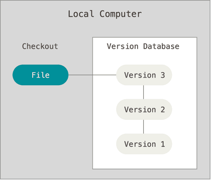
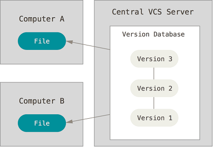
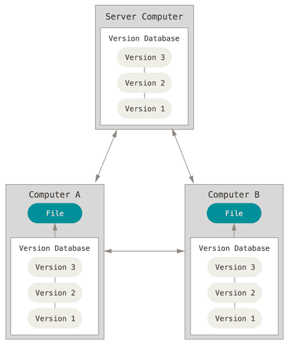
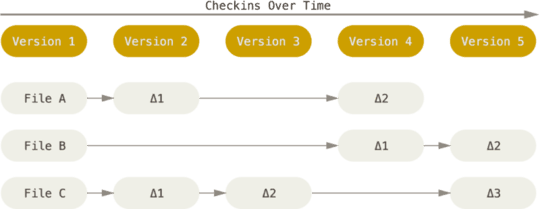
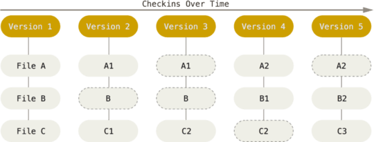
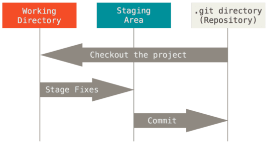

## 一、三类版本控制系统

### 1、本地版本控制系统

1）机制：通过数据库记录文件历次更新的差异，差异以补丁的形式记录对应文件修订前后的内容变化。

2）不足：不支持多开发者协同工作。

3）典型软件：rcs。

### 2、集中化版本控制系统

1）机制：单一的集中管理的服务器保存所有文件的修订版本，协同工作的人们通过客户端连到该服务器，取出最新的文件或提交更新。

2）不足：中央服务器的单点故障可能导致数据丢失。

3）典型软件：CVS，Subversion，Perforce等。

### 3、分布式版本控制系统

1）机制：每个客户端都拥有独立且完整的版本仓库，且客户端地位相等（类似P2P网络），它们之间可相互获取、推送更新。

2）优点：

* 消除集中版本控制系统的单点故障；
* 协作开发时，允许单个客户端在本地版本仓库独立提交更新，并在合适时推送给其他客户端或某个约定为中央仓库的客户端。

3）典型软件：Git，Mercurial，Bazaar，Darcs等。

## 二、Git基础

### 1、Git优势

* 速度
* 简单的设计
* 对非线性开发模式的强力支持（允许上千个并行开发分支）
* 完全分布式
* 有能力高效管理类似Linux内核一样的超大规模项目（速度和数据量）
### 2、Git特性
#### 1）保存快照，而非差异

* Git关心文件整体内容的变化，而大多数其他系统则关心文件内容的差异。
* 此特性为多分支并行开发提供了支持。

#### 2）几乎所有操作都是本地操作

* 速度快
* 客户端离线时也可进行更新操作

#### 3）时刻保持数据完整性

* 保存到Git之前，所有数据都要经过Hash运算，并将Hash值作为数据的唯一标识和索引，而非文件名。
* Git采用[SHA-1](https://baike.baidu.com/item/SHA-1/1699692?fr=aladdin)算法来生成文件或整个目录的杂凑值，并作为唯一标识。该算法输出160bit哈希值，即40个16进制字符（0-9及a-f）。类似`24b9da6552252987aa493b52f8696cd6d3b00373`。

#### 4）多数操作仅添加数据

* 保证历史版本的可回溯

#### 5）三种状态（`git status`命令当前状态）

> 原理：通过比较**相同文件名**所对应的**SHA-1值**是否相同，来判断文件是否更新。

I、已修改（modified）

* 状态：工作区的文件已修改，还未暂存。
* 系统通过比较**工作区**和**暂存区**（对应.git/index）内相同文件名的文件的SHA-1值，来判定文件是否更新。
* 用户可通过`git diff`命令查看工作区和暂存区内容的具体差异。

II、已暂存（staged）

* 状态：工作区修改的文件已保存至暂存区，但还未提交。
* 系统通过比较**暂存区**（对应.git/index）和**Git仓库**（对应.git/HEAD）内相同文件名的文件的SHA-1值，来判定文件是否更新。
* 用户可通过`git diff --cached`命令查看暂存区和Git仓库的具体内容差异。

III、已提交（committed）

* 状态：暂存区的文件已提交至版本库。
* 系统通过比较**暂存区**和**Git仓库**内相同文件名的文件的SHA-1值，来判定文件是否更新。（同上）

#### 6）单向性

I、当差异发生时提示**已修改，已暂存，已提交**三种状态，这暗示了Git中更新并提交文件的单向性，**工作区 → 暂存区 → Git目录**。

II、Git中的版本回退命令`git reset`和`git revert`在各自不同参数下的执行结果都满足工作区的版本**不旧于**暂存区，暂存区的版本**不旧于**Git目录。

Note：`git reset`和`git revert`命令在**提交层面**上实现回退的思路不同，前者做**减法**（适合在私有分支上回退），而后者做**加法**（适合在公共分支上回退）。

III、本质上讲：

* git不关心文件新旧，只关心文件是否相同（通过相同文件名的SHA-1值判断）。
     * 若相同，直接引用已有文件的SHA-1值，Git仓库内也只会保留一份文件；
     * 若不同，则引用更新后文件的SHA-1值，Git仓库会保有不同版本的文件。

* 约定更新和提交是单向的。

Note：`git add`命令后，**新增或更新的文件**会以blob对象（blob、tree、commit、tag四大对象之一）的形式**首次进入**./git/objects目录。

## #、参考文章

1. [代码回滚：git reset、git checkout和git revert区别和联系](http://www.cnblogs.com/houpeiyong/p/5890748.html)
2. [GIT科普系列3：底层存储机制Internal Objects](http://blog.csdn.net/zssureqh/article/details/52136946)
3. [Git 内部原理 - Git 对象](https://git-scm.com/book/zh/v2/Git-%E5%86%85%E9%83%A8%E5%8E%9F%E7%90%86-Git-%E5%AF%B9%E8%B1%A1)
4. [Diff程序的原理](http://blog.csdn.net/wishfly/article/details/2043180)
5. [https://en.wikipedia.org/wiki/Git](https://en.wikipedia.org/wiki/Git)