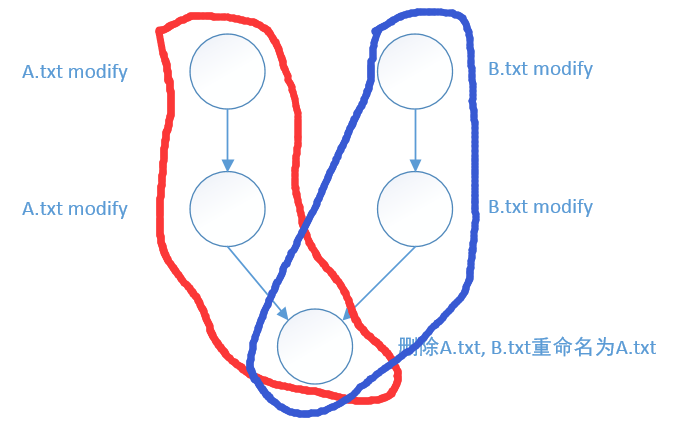
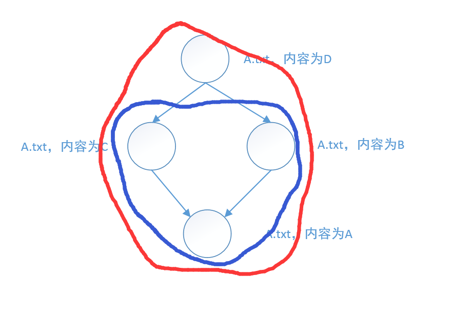
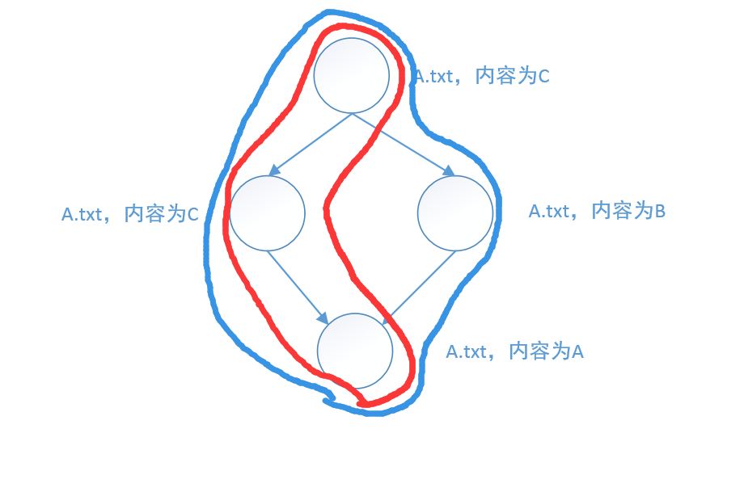

<!-- date: 2018.07.17 09:24 -->

## 一、查看文件每行修改人

> 当文件中的某行被别人修改后，可通过该命令查看

`git blame file`

## 二、查看文件变更记录

<!-- date: 2019.05.08 14:08 -->

### 1、git log

```shell
git log --all file/directory
git log --graph --all file/directory
```

注意：当文件或目录被别人删除时，需要先在工作区间`重新创建该文件或目录`。因为git log后指定的文件必须在工作区存在, 否则会报错。最好加上`--all`选项来显示所有分支的修改历史；否则只会显示当前分支的修改，可能会因缺少相应信息导致难以理解。


### 2、git log --follow

> 针对有过rename操作的文件，需要增加--follow才会返回rename前的历史

#### 1、命令解释

> `git help log`中这样解释--follow参数
> --follow:
>     Continue listing the history of a file beyond renames (**works only for a single file**).
> 
> `--follow`参数只针对文件有效，对目录无效。Git不会跟踪目录的rename操作。

#### 2、案例

```shell
git log A.txt   # 显示红色区域的提交
git log --follow A.txt  # 显示蓝色区域的提交
```

**案例一**



**案例二**



**案例三**



## 参考

1. [Is there a trick to git log --follow a directory which has been renamed? - Stack Overflow](https://stackoverflow.com/questions/38870925/is-there-a-trick-to-git-log-follow-a-directory-which-has-been-renamed)
2. [How to git log with renamed files - makandra dev](https://makandracards.com/makandra/498904-how-to-git-log-with-renamed-files)