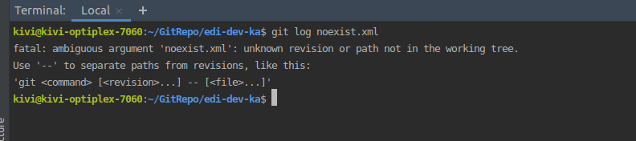

## 一、查看某个文件/目录的提交记录
`git log --all file/directory`
`git log --graph --all file/directory`

###### 注意：
1、当文件或目录被别人删除时，需要先在工作区间`重新创建该文件或目录`。因为git log后指定的文件必须在工作区存在, 否则会报错。

2、最好加上`--all`选项来显示所有分支的修改历史；否则只会显示当前分支的修改，可能会因缺少相应信息导致难以理解。

## 二、查看某文件的每行修改人

> 当文件中的某行被别人修改后，可通过该命令查看

`git blame file`

## 三、查看某次提交的文件
`git show commit --state`