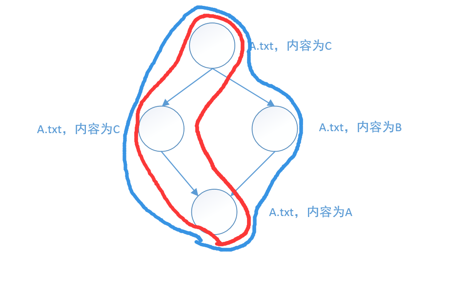

## 一、命令解释

> `git help log`中这样解释--follow参数
> --follow:
>     Continue listing the history of a file beyond renames (**works only for a single file**).

## 二、注意点

`--follow`参数只针对文件有效，对目录无效。Git不会跟踪目录的rename操作。

参考：

1. https://stackoverflow.com/questions/38870925/is-there-a-trick-to-git-log-follow-a-directory-which-has-been-renamed
2. https://makandracards.com/makandra/498904-how-to-git-log-with-renamed-files

## 三、案例

```
git log A.txt   # 显示红色区域的提交
git log --follow A.txt  # 显示蓝色区域的提交
```

#### 案例一


#### 案例二


#### 案例三

