## 一、前言

* Git使用比较灵活，达到相同结果有多种方式。
* 靠记忆不同场景下的命令组合，会停留在“知其然，不知其所以然”的层次。
* 只有理解Git内部原理和Git命令的底层操作，才能深入浅出的灵活运用Git。
## 二、Git内部原理

> Git是由C语言开发的一套内容寻址文件系统，并在此之上提供了一个VCS用户界面。
### 1、Git目录结构
使用`git init`命令初始化当前目录，生成**.git**文件夹。

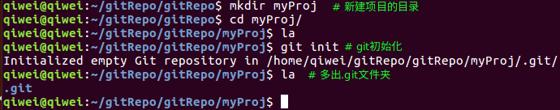

1）工作区、暂存区和Git仓库

* 工作区是当前目录（除去.git/），所有的编辑操作都在该目录进行。
* 暂存区对应.git/index文件，它包含了当前暂存区的信息，由它可生成git的tree对象。（`git init`执行后并没有产生.git/index，而是在首次执行`git add`命令后才生成，并把由更新文件生成的blob对象放入**.git/objects/**内。）

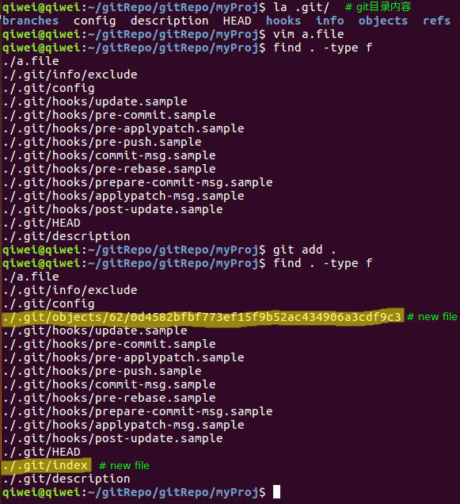

* git仓库对应.git/，它存储了项目的所有历史快照，以供需要的时候使用。

2）.git/目录
.git/包含了以下目录和文件：

 * ~~branches/：新版本不再使用~~
 * description：仅供GitWeb程序使用
 * config：当前项目的配置选项
 * info/：不同于.gitignore文件，可配置本地的文件忽略模式，不会push到remote库而影响其他人。
 * hooks/：目录存放钩子脚本
 * objects/：目录存储所有数据内容
 * refs/：目录存储指向数据的commit对象的指针
 * HEAD：文件内容为当前分支
 * index：文件内容为暂存区的信息

### 2、Git命令
Git包含底层命令（Plumbing）和高层命令（Procelain）。

1）用户平时使用的Git命令一般为高层命令，如add、commit、checkout等；高层命令对用户友好，便于理解和操作。

2）Git起初被设计为供VCS使用的工具集，这些工具也称为底层命令；底层命令一般不被用户直接使用，而是被shell或脚本调用。

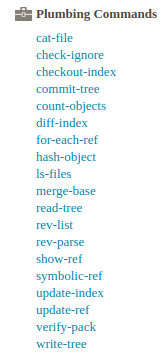

此处列举几个底层命令简要说明：

 * checkout-index：Copy files from the index to the working tree.
 * cat-file：Provide content or type and size information for repository objects.
 * hash-object：Compute object ID and optionally creates a blob from a file.
 * update-index：Register file contents in the working tree to the index.
 * write-tree：Create a tree object from the current index.
 * commit-tree：Create a new commit object.

### 3、Git对象
Git定义了4种对象：blob、tree、commit和tag，它们都位于**.git/objects/**目录下。git对象在原文件的基础上增加了一个头部，即`对象内容 = 对象头 + 文件内容`。这种格式无法直接通过`cat`命令读取，需要使用`git cat-file`这个底层命令才能正确读取。

对象头的格式为：`对象头 = 对象类型 + 空格 + 数据内容长度 + null byte`，例如一个文件内容为“hello world”，其blob对象头为"blob 11\000"。

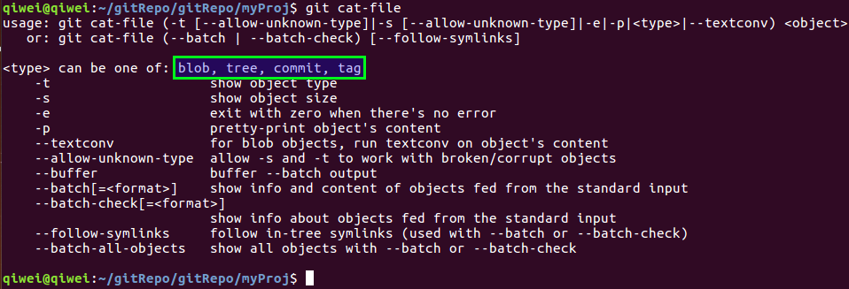

* blob：工作区的文件以blob对象的形式进入git仓库，相当于UNIX中的inodes或文件内容。
* tree：tree对象包含对blob对象以及其他tree对象的引用，相当于UNIX中的目录。
* commit：包含了上一次commit对象的Hash串引用、该时间点项目快照的顶层tree对象的Hash串引用、作者/提交者信息、时间戳、空行，以及提交的注释信息。

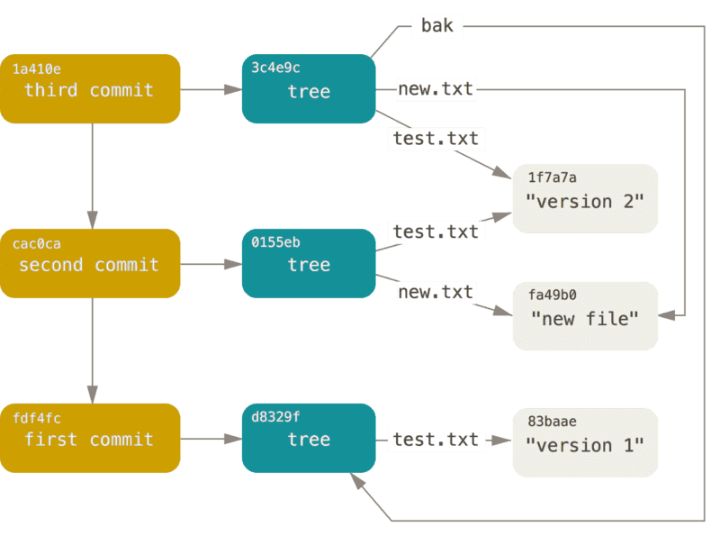

* tag：包含一个commit的Hash串引用、标签名，以及其他信息（由标签类型决定）。
### 4、内容寻址

1）依赖底层命令`git hash-object`命令，对文件内容增加头信息后计算hash值并返回，增加`-w`参数后在git仓库内创建blob对象（**blob对象 = 对象头 + 文件内容**）。

2）blob对象存储到git仓库目录（.git/objects/）时，依据40位（16进制字符）长度的hash串指定存储目录（hash串前2位）和命名文件（hash串后38位）。

例如某blob对象的hash值为`62/0d4582bfbf773ef15f9b52ac434906a3cdf9c3`，那么它在git仓库中的路径为`.git/objects/62/0d4582bfbf773ef15f9b52ac434906a3cdf9c3`。

3）Git内容寻址本质是：Git根据由文件内容（增加文件头）产生的Hash值来标识和索引文件，另外进行命令操作时没有必要写完整的hash串，只要输入的hash串长度是唯一可识别和索引的即可。

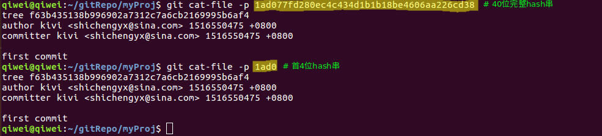

4）无需考虑Hash碰撞的情况，在大型项目上也可以放心使用Git。因为在概率上SHA-1产生的哈希值碰撞的机会可以小到忽略。

### 5、Git版本机制

1）HEAD指向当前分支。若master是当前分支，则HEAD文件内容为`ref: refs/heads/master`。

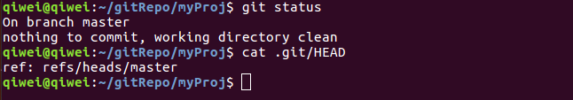

2）分支（本地分支、远程分支、远程跟踪分支、跟踪分支）和标签（tag对象）都包含了对commit对象的引用。

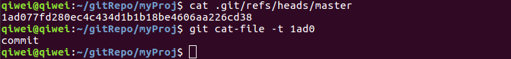

3）commit对象包含了上次commit对象的引用（类似单链表）和本次提交的顶级tree对象的引用。

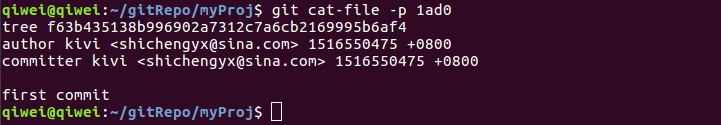

* 每个顶级tree对象可看做是一个完整的版本。
* 通过commit对象的链式结构进行串联，形成提交历史和版本历史。

4）总之：git的分支和标签通过引用commit对象来标注当前分支的版本信息。

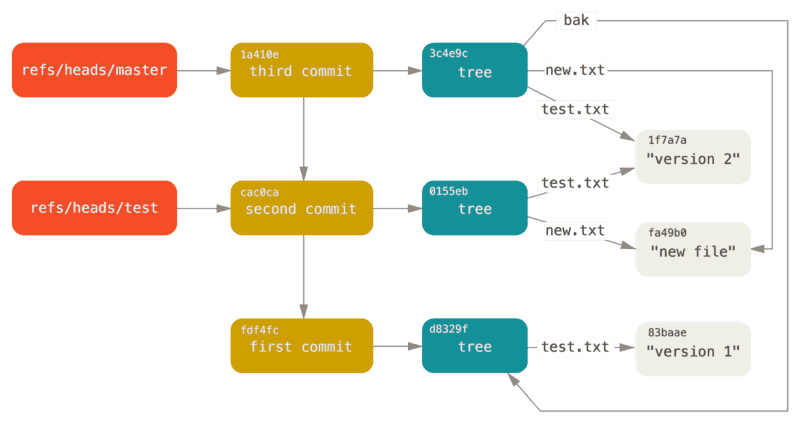

Note：凡是对Git对象的引用，都指的是Git对象的40位长度的Hash串。

### 6、引用规格（refspec）
引用规格指的是远程仓库分支和本地分支的映射，可表示为`<src>:<dst>`，这也暗示了数据流向为`src →
 dst`。

1）fetch和push命令

```shell
# 两命令都包含引用规格（refspec）来指定数据流向。
git fetch [remote repository] [remote branch]:[local branch]
git push [remote repository] [local branch]:[remote branch]
```
2）config文件配置refspec

当使用缺省的fetch/push命令时，Git会根据.git/config中的refspec配置进行操作。

I、当通过`git remote add`命令添加一个远程分支的同时，会在.git/config文件中添加一个配置结点。

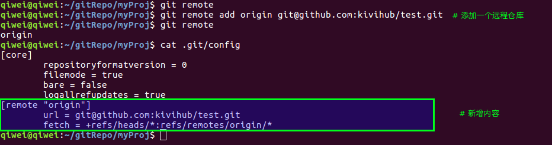

fetch中的”+“是可选的，它告诉Git在不能fast-forward的情况下，也强制去更新它。此后执行`git fetch orgin`这个缺省命令时，会拉取origin远程仓库的所有分支。

II、可通过`git log origin/master`来查看从远程仓库fetch的master分支。

```shell
# 以下三个命令是等价的，Git会把他们都扩展为refs/remote/origin/master
git log origin/master
git log remote/origin/master
git log refs/remote/origin/master
```
III、refspec指定分支映射

* 可通过改写fetch行为`fetch = +refs/heads/master:refs/remotes/origin/mymaster`，指定把远程的master分支映射为本地的origin/mymaster分支。
* 也可指定多个映射，一次拉取多个指定分支。

```properties
[remote "origin"]
      url = git@github.com:kivihub/test.git
      fetch = +refs/heads/master:refs/remotes/origin/master
      fetch = +refs/heads/experiment:refs/remotes/origin/experiment
      fetch = +refs/heads/qa/*:refs/remote/orgin/qa/*
```
* 可同时指定push的refspec。若要把本地的master分支push到远程的qa/master分支，可配置如下：

```properties
[remote "origin"]
      url = git@github.com:kivihub/test.git
      fetch = +refs/heads/master:refs/remotes/origin/master
      fetch = +refs/heads/experiment:refs/remotes/origin/experiment
      fetch = +refs/heads/qa/*:refs/remote/orgin/qa/*
      push = refs/heads/master:refs/heads/qa/master 
```
IV、删除远程分支
通过命令`git push origin :master`可以删除远程origin库的master分支。因为refspec的格式为<src>:<dst>，通过把<src>置空表示把远程分支变为空，也就是删除它。

### 7、其他
`git gc`垃圾回收命令用于压缩或删除数据，节省磁盘空间。

* 将松散对象进行打包存入packfile。
* 将不被任何commit引用并且已存在一段时间（数月）的对象删除。

## 参考
1.  [GIT科普系列5：index in git](http://blog.csdn.net/zssureqh/article/details/53056095) 
2. 《Pro Git》相关章节内容
   1. [Git 内部原理 - 底层命令和高层命令](https://git-scm.com/book/zh/v2/Git-%E5%86%85%E9%83%A8%E5%8E%9F%E7%90%86-%E5%BA%95%E5%B1%82%E5%91%BD%E4%BB%A4%E5%92%8C%E9%AB%98%E5%B1%82%E5%91%BD%E4%BB%A4)
   2. [Git 内部原理 - Git 对象](https://git-scm.com/book/zh/v2/Git-%E5%86%85%E9%83%A8%E5%8E%9F%E7%90%86-Git-%E5%AF%B9%E8%B1%A1)
   3. [Git 内部原理 - Git 引用](https://git-scm.com/book/zh/v2/Git-%E5%86%85%E9%83%A8%E5%8E%9F%E7%90%86-Git-%E5%BC%95%E7%94%A8)
   4. [Git 内部原理 - 包文件](https://git-scm.com/book/zh/v2/Git-%E5%86%85%E9%83%A8%E5%8E%9F%E7%90%86-%E5%8C%85%E6%96%87%E4%BB%B6)
   5. [Git 内部原理 - 引用规格](https://git-scm.com/book/zh/v2/Git-%E5%86%85%E9%83%A8%E5%8E%9F%E7%90%86-%E5%BC%95%E7%94%A8%E8%A7%84%E6%A0%BC)
   6. [Git 内部原理 - 传输协议](https://git-scm.com/book/zh/v2/Git-%E5%86%85%E9%83%A8%E5%8E%9F%E7%90%86-%E4%BC%A0%E8%BE%93%E5%8D%8F%E8%AE%AE)
   7. [Git 内部原理 - 维护与数据恢复](https://git-scm.com/book/zh/v2/Git-%E5%86%85%E9%83%A8%E5%8E%9F%E7%90%86-%E7%BB%B4%E6%8A%A4%E4%B8%8E%E6%95%B0%E6%8D%AE%E6%81%A2%E5%A4%8D)
   8. [Git 内部原理 - 环境变量](https://git-scm.com/book/zh/v2/Git-%E5%86%85%E9%83%A8%E5%8E%9F%E7%90%86-%E7%8E%AF%E5%A2%83%E5%8F%98%E9%87%8F)
3.  [Git命令列表](https://git-scm.com/docs)
4.  [.gitignore和exclude](http://blog.csdn.net/vic___/article/details/9446729)