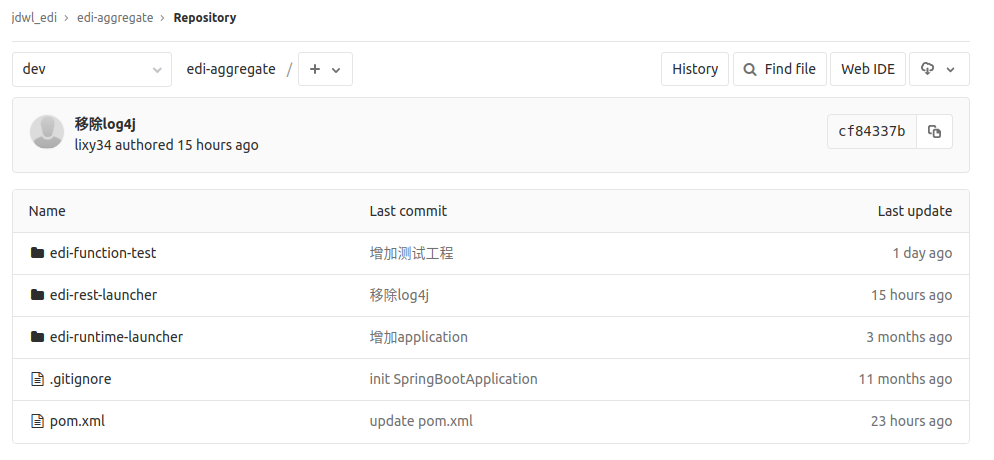
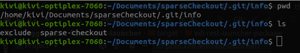

假如我本地只想检出edi-rest-launcher，则可进行如下配置：

一、配置.git/config，增加`sparsecheckout = true`

```properties
[core]                                                                                                
        repositoryformatversion = 0 
        filemode = true
        bare = false
        logallrefupdates = true
        sparsecheckout = true
[remote "origin"]
        url = git@git.jd.com:jdwl_edi/edi-aggregate.git
        fetch = +refs/heads/*:refs/remotes/origin/*
[branch "master"]
        remote = origin
        merge = refs/heads/master
[branch "dev"]
        remote = origin
        merge = refs/heads/dev

```
二、配置.git/info/sparse-checkout




```
edi-rest-launcher 
```

