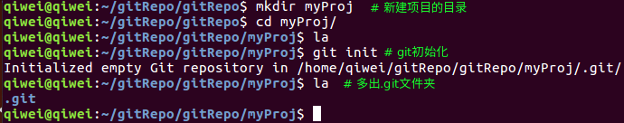
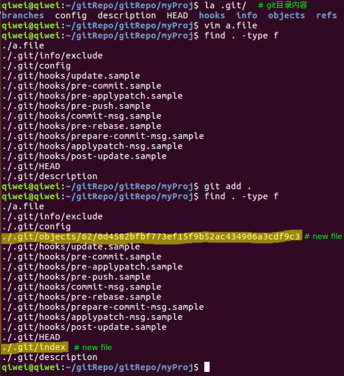
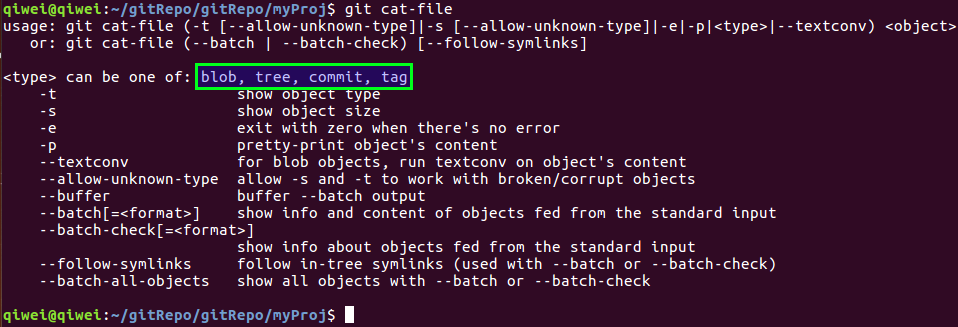
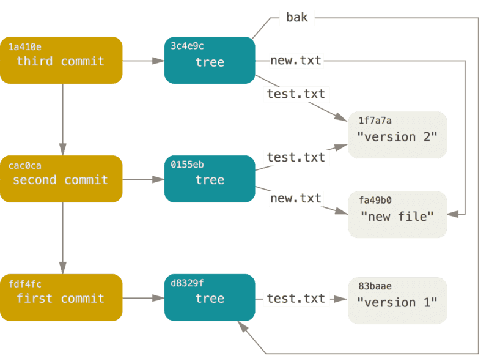

<!-- date: 2018.01.18 22:40 -->

> Git是由C语言开发的一套内容寻址文件系统，并在此之上提供了一个VCS用户界面。

## 一、前言

* Git使用比较灵活，达到相同结果有多种方式。
* 靠记忆不同场景下的命令组合，会停留在“知其然，不知其所以然”的层次。
* 只有理解Git内部原理和Git命令的底层操作，才能深入浅出的灵活运用Git。

## 二、Git目录结构

使用`git init`命令初始化当前目录，生成 **.git/** 文件夹。



### 1、工作区、暂存区和Git仓库

* 工作区是当前目录（除去.git/），所有的编辑操作都在该目录进行。
* 暂存区对应.git/index文件，它包含了当前暂存区的信息，由它可生成git的tree对象。（`git init`执行后并没有产生.git/index，而是在首次执行`git add`命令后才生成，并把由更新文件生成的blob对象放入**.git/objects/**内。）



* git仓库对应.git/，它存储了项目的所有历史快照，以供需要的时候使用。

### 2、.git目录

.git/包含了以下目录和文件：

* ~~branches/：新版本不再使用~~
* description：仅供GitWeb程序使用
* config：当前项目的配置选项
* info/：不同于.gitignore文件，可配置本地的文件忽略模式，不会push到remote库而影响其他人。
* hooks/：目录存放钩子脚本
* objects/：目录存储所有数据内容
* refs/：目录存储指向数据的commit对象的指针
* HEAD：文件内容为当前分支
* index：文件内容为暂存区的信息

### 3、index文件

<!-- date: 2020.08.19 10:59 -->

> .git/index里存储的是暂存区内容，暂存的内容都会进入仓库，不会丢失（短时间内）。

#### 1）查看index内容

1. `git ls-files --stage`
   
   ```text
   100644 a65bf3836e0169b1cb49a8c051141652601e80b7 0    .gitignore
   100644 99cd02507010eff1a8a3f813c16af5b83a32a9fd 0    README.md
   100644 ba0a399d89da367d5a06fe4a882fddbed1e96ad2 0    pom.xml
   100644 39138cf9e31fe22fab671a63bee972c29a5c1580 0    src/main/java/com/jd/edi/test/jsf/RpcUtil.java
   100644 75808965f4c184b2f77966391254c08d3c64f287 0    src/main/resources/log4j2.xml
   100644 18d6d3f536df2686339624d4ec7ba4c1fa3e73fa 0    src/test/java/com/jd/edi/test/log/DubboTest.java
   100644 eee242e578dcbc8e0347c06c587a4bc37057dc33 0    src/test/java/com/jd/edi/test/log/JsfTest.java
   100644 d5117d32b38f39656de1eac6597e648329bcf47d 0    src/test/resources/dubbo/DTC.zip
   100644 f07cb32715bbe1695c6f5d2e6ae5dcbd04f09e4d 0    src/test/resources/dubbo/dubbo.properties
   100644 5a4eb082c444ff0be9b7f497fae28e23be49f4e0 0    src/test/resources/edi-ka-1.0.0-SNAPSHOT.zip
   ```

2. `hexdump -e '16/1 "%02X " "  |  "' -e '16/1 "%_p" "\n"' index  > out.txt`
   
   ```text
   44 49 52 43 00 00 00 02 00 00 00 0B 5D D4 BE 49  |  DIRC........]..I
   22 46 99 3B 5D D4 BE 49 20 21 4A 60 00 00 08 01  |  "F.;]..I !J`....
   00 80 12 32 00 00 81 A4 00 00 03 E8 00 00 03 E8  |  ...2............
   00 00 00 15 A6 5B F3 83 6E 01 69 B1 CB 49 A8 C0  |  .....[..n.i..I..
   51 14 16 52 60 1E 80 B7 00 0A 2E 67 69 74 69 67  |  Q..R`......gitig
   6E 6F 72 65 00 00 00 00 00 00 00 00 5D D2 3C F7  |  nore........].<.
   22 A9 B3 FC 5D D2 3C F7 22 A9 B3 FC 00 00 08 01  |  "...].<.".......
   00 80 12 25 00 00 81 A4 00 00 03 E8 00 00 03 E8  |  ...%............
   00 00 00 0C 99 CD 02 50 70 10 EF F1 A8 A3 F8 13  |  .......Pp.......
   C1 6A F5 B8 3A 32 A9 FD 00 09 52 45 41 44 4D 45  |  .j..:2....README
   2E 6D 64 00 5F 23 F9 3D 14 62 2F 77 5F 23 F9 3D  |  .md._#.=.b/w_#.=
   11 85 C5 BE 00 00 08 01 00 80 11 6F 00 00 81 A4  |  ...........o....
   00 00 03 E8 00 00 03 E8 00 00 11 33 E4 6C 63 C0  |  ...........3.lc.
   55 B9 86 E9 64 87 C5 0F 02 E5 34 11 9B D1 E8 FF  |  U...d.....4.....
   00 07 70 6F 6D 2E 78 6D 6C 00 00 00 5F 23 F4 29  |  ..pom.xml..._#.)
   09 38 20 93 5F 23 F4 29 05 A4 9C F2 00 00 08 01  |  .8 ._#.)........
   00 98 0B 4D 00 00 81 A4 00 00 03 E8 00 00 03 E8  |  ...M............
   00 00 05 4A DD B2 E8 32 F1 CF 37 51 02 B9 51 2F  |  ...J...2..7Q..Q/
   7E 1C 3D 30 AB D4 D5 E7 00 2B 73 72 63 2F 6D 61  |  ~.=0.....+src/ma
   69 6E 2F 6A 61 76 61 2F 63 6F 6D 2F 6A 64 2F 65  |  in/java/com/jd/e
   64 69 2F 74 65 73 74 2F 6A 73 66 2F 4D 61 69 6E  |  di/test/jsf/Main
   2E 6A 61 76 61 00 00 00 00 00 00 00 5E C7 49 0D  |  .java.......^.I.
   05 6A B2 B6 5E C7 49 0D 05 6A B2 B6 00 00 08 01  |  .j..^.I..j......
   00 98 07 E4 00 00 81 A4 00 00 03 E8 00 00 03 E8  |  ................
   00 00 03 06 39 13 8C F9 E3 1F E2 2F AB 67 1A 63  |  ....9....../.g.c
   BE E9 72 C2 9A 5C 15 80 00 2E 73 72 63 2F 6D 61  |  ..r..\....src/ma
   69 6E 2F 6A 61 76 61 2F 63 6F 6D 2F 6A 64 2F 65  |  in/java/com/jd/e
   64 69 2F 74 65 73 74 2F 6A 73 66 2F 52 70 63 55  |  di/test/jsf/RpcU
   74 69 6C 2E 6A 61 76 61 00 00 00 00 5D D4 B4 2E  |  til.java....]...
   33 40 3A 5F 5D D4 B4 2E 31 1A EA 8A 00 00 08 01  |  3@:_]...1.......
   00 98 07 38 00 00 81 A4 00 00 03 E8 00 00 03 E8  |  ...8............
   00 00 06 CB 75 80 89 65 F4 C1 84 B2 F7 79 66 39  |  ....u..e.....yf9
   12 54 C0 8D 3C 64 F2 87 00 1D 73 72 63 2F 6D 61  |  .T..<d....src/ma
   69 6E 2F 72 65 73 6F 75 72 63 65 73 2F 6C 6F 67  |  in/resources/log
   34 6A 32 2E 78 6D 6C 00 00 00 00 00 5E C7 49 0D  |  4j2.xml.....^.I.
   05 6A B2 B6 5E C7 49 0D 05 6A B2 B6 00 00 08 01  |  .j..^.I..j......
   00 B6 06 02 00 00 81 A4 00 00 03 E8 00 00 03 E8  |  ................
   00 00 06 2D 18 D6 D3 F5 36 DF 26 86 33 96 24 D4  |  ...-....6.&.3.$.
   EC 7B A4 C1 FA 3E 73 FA 00 30 73 72 63 2F 74 65  |  .{...>s..0src/te
   73 74 2F 6A 61 76 61 2F 63 6F 6D 2F 6A 64 2F 65  |  st/java/com/jd/e
   64 69 2F 74 65 73 74 2F 6C 6F 67 2F 44 75 62 62  |  di/test/log/Dubb
   6F 54 65 73 74 2E 6A 61 76 61 00 00 5F 27 AA 90  |  oTest.java.._'..
   0D 56 22 13 5F 27 AA 90 09 FF A8 76 00 00 08 01  |  .V"._'.....v....
   00 B6 0F B3 00 00 81 A4 00 00 03 E8 00 00 03 E8  |  ................
   00 00 51 50 D0 7D 1E 76 95 F5 EA 98 87 14 69 C9  |  ..QP.}.v......i.
   35 FE E2 D8 70 86 19 1E 00 2E 73 72 63 2F 74 65  |  5...p.....src/te
   73 74 2F 6A 61 76 61 2F 63 6F 6D 2F 6A 64 2F 65  |  st/java/com/jd/e
   64 69 2F 74 65 73 74 2F 6C 6F 67 2F 4A 73 66 54  |  di/test/log/JsfT
   65 73 74 2E 6A 61 76 61 00 00 00 00 5E C7 49 0D  |  est.java....^.I.
   05 6A B2 B6 5E C7 49 0D 05 6A B2 B6 00 00 08 01  |  .j..^.I..j......
   00 C8 0E 96 00 00 81 A4 00 00 03 E8 00 00 03 E8  |  ................
   00 00 0E A2 D5 11 7D 32 B3 8F 39 65 6D E1 EA C6  |  ......}2..9em...
   59 7E 64 83 29 BC F4 7D 00 20 73 72 63 2F 74 65  |  Y~d.)..}. src/te
   73 74 2F 72 65 73 6F 75 72 63 65 73 2F 64 75 62  |  st/resources/dub
   62 6F 2F 44 54 43 2E 7A 69 70 00 00 5E C7 49 0D  |  bo/DTC.zip..^.I.
   05 6A B2 B6 5E C7 49 0D 05 6A B2 B6 00 00 08 01  |  .j..^.I..j......
   00 C8 0E 97 00 00 81 A4 00 00 03 E8 00 00 03 E8  |  ................
   00 00 00 FF F0 7C B3 27 15 BB E1 69 5C 6F 5D 2E  |  .....|.'...i\o].
   6A E5 DC BD 04 F0 9E 4D 00 29 73 72 63 2F 74 65  |  j......M.)src/te
   73 74 2F 72 65 73 6F 75 72 63 65 73 2F 64 75 62  |  st/resources/dub
   62 6F 2F 64 75 62 62 6F 2E 70 72 6F 70 65 72 74  |  bo/dubbo.propert
   69 65 73 00 5D D7 A6 44 0F 4A 25 12 5D D7 A5 F6  |  ies.]..D.J%.]...
   20 E6 DA 00 00 00 08 01 00 C8 0B 60 00 00 81 A4  |   ..........`....
   00 00 03 E8 00 00 03 E8 00 29 4F 9C 5A 4E B0 82  |  .........)O.ZN..
   C4 44 FF 0B E9 B7 F4 97 FA E2 8E 23 BE 49 F4 E0  |  .D.........#.I..
   00 2C 73 72 63 2F 74 65 73 74 2F 72 65 73 6F 75  |  .,src/test/resou
   72 63 65 73 2F 65 64 69 2D 6B 61 2D 31 2E 30 2E  |  rces/edi-ka-1.0.
   30 2D 53 4E 41 50 53 48 4F 54 2E 7A 69 70 00 00  |  0-SNAPSHOT.zip..
   00 00 00 00 54 52 45 45 00 00 00 F3 00 2D 31 20  |  ....TREE.....-1 
   31 0A 73 72 63 00 2D 31 20 32 0A 6D 61 69 6E 00  |  1.src.-1 2.main.
   2D 31 20 32 0A 6A 61 76 61 00 2D 31 20 31 0A 63  |  -1 2.java.-1 1.c
   6F 6D 00 2D 31 20 31 0A 6A 64 00 2D 31 20 31 0A  |  om.-1 1.jd.-1 1.
   65 64 69 00 2D 31 20 31 0A 74 65 73 74 00 2D 31  |  edi.-1 1.test.-1
   20 31 0A 6A 73 66 00 2D 31 20 30 0A 72 65 73 6F  |   1.jsf.-1 0.reso
   75 72 63 65 73 00 31 20 30 0A C3 B7 95 22 38 01  |  urces.1 0...."8.
   71 55 91 97 79 3D 4A 97 3B 21 B9 57 1E 53 74 65  |  qU..y=J.;!.W.Ste
   73 74 00 2D 31 20 32 0A 6A 61 76 61 00 2D 31 20  |  st.-1 2.java.-1 
   31 0A 63 6F 6D 00 2D 31 20 31 0A 6A 64 00 2D 31  |  1.com.-1 1.jd.-1
   20 31 0A 65 64 69 00 2D 31 20 31 0A 74 65 73 74  |   1.edi.-1 1.test
   00 2D 31 20 31 0A 6C 6F 67 00 2D 31 20 30 0A 72  |  .-1 1.log.-1 0.r
   65 73 6F 75 72 63 65 73 00 33 20 31 0A DA 51 E1  |  esources.3 1..Q.
   E1 F7 1B E3 6D FF C4 EA 5A 23 05 74 72 EA 7C 76  |  ....m...Z#.tr.|v
   97 64 75 62 62 6F 00 32 20 30 0A ED 23 F0 8E F3  |  .dubbo.2 0..#...
   10 DA 69 79 3B 26 1B 99 E6 81 B8 59 B5 1B 38 09  |  ..iy;&.....Y..8.
   58 52 E9 C5 2C 00 18 95 21 2B 6C 8C 58 FF 6D 16  |  XR..,...!+l.X.m.
   BA 82 A9                                         |  ...
   ```

#### 2）index格式

1. 该文件创建的时间，最后修改时间

2. inode信息，设备号和Innode号

3. 文件权限，例如：777

4. 文件的用户及用户组

5. 文件大小

6. `文件的blobId`

7. 文件的相对路径

## 三、Git命令

Git包含底层命令（Plumbing）和高层命令（Procelain）。

1）用户平时使用的Git命令一般为高层命令，如add、commit、checkout等；高层命令对用户友好，便于理解和操作。

2）Git起初被设计为供VCS使用的工具集，这些工具也称为底层命令；底层命令一般不被用户直接使用，而是被shell或脚本调用。


此处列举几个底层命令简要说明：

* checkout-index：Copy files from the index to the working tree.
* cat-file：Provide content or type and size information for repository objects.
* hash-object：Compute object ID and optionally creates a blob from a file.
* update-index：Register file contents in the working tree to the index.
* write-tree：Create a tree object from the current index.
* commit-tree：Create a new commit object.

## 四、Git对象

Git定义了4种对象：blob、tree、commit和tag，它们都位于**.git/objects/**目录下。git对象在原文件的基础上增加了一个头部，即`对象内容 = 对象头 + 文件内容`。这种格式无法直接通过`cat`命令读取，需要使用`git cat-file`这个底层命令才能正确读取。

对象头的格式为：`对象头 = 对象类型 + 空格 + 数据内容长度 + null byte`，例如一个文件内容为“hello world”，其blob对象头为"blob 11\000"。



* blob：工作区的文件以blob对象的形式进入git仓库，相当于UNIX中的inodes或文件内容。
* tree：tree对象包含对blob对象以及其他tree对象的引用，相当于UNIX中的目录。
* commit：包含了上一次commit对象的Hash串引用、该时间点项目快照的顶层tree对象的Hash串引用、作者/提交者信息、时间戳、空行，以及提交的注释信息。



* tag：包含一个commit的Hash串引用、标签名，以及其他信息（由标签类型决定）。

## 五、内容寻址

1）依赖底层命令`git hash-object`命令，对文件内容增加头信息后计算hash值并返回，增加`-w`参数后在git仓库内创建blob对象（**blob对象 = 对象头 + 文件内容**）。

2）blob对象存储到git仓库目录（.git/objects/）时，依据40位（16进制字符）长度的hash串指定存储目录（hash串前2位）和命名文件（hash串后38位）。

例如某blob对象的hash值为`62/0d4582bfbf773ef15f9b52ac434906a3cdf9c3`，那么它在git仓库中的路径为`.git/objects/62/0d4582bfbf773ef15f9b52ac434906a3cdf9c3`。

3）Git内容寻址本质是：Git根据由文件内容（增加文件头）产生的Hash值来标识和索引文件，另外进行命令操作时没有必要写完整的hash串，只要输入的hash串长度是唯一可识别和索引的即可。


4）无需考虑Hash碰撞的情况，在大型项目上也可以放心使用Git。因为在概率上SHA-1产生的哈希值碰撞的机会可以小到忽略。

## 六、hash碰撞

<!-- date: 2020.08.04 13:03 -->

1）hash碰撞后的原则

当出现冲突时，保留当前仓库已有的对象；

 2）冲突场景

| 已存在    | 新对象    | 结果                                    |
| ------ | ------ | ------------------------------------- |
| blob   | blob   | commit success, lost fail             |
| tree   | blob   | commit sucess, push fail              |
| commit | blob   | commit sucess, push fail              |
| blob   | commit | commit fail, when updating "ref"      |
| blob   | tree   | commit fail, when create commit       |
| tree   | commit | commit fail, when updating "ref"      |
| tree   | tree   | push success, reference to wrong tree |
| commit | commit | HEAD always point to old              |
| commit | tree   | commit fail, when create commit       |

## 七、Git版本机制

1）HEAD指向当前分支。若master是当前分支，则HEAD文件内容为`ref: refs/heads/master`。


2）分支（本地分支、远程分支、远程跟踪分支、跟踪分支）和标签（tag对象）都包含了对commit对象的引用。


3）commit对象包含了上次commit对象的引用（类似单链表）和本次提交的顶级tree对象的引用。


* 每个顶级tree对象可看做是一个完整的版本。
* 通过commit对象的链式结构进行串联，形成提交历史和版本历史。

4）总之：git的分支和标签通过引用commit对象来标注当前分支的版本信息。


Note：凡是对Git对象的引用，都指的是Git对象的40位长度的Hash串。

## 八、引用规格（refspec）

引用规格指的是远程仓库分支和本地分支的映射，可表示为`<src>:<dst>`，这也暗示了数据流向为`src →
 dst`。

### 1）fetch和push命令

```shell
# 两命令都包含引用规格（refspec）来指定数据流向。
git fetch [remote repository] [remote branch]:[local branch]
git push [remote repository] [local branch]:[remote branch]
```

### 2）config文件配置refspec

当使用缺省的fetch/push命令时，Git会根据.git/config中的refspec配置进行操作。

I、当通过`git remote add`命令添加一个远程分支的同时，会在.git/config文件中添加一个配置结点。


fetch中的”+“是可选的，它告诉Git在不能fast-forward的情况下，也强制去更新它。此后执行`git fetch orgin`这个缺省命令时，会拉取origin远程仓库的所有分支。

II、可通过`git log origin/master`来查看从远程仓库fetch的master分支。

```shell
# 以下三个命令是等价的，Git会把他们都扩展为refs/remote/origin/master
git log origin/master
git log remote/origin/master
git log refs/remote/origin/master
```

III、refspec指定分支映射

* 可通过改写fetch行为`fetch = +refs/heads/master:refs/remotes/origin/mymaster`，指定把远程的master分支映射为本地的origin/mymaster分支。
* 也可指定多个映射，一次拉取多个指定分支。

```properties
[remote "origin"]
      url = git@github.com:kivihub/test.git
      fetch = +refs/heads/master:refs/remotes/origin/master
      fetch = +refs/heads/experiment:refs/remotes/origin/experiment
      fetch = +refs/heads/qa/*:refs/remote/orgin/qa/*
```

* 可同时指定push的refspec。若要把本地的master分支push到远程的qa/master分支，可配置如下：

```properties
[remote "origin"]
      url = git@github.com:kivihub/test.git
      fetch = +refs/heads/master:refs/remotes/origin/master
      fetch = +refs/heads/experiment:refs/remotes/origin/experiment
      fetch = +refs/heads/qa/*:refs/remote/orgin/qa/*
      push = refs/heads/master:refs/heads/qa/master 
```

IV、删除远程分支
通过命令`git push origin :master`可以删除远程origin库的master分支。因为refspec的格式为<src>:<dst>，通过把<src>置空表示把远程分支变为空，也就是删除它。

## 九、垃圾回收

`git gc`垃圾回收命令用于压缩或删除数据，节省磁盘空间。

* 将松散对象进行打包存入packfile。
* 将不被任何commit引用并且已存在一段时间（数月）的对象删除。

## 参考

1. [GIT科普系列5：index in git](http://blog.csdn.net/zssureqh/article/details/53056095) 
2. 《Pro Git》相关章节内容
   1. [Git 内部原理 - 底层命令和高层命令](https://git-scm.com/book/zh/v2/Git-%E5%86%85%E9%83%A8%E5%8E%9F%E7%90%86-%E5%BA%95%E5%B1%82%E5%91%BD%E4%BB%A4%E5%92%8C%E9%AB%98%E5%B1%82%E5%91%BD%E4%BB%A4)
   2. [Git 内部原理 - Git 对象](https://git-scm.com/book/zh/v2/Git-%E5%86%85%E9%83%A8%E5%8E%9F%E7%90%86-Git-%E5%AF%B9%E8%B1%A1)
   3. [Git 内部原理 - Git 引用](https://git-scm.com/book/zh/v2/Git-%E5%86%85%E9%83%A8%E5%8E%9F%E7%90%86-Git-%E5%BC%95%E7%94%A8)
   4. [Git 内部原理 - 包文件](https://git-scm.com/book/zh/v2/Git-%E5%86%85%E9%83%A8%E5%8E%9F%E7%90%86-%E5%8C%85%E6%96%87%E4%BB%B6)
   5. [Git 内部原理 - 引用规格](https://git-scm.com/book/zh/v2/Git-%E5%86%85%E9%83%A8%E5%8E%9F%E7%90%86-%E5%BC%95%E7%94%A8%E8%A7%84%E6%A0%BC)
   6. [Git 内部原理 - 传输协议](https://git-scm.com/book/zh/v2/Git-%E5%86%85%E9%83%A8%E5%8E%9F%E7%90%86-%E4%BC%A0%E8%BE%93%E5%8D%8F%E8%AE%AE)
   7. [Git 内部原理 - 维护与数据恢复](https://git-scm.com/book/zh/v2/Git-%E5%86%85%E9%83%A8%E5%8E%9F%E7%90%86-%E7%BB%B4%E6%8A%A4%E4%B8%8E%E6%95%B0%E6%8D%AE%E6%81%A2%E5%A4%8D)
   8. [Git 内部原理 - 环境变量](https://git-scm.com/book/zh/v2/Git-%E5%86%85%E9%83%A8%E5%8E%9F%E7%90%86-%E7%8E%AF%E5%A2%83%E5%8F%98%E9%87%8F)
3. [Git命令列表](https://git-scm.com/docs)
4. [.gitignore和exclude](http://blog.csdn.net/vic___/article/details/9446729)
5. Hash碰撞
   1. [Linus reply: Starting to think about sha-256?](http://web.archive.org/web/20120701221418/http://kerneltrap.org/mailarchive/git/2006/8/28/211065)
   2. [https://stackoverflow.com/questions/9392365/how-would-git-handle-a-sha-1-collision-on-a-blob/34599081#34599081](https://stackoverflow.com/questions/9392365/how-would-git-handle-a-sha-1-collision-on-a-blob/34599081#34599081)