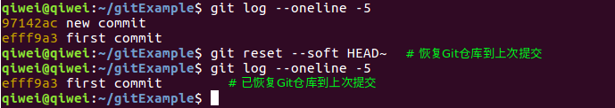
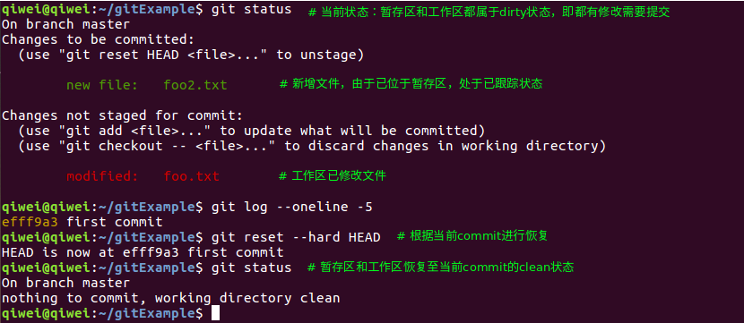

> 版本控制的关键是可撤销性，即可以使项目回退到某些操作之前状态。Git作为一款非常优秀的版本控制软件具备了丰富的撤销的命令来应对不同的场景，下面我们来学习一下。

## 一、修改最后一次提交

> 命令：`git commit --amend`
>
> 作用：本次提交覆盖上次提交，以此达到修改上次提交的目的。

### 1、修改直接提交


值得注意的是，两次提交的项目内容和提交人没有变化，但是由于提交的时间不同，导致commit对象的内容不同，因此产生内容的ID也不相同。

### 2、修改后再提交


## 二、reset、revert和checkout

Git使用reset、revert和checkout三个命令来回退项目到某一个历史快照。
回退有两个影响级别：

* commit级别：根据指定的commit来恢复项目整体到历史的某一快照。
* 文件级别：根据指定commit和文件路径来恢复指定文件到某一历史版本。
### 1、commit级别回退
#### 1）回退Git仓库
> 命令：`git reset --soft [commit]`
>
> 作用：把HEAD引用的当前分支的commit引用移动到指定commit，以此达到回退的目的。




重新根据reset命令撤销刚才的撤销操作（是不是有点绕口）


#### 2）回退Git仓库和暂存区

I、命令：`git reset [commit]`/`git reset --mixed [commit]`

II、作用：本命令会恢复Git仓库到指定commit，并根据指定commit清空覆盖暂存区（不会提示冲突，因为是强行覆盖）。

III、结果：

* 不在指定commit的文件树中的工作区的目录和文件会变成未跟踪状态；

* 与指定commit的文件树中的内容不同的文件会变成已修改状态，待加入暂存区。


#### 3）回退Git仓库、暂存区和工作区

I、**git reset**

* 命令：`git reset --hard [commit]`
* 作用：根据指定commit的文件树，覆盖git仓库和暂存区，清空工作区所有**已跟踪文件**然后以指定commit的内容代替。
* 结果：1）只有工作区内处于未跟踪状态的目录和文件会维持原来状态；2）其他文件都会与指定commit内容具有相同内容。




II、**git revert**

* 命令1：`git revert [commit]`  作用：打补丁的形式撤销某次历史版本；
* 命令2：`git revert -n [commit]..[commit]`   作用：撤销一个commit区间
* 原理：根据diff操作计算出指定commit与其之前commit的内容差异，针对该差异计算出反补丁，应用反补丁到当前git仓库、暂存区和工作区，并产生一次提交。
* 条件：1）保持暂存区clean状态；2）工作区不能有和revert补丁冲突的处于已修改状态的文件，例如不能修改同一行等。


#### 4）reset和revert的区别


git reset不会产生新的提交，只通过移动HEAD引用的分支指向的commit来恢复项目快照。


git revert不会影响已有历史，它会产生新的提交来撤销某次或一定范围的修改。


区别列表

| 命令   | git reset                  | git revert                       |
| ------ | -------------------------- | -------------------------------- |
| 原理   | 改变分支的commit的引用     | 对已有commit引用打反补丁         |
| 副作用 | 改变commit历史             | 不会改变commit历史               |
| 适用性 | 本地分支                   | 公共分支                         |
| 冲突   | 无冲突                     | 会有冲突                         |
| 优点   | 无冲突的恢复到某次历史快照 | 可针对中间的某次提交进行撤销操作 |
| 本质   | 覆盖操作                   | 修补操作                         |
### 2、文件级别回退

#### 1）回退暂存区文件

* 命令：`git reset [commit] [file]`，若是commit是`HEAD`可替换为`--`。
* 作用：根据指定commit，撤销暂存区指定文件的操作；
* 结果：若新增，则删除；若删除和修改，则恢复。
#### 2）回退工作区文件

* 命令1：`git checkout file`
* 作用：把**暂存区**文件检出到工作区；
* 命令2：`git chekcout [commit] [file]`，若是commit是`HEAD`可替换为`--`。
* 作用：根据指定commit，从git仓库检出指定文件到**暂存区**和**工作区**。
## 三、提交树

Git中每次提交都会存储在Git仓库，只是有些提交经过reset、删除分支、删除储藏等操作后不被分支和标签引用，变成悬挂状态（dangling）。我们可以通过以下命令查看这些提交（Git的提交树和vim的undo树异曲同工）。

### 1、完整提交树

* 命令：`git log -g`或`git reflog`来查看
* 作用：显示所有操作，包括撤销的。
### 2、有效提交树

* 命令：`git log`查看
* 作用：显示当前有效的操作

### 3、撤销的悬挂提交（dangling commit）

* 命令：`git fsck --lost-found`
* 作用：通过校验Git仓库的完整性（通过引用链），找出悬挂对象。
### 4、一图以蔽之


## 四、储藏和恢复

由于revert、分支合并等场景下的操作会与工作区和暂存区的内容产生冲突，若不想提交当前工作区和暂存区的修改内容，可以通过储藏命令将其储藏起来，然后在合适的时候恢复工作区和暂存区。

```shell
git stash       # 储藏当前工作区和暂存区
git stash list  # 查看当前的储藏列表
git stash apply # 恢复上一次的储藏内容
git stach pop   # 恢复上一次的储藏内容，并将其从储藏区删除
```
## 五、清除未跟踪文件

1）命令1：`git clean -f`   作用：删除未跟踪文件

2）命令2：`git clean -df`  作用：删除未跟踪文件和目录

3）一般与`git reset --hard`命令搭配使用。

```shell
git reset --hard commit  # 恢复git仓库、暂存区和工作区（不包含未跟踪内容）到指定commit
git clean -df # 删除当前处于未跟踪状态的文件和目录
git status # 当前处于commit，且暂存区和工作区都处于clean状态
```

## 参考

1. [代码回滚：git reset、git checkout和git revert区别和联系](http://www.cnblogs.com/houpeiyong/p/5890748.html)
2. [在 git 中找回丢失的 commit](http://cnodejs.org/topic/546e0512c4922d383a82970f)
3. [Git 工具 - 储藏（Stashing）](https://git-scm.com/book/zh/v1/Git-%E5%B7%A5%E5%85%B7-%E5%82%A8%E8%97%8F%EF%BC%88Stashing%EF%BC%89)
4. [Git的"～"和"^"的区别](https://stackoverflow.com/questions/2221658/whats-the-difference-between-head-and-head-in-git)