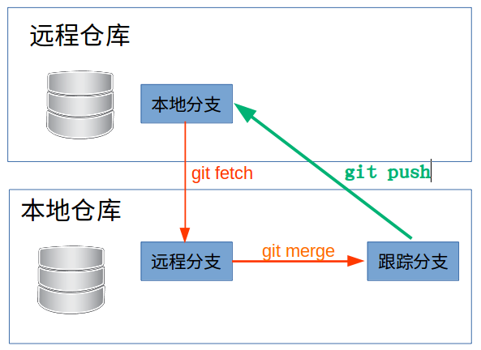
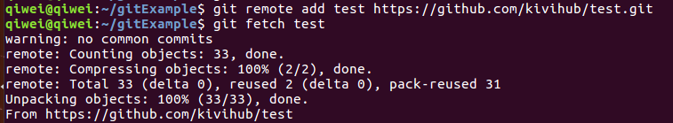
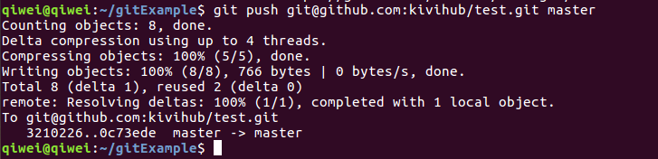

<!-- date: 2018.02.07 20:15 -->

> Git通过远程仓库的方式进行团队协作开发。
> 远程仓库是指托管到网络上的项目仓库，有权限的项目成员可通过拉取和推送操作来协同开发。

## 一、管理远程仓库

## 二、拉取（fetch/pull）和推送（push）

1、命令：`git fetch [repository] [remote-branch]:[local-branch]`

2、命令：`git pull`相当于`git fetch` + `git merge`。即先把远程分支fetch到本地，然后和当前分支合并（分支合并将在分支章节详细说明）。

3、命令：`git push [repository] [local-branch]:[remote-branch]`。

若执行：`git push origin master:master`，结果为：

1）更新远程origin仓库的refs/heads/master分支。

2）更新本地仓库的refs/remotes/origin/master分支。

