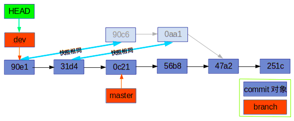

## 一、标签

> 标签是Git的对象，包含了对commit对象的引用；另外每个标签都会有一个标签相同名称的ref文件存储在`.git/refs/tags/`目录下，文件内容为Git对象的SHA值，此处有两种情况：
> 1）若为轻量级标签，Git不会真正建立tag对象，而由tag的ref文件直接引用commit的SHA值；
> 2）若为含有附注的标签，则Git会建立tag对象，tag对象包含commit的引用，而tag的ref文件则包含tag对象的引用。


### 1、查看标签

```shell
`git tag`                    # 查看全部标签，按字母序排列 
`git tag -l 'expression'`    # 查看符合条件的标签
`git show <object>`          # 显示Git四种对象的具体信息
```


### 2、管理标签

#### 1）新建轻量级标签

```shell
# 新建轻量级标签，可指定Git对象创建标签，若不指定默认为HEAD。
git tag tagname  [commit|object]    
```


#### 2）新建含附注的标签

```shell
# 新建含附注标签，可指定Git对象创建标签，若不指定默认为HEAD。
git tag -a tagname -m ‘tag message’ [commit|object]    
```

#### 3）轻量级标签和含附注标签的区别

I、轻量级标签不含打标签人、打标签时间、message等信息

II、轻量级标签并没有真正建立git的tag对象，它只是在.git/refs/tags/目录下创建了一个tag名字的ref文件，文件内容为tag指向的commit引用。


#### 4）分享标签

```shell
git push [remote-branch] tagName # 把标签推送至指定远程分支
git push [remote-branch] --tags  # 把所有分支推送至指定远程分支
git push [remote-branch] :refs/tags/tagName  # 删除远程分支指定标签

# 默认情况下，git push不会把标签传送到远程服务器
```

> 标签除轻量级标签和含附注的标签外，还有签署标签。若持有签署者的公钥则可以通过验证操作来验证。

## 二、分支

> 分支不是Git对象，它只是包含git的commit对象引用的常规文件，一般保存在.git/refs/heads/和.git/refs/remotes/两个目录，前者是本地分支，后者是远程分支。

### 1、分支概念和原理

1）首先回顾下Git的四个对象blob、tree、commit和tag。

I、blob对象：对应工作区的文件，按Git定义的格式存储了文件内容，blob索引为其内容的SHA值；

II、tree对象：对应工作区的目录，可含有子目录和文件。tree对象的内容为其包含文件名和文件对应的blob的SHA值（或其子目录名称和对应的tree对象的SHA值），tree索引为其内容的SHA值；

III、commit对象：包含顶级树（即工作区根目录）的SHA值引用和提交信息，其索引为其内容的SHA值；

IV、tag对象：包含了特定commit对象的索引，也称引用，若是含附注的tag还包含打标签的信息，例如标签人、标签时间和message等。

2）分支和轻量级tag类似，只包含了commit对象的索引。

|     | 相同点          | 不同点                   |
| --- | ------------ | --------------------- |
| 分支  | 含commit对象的索引 | 分支更新后，分支替换为新的commit索引 |
| 标签  | 含commit对象的索引 | 创建后内容不再变化             |

3）分支是包含commit索引的常规文件，存储在`.git/refs/heads/`目录和`.git/refs/remotes/`目录下。

4）HEAD是一个具有特殊意义的常规文件，内容为当前分支。例如当前分支为master，那么HEAD文件内容为`ref: refs/heads/master`。

5）情景例子

I、假设当前有两个分支master和dev，现在HEAD指向master分支（即master是当前分支），如下图所示。

II、当前分支（master分支）进行一次提交后，如下图所示。

III、执行`git checkout dev`切换分支，结果如图。

### 2、分支命令

> 假设当前HEAD指向唯一的分支master，且当前有两个提交，如下图所示。


#### 1）查看分支

```shell
git branch -l # 查看本地分支
git branch    # 查看本地分支的缺省命令
git branch -r # 查看远程分支
git branch -a # 查看所有分支
其他参数：
-v  # 显示分支的最后一次提交信息
```

#### 2）创建并检出分支

```shell
git checkout -b dev # 创建并检出dev分支
等同于下面两条命令
git branch dev     # 创建dev分支
git checkout dev   # 检出dev分支/切换至dev分支
```


#### 3）切换分支

> git checkout master


#### 4）合并分支

经过一系列提交后，git空间状态如下图所示。

##### I、No FF(非快进)/merge commit(合并提交)

当前分支为master分支，dev分支和master分支在`47a2`提交处发生分离。此时若执行合并操作，则会进行合并提交，也称No FF提交。

> git merge dev

merge commit的执行步骤如下：

a、git首先会对要合并的两个分支的末端的提交和它们的分离处（共同祖先）的提交进行一次简单的三方合并计算。

b、根据计算结果判断是否有合并冲突。当两个分支的操作是互斥时就会发生冲突，例如两个分支都对同一个文件的同一处文本发生了修改操作，则会有合并冲突。

Φ 若无冲突，默认情况下自动执行以下操作：

* 将工作区的合并结果进行commit操作，产生一个合并提交。该合并提交有两个parent，即两个合并分支的末端的commit对象。
* 当前分支指向新的commit。

Φ 若有冲突，则需手动解决冲突，然后手动进行提交，产生的合并结果与上面相同。
总之，merge commit操作就是根据三个commit对象的快照信息，计算一个新的合并快照，于此同时新建commit对象完成合并操作。

##### II、Fast forward（快进）

a、`git checkout dev`     # 检出dev分支


此时，dev和master两个分支的末端有通路，即有连通的引用链。若在dev分支执行合并master操作，无需创建新的commit对象，可直接将dev的分支指向两个分支中的那个最远末端的commit即可（也就是所谓的快进操作）。

b、`git merge master`


```shell
# 常用参数
git merge -m <msg> <commit> ... 
# -m 后可指定提交信息，否则git自动产生提交信息，类似“merge branch `dev` into master”。
git merge --abort
# 合并失败后会恢复合并前的状态，类似事务失败的情况。建议执行此操作前保持工作区修改内容已提交，否则可能无法恢复。
--commit 
# 合并成功后自动提交（只针对merge commit）
--no-commit 
# 合并成功后不自动提交，需手动提交（只针对merge commit）
--edit,-e 和 --no-edit
# 自动合并后，是否编辑提交信息，前者会进入编辑页面对提交信息进行编辑；后者则接受git产生的提交信息。
--ff和--no-ff
# 针对fast forward合并，指定是否产生新的commit对象。前者不会产生新的commit对象，而后者则会产生新的commit对象指向两个分支的末端commit对象。git默认是--ff操作。
--ff-only
# 只有当fast forward情况时执行合并，否则不做合并操作。开发中常用此操作，例如master分支和fixbug分支常进行fast forward合并的操作。
--squash 
# 压缩合并，详见下一节《Git补充内容》
```

#### 5）衍合分支

rebase（衍合）是merge之外的另一种分支合并方式，它和merge的方式产生的最终快照内容相同，但和merge有很大区别。

I、优点：

rebase会产生一个干净的提交历史。例如为某一开源项目进行贡献时，可把本地的分支代码衍合至远程开源库分支的最新提交，这样管理开源库的人就可以通过fast forward纳入你贡献的代码。

II、原理：

* 回到两个分支（待衍合分支和被衍合进去的分支）的共同祖先；

* 提取待衍合分支自共同组先后的每次提交时的差异内容，保存至临时文件；

* 把这些差异文件按次序应用到被衍合进入的分支（类似打补丁），每次应用差异文件都会生成一个新的commit对象；

* 衍合完成，得到和merge一样的快照内容；但是rebase丢失了产生这些差异文件的commit引用，这些commit对象会变成悬挂态而在合适的时候被git垃圾回收。

| 不同点    | merge       | rebase            |
| ------ | ----------- | ----------------- |
| 原理     | 三个commit的合并 | 差异文件的在目标分支末端的依次应用 |
| 是否重写历史 | 否           | 是                 |
| 适用范围   | 公有分支        | 私有分支              |

III、衍合实例

假设当前状态如下图所示。


`git rebase master`  # 当前分支衍合至master分支



```shell
# 常用参数
git rebase <newbase> <branch>
# 把branch分支衍合至newbase分支；若省略branch，则默认为当前分支。

git rebase --onto <newbase> <upstream> <branch>
# branch分支结合upstream分支，可指定从该两者的共同祖先结点开始产生差异文件。
```

#### 6）删除分支

```shell
git branch --merged       # 查看当前分支和已并入当前分支的其他分支
git branch --no-merged    # 查看未并入当前分支的其他分支
git branch -d branchName  # 删除已并入当前分支的其他指定分支
git branch -D branchName  # 强制删除其他指定分支
```

### 3、远程跟踪分支和跟踪分支

> Checking out a local branch from a remote-tracking branch automatically creates what is called a “tracking branch” (and the branch it tracks is called an “upstream branch”). 
> ——引自《ProGit》

1）远程跟踪分支：本地仓库通过clone、fetch或pull操作把远程仓库的分支内容down到本地git仓库后，远程仓库的.git/refs/heads/下的分支索引文件down到本地仓库的.git/refs/remotes/下，以此可被git检索到，在本地仓库形成远程跟踪分支。**一般用（远程仓库名）/（分支名）形式表示远程跟踪分支。**

2）跟踪分支：从远程跟踪分支检出的本地分支，称为跟踪分支。值得注意的是：克隆仓库时git会自动建立一个master分支来跟踪远程跟踪分支orgin/master。

> 跟踪分支会通过本地的远程跟踪分支来间接的对远程仓库的分支进行更新操作。详见[Git远程仓库](./7.Git远程仓库.md)。

```shell
# 常用命令及参数
git checkout --track [远程名]/[分支名]
# 创建跟踪分支并检出

git checkout -b [分支名] [远程名]/[分支名]
# 创建跟踪分支并检出，可指定跟踪分支名称

git push [远程名] :[分支名]
# 删除远程分支
```

## 附注

git help show 


## 参考

1. [git merge的三方合并](http://blog.fedeoo.cn/2017/02/22/git-%E5%90%88%E5%B9%B6%E7%AD%96%E7%95%A5-%E4%B9%8B-recursive/)