<!-- date: 2018.03.04 15:30 -->

> 本节作为一个杂烩，介绍Git的一些零散但有用的技能知识。

## 一、祖先引用（^和～区别）

| 符号   | 作用                     | 特殊缩写        |
| ---- | ---------------------- | ----------- |
| `^n` | 代表当前提交的第n父提交，结果为某一父辈提交 | `^`是`^1`的简写 |
| `~n` | 代表当前提交的n次父提交，结果为某一祖先提交 | `～`是`～1`的简写 |

关于^和～的区别，stackoverflow的[What's the difference between HEAD^ and HEAD~ in Git?](https://stackoverflow.com/questions/2221658/whats-the-difference-between-head-and-head-in-git)下的回答很好，此处引用高票答案的图如下。

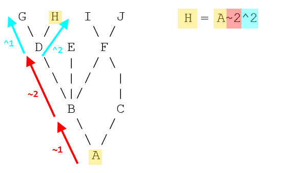

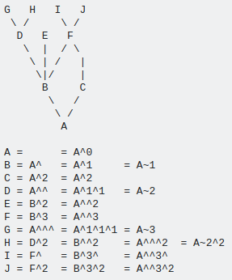

## 二、提交范围

通过祖先引用可以指明单次提交，此外通过特定语法我们还可以指定一定范围的提交。这常常是有用的，例如有时我们需要查看“这个分支的哪些提交还没有合并到主分支？”。

| 类别   | 表示             | 作用                        | 数学概念                                |
| ---- | -------------- | ------------------------- | ----------------------------------- |
| 两点提交 | before..after  | 隶属于after分支，但不隶属于before的提交 | 差集 (after-before)                   |
| 三点提交 | before...after | 两分支中除去共同拥有的提交外的提交         | 并集-交集 (before∪after - before∩after) |
| 多点提交 | ^或--not        | 不包含指定分支的所有提交              | 差集                                  |

## 三、git cherry-pick

挑拣类似针对某次特定提交的衍合。它首先提取某次提交的补丁，然后试着应用在当前分支上。应用场景：

1）如果某特性分支上有多个commits，你只想引入其中一个，就可使用挑拣。

2）或者个人偏好挑拣胜于衍合。

**示例**

当前有两个分支，若master分支只想引入e43a6的快照内容，则可进行如下操作。

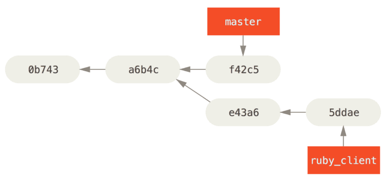

```shell
git cherry-pick e43a6   # 在当前状态执行挑拣
```

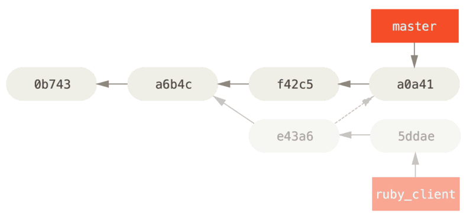

## 四、git rebase

通过rebase当前分支，可达到修改多个提交的目的。

```shell
# 重写到指定提交（非Root）之间的所有提交
git rebase -i <newbase> # 进入rebase交互模式，从newbase处开始进行多个提交的修改

# 重写到Root的所有提交，--root rebase all reachable commits up to the root(s)
git rebase -i --root
```

### 1、示例

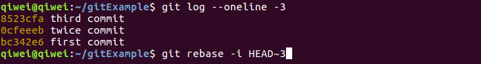

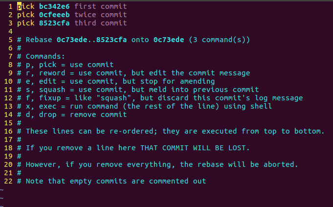

### 2、命令解释

| 命令     | 含义                                   | 使用场景                                                                        |
| ------ | ------------------------------------ | --------------------------------------------------------------------------- |
| pick   | 提交                                   | 保持原样                                                                        |
| reword | 先编辑提交信息，然后再提交                        | 可编辑多个历史提交信息                                                                 |
| edit   | 提交后中断，可通过git rebase --continue继续下面操作 | 1）可编辑多个历史提交信息；<br>2）一个拆分为多个提交（结合命令`git reset HEAD~`、`git add`和`git commit`） |
| squash | 把本次提交整合进上一次提交，需编辑的合并的提交信息            | 把多个提交压缩为一个提交                                                                |
| drop   | 删除提交                                 | 删除提交                                                                        |

## 五、git filter-branch

* 作用：遍历所有commit，并对每个提交执行某个指令操作。
* 场景：1）仓库要开源，遍历所有提交去除掉敏感信息；2）手误提交了一个大文件，需要从仓库里删除。

## 六、git stash

<!-- date: 2020.03.11 11:53 -->

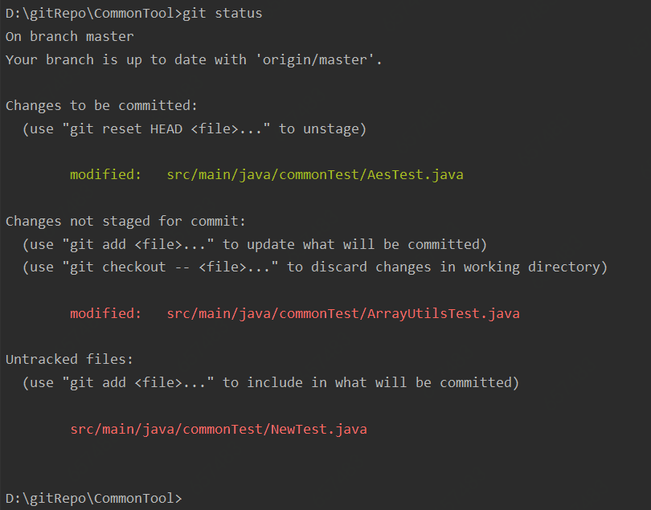

### 1、简介

1）执行`git stash`命令，发现只会把已跟踪的文件暂存起来：

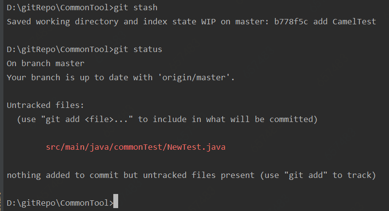

2）然后执行`git stash pop`，发现之前的暂存区的状态会丢失：


### 2、深入git stash的参数

1）暂存所有状态的文件：`git stash --all`

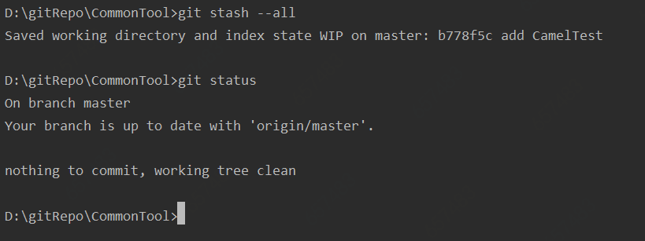

2）恢复暂存前所有状态：`git stash apply|pop --index`

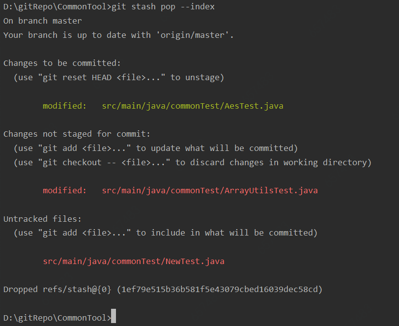

## 七、sparse checkout

<!-- date: 2020.08.18 11:52 -->

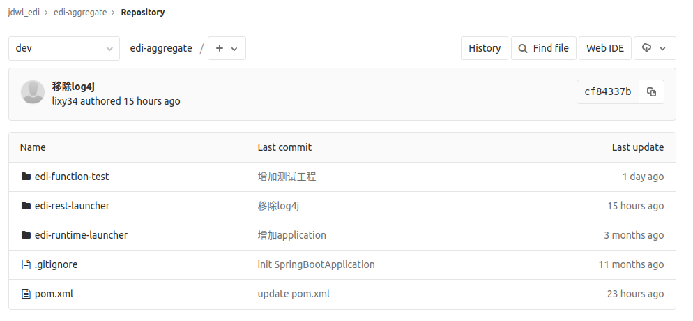假如我本地只想检出edi-rest-launcher，则可进行如下配置：

1、配置.git/config，增加`sparsecheckout = true`

```properties
[core]                                                                                                
        repositoryformatversion = 0 
        filemode = true
        bare = false
        logallrefupdates = true
        sparsecheckout = true
[remote "origin"]
        url = git@git.jd.com:jdwl_edi/edi-aggregate.git
        fetch = +refs/heads/*:refs/remotes/origin/*
[branch "master"]
        remote = origin
        merge = refs/heads/master
[branch "dev"]
        remote = origin
        merge = refs/heads/dev
```

2、配置.git/info/sparse-checkout

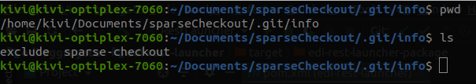

```
edi-rest-launcher 
```

## 八、子模块

* 若出现项目引用一个公共库的情况，可把公共库以子模块的方式导入到当前项目。
* 当前项目库中只保存子模块的url、路径和最新commit的引用。

> 具体使用可参考：姜家志老师写的文章《[使用Git Submodule管理子模块](https://segmentfault.com/a/1190000003076028)》，本节不在赘述。

## 九、补丁

* 多用于公开的大型项目。
* 当前不做介绍，只需了解可以创建补丁和应用补丁来实现代码更新。

## 十、Git调试

### 1、文件标注

可使用`git blame`来标注文件，查看文件中某一行是谁在哪一天修改的。其实该命令从名称可以看出来，就是出事后来问责的：）。

```shell
git blame -L <range> filename
# 若指定12行到20行，则range可表示为12,20或12,+9，此外还支持正则表达式
```

### 2、二分查找

git通过二分查找为在大量提交中找出引发系统错误的提交提供了高效的解决方案。

```shell
git bisect start <bad> <good>
指定问题区间，等同于以下三条命令
1. git bisect start
2. git bisect bad <bad>
3. git bisect good <good>

git bisect bad    # 标注当前为bad
git bisect good   # 标注当前为good
```

## 十一、git提交规范

<!-- date: 2020.04.25 13:54 -->

### 1、git提交规范

```text
<type>: <subject>
<BLANK LINE>
<detail body>
</detail body>
```

1）首行

* 声明提价的类型和摘要，便于通过命令或工具过滤，搜索。
* 类型主要有：feature，refactor，fixbug等，可团队内协定。

2）首行后的空行

* 必须存在，是body和首行摘要的分隔符。

3）详情

* 可详细说明本地提交的内容
* 粒度要比摘要详细。

### 2、示例

1）新增特性-library相关rest

```git
feature: add library rest

1) add lib query rest;
2) add lib upload rest;
3) add lib delete rest;
```

2）重构已有的library rest

```git
refactor: extract BaseController from librarayController 

1) extract sso logic to BaseController
2) extract file upload logic to BaseController
```

## 十二、Git分析工具

1、[Gource](https://gource.io/) - Git提交可视化

2、[gitstats](https://github.com/hoxu/gitstats) - Git仓库分析，如提交时间分析、提交人分析、趋势，[使用说明](https://shenxianpeng.github.io/2019/12/git-stats/)。