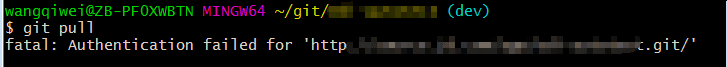
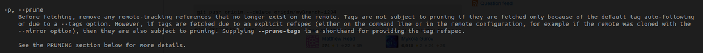
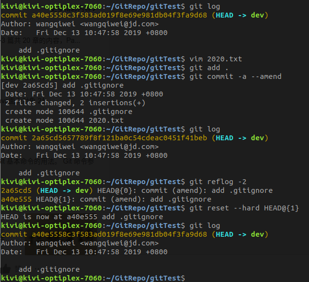

<!-- date: 2018.04.16 10:23 -->
## 一、设置BC为Diff工具

设置difftool为beyondCompare

```properties
# git配置文件增加如下配置即可
[diff]
  tool = bc4
[difftool]
  prompt = true                                                                                                                                                                                     
[difftool "bc4"]
  cmd = bcompare \"$LOCAL\" \"$REMOTE\"
```

## 二、认证失败

1）描述: 覆盖安装git-2.17.0-64-bit.exe后出现错误“fatal：Authentication failed for ...”

2）Git环境


3）错误信息



4）原因：windows自动缓存了密码，在[控制面板] - [凭据管理器] - [Windows凭据]下，删除git凭据即可。

## 三、删除远程分支失败

#### 1、操作

执行命令`git push origin :branchA`，出现异常“unable to delete remote ref does not exist”。

#### 2、原因

本地有远程分支的缓存，虽然远程已经不存在该分支，但本地执行`git branch -r`仍能看到。

#### 3、解决方案

执行命令`git fetch --prune origin`，更新本地分支缓存。



## 四、切换分支时对工作去要求

`git checkout otherbranch`若要成功切换分支，当前工作区状态需要满足以下要求：

1）clean状态；

2）非clean状态；

a.新增文件;

b.修改已跟踪文件，且该文件在两分支的仓库内容是一致的，即共用一个blob。

c.删除文件；

## 五、路径通配符

用于"git ls-files", "git ls-tree", "git add", "git grep", "git diff", "git checkout"等命令中的路径参数都可以使用通配模式。

NOTE：在shell中执行git命令时，通配符需要`被单引号或双引号括住`。否则通配符会由shell解析而无法传递到git程序，导致路径解析错误。

```
git checkout '*.xml'
git checkout "*.xml"
```

**参考**

1. [https://git-scm.com/docs/gitglossary.html#def_pathspec](https://git-scm.com/docs/gitglossary.html#def_pathspec)
2. [https://man7.org/linux/man-pages/man3/fnmatch.3.html](https://man7.org/linux/man-pages/man3/fnmatch.3.html)
3. [stackoverflow: Is there a way to use wildcards with git checkout？](https://stackoverflow.com/a/33306066)

## 六、合并时无法忽略文件

#### 1、问题描述

在使用GitFlow工作流时，不同分支的pom.xml的版本是不同的。这在Git分支间同步代码时，总是把版本也同步过去了。

此场景下需要一个功能，合并时忽略某些特定文件，如pom.xml。

#### 1、分析

1）Git提供了`.gitattributes`可以指定符合`pattern`的文件使用指定合并策略，例如**ours**。但这只在冲突时生效，不符合我们的需求。

2）反向思考下，Git之所以不提供此功能可能是因为合并有时候是双向的，如果两个分支都使用自己的文件，那么他们相互合并时（master merge to dev  &   dev merge to master），就会产生两个不同的提交。

结果就是，双向合并的提交不再是同一个结点，也无法fast-forwad。

 **参考**

1. https://stackoverflow.com/questions/15232000/git-ignore-files-during-merge

## 七、Mac/Windows不区分大小写带来的困惑

#### 1、问题描述

今日,  使用MacOs的同事在更新项目的Git仓库时, 出现一个令人困惑的情况. 具体执行序列如下:

```shell
执行:
1) git status
结果: modified:   ABC.xml

执行: 
1) git reset --hard  
2) git status
结果: modified:   ABC.xml

执行: 
1) git checkout . 
2) git status
结果: modified:   ABC.xml

执行: 
1) ls
结果: abc.xml
```

#### 2、解决路径

1. 在我的Ubuntu环境下, 仓库处于clean状态, 且该目录下有两个文件"abc.xml", "ABC.xml".
2. 发现是由于Windows, Mac操作系统的文件系统不区分大小写导致的.

#### 3、解决方案

1）在Ubuntu下删除其中一个文件, 并提交.

2）Mac, Windows环境下执行命令,

```shell
git pull # 更新仓库
git reset --hard origin/branch  # reset到对应的远程分支
```

#### 4、延伸

同理Mac,Windows下的分支也是忽略大小写的。

## 八、撤销git commit --amend

git使用amend命令的频率很高，常用来修补上次提交的不足。但有时可能需要撤销amend操作，这时可以利用reflog来找到之前的revision。



## 九、Git merge策略

**参考资料**

1. [https://git-scm.com/docs/merge-strategies](https://git-scm.com/docs/merge-strategies)

2. [http://blog.plasticscm.com/2011/09/merge-recursive-strategy.html](http://blog.plasticscm.com/2011/09/merge-recursive-strategy.html)

3. [https://stackoverflow.com/questions/60049845/git-merge-strategy-what-is-the-resolve-strategy](https://stackoverflow.com/questions/60049845/git-merge-strategy-what-is-the-resolve-strategy)

4. [https://stackoverflow.com/questions/366860/when-would-you-use-the-different-git-merge-strategies](https://stackoverflow.com/questions/366860/when-would-you-use-the-different-git-merge-strategies)

5. [https://www.cnblogs.com/chaoguo1234/p/5347623.html](https://www.cnblogs.com/chaoguo1234/p/5347623.html)

6. [Version Control with Git](https://books.google.com.hk/books?id=e9FsGUHjR5sC&pg=PA142&lpg=PA142&dq=git+merge+%22-s+resolve%22&source=bl&ots=Zi5h3H_bqh&sig=Lp_-I3uOvMbYBcsraQEe6WbFMhU&hl=en&sa=X&ei=cPW0T7qzEsae2gWeq9w9&redir_esc=y#v=onepage&q&f=false) 第九章 Merges 140-143页

7. [How does 'git merge' work in details?](https://stackoverflow.com/questions/14961255/how-does-git-merge-work-in-details)