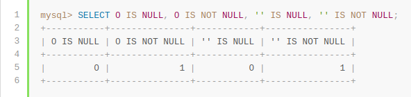

Mysql数据库中的Null是一个特殊的存在，表示该记录没有值，不同于空（''）和0；
1）应该使用IS NULL或者IS NOT NULL来判断
2）禁止使用<>, <, >, =去检测NULL，因为其结果集永远是空;
`NOTE：任何数和NULL运算结果都为NULL。`

3）NULL不同于'', 0。它表示'not having a value'。

#### 参考
1. [https://dev.mysql.com/doc/refman/8.0/en/working-with-null.html](https://dev.mysql.com/doc/refman/8.0/en/working-with-null.html)
1. [https://dev.mysql.com/doc/refman/8.0/en/problems-with-null.html](https://dev.mysql.com/doc/refman/8.0/en/problems-with-null.html)