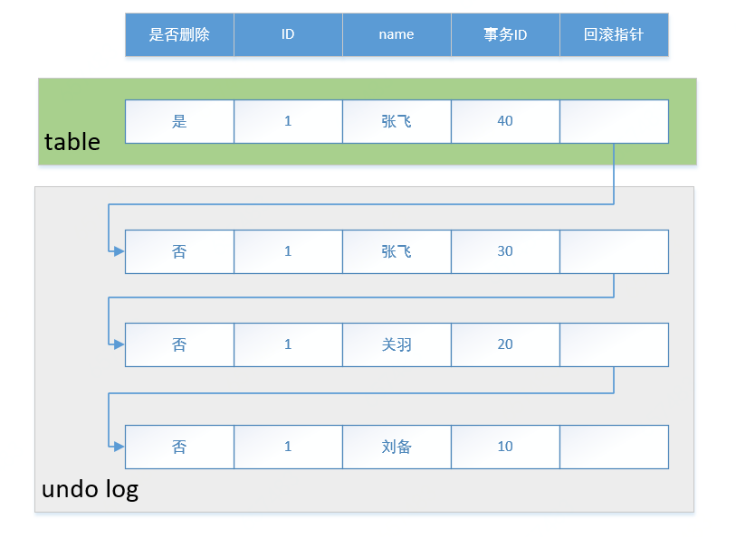

> MVCC是为了保证事务的非阻塞读，提高并发性的一种机制。目前有两种主流实现；
#### 前置问题
1. mysql的事务是一开始就生成事务ID吗？
2. read view是什么？
3. read view生成的时机？
4. read view如何实现隔离级别？
5. read view生成的时机？
6. read view和版本链的关系？
7. DML操作会生成事务快照吗？
#### 一、通过undo log实现
##### 1. 版本链
事务针对记录的修改都会通过复制产生新的记录放到库表里，老的记录则放入undo log，并通过回滚指针关联。

##### 2. read view和隔离级别
read view是事务实现隔离性时，用于判断记录可见性的事务集合。其格式为`[tx_min, tx_id, ...], tx_max`，
* 括号内为数据库当前所有未提交事务的集合，`tx_min`是未提交事务中ID最小的事务；
* 括号外的`tx_max`是数据库当前已创建的最大事务ID；

假设记录的事务ID为tx_id，则可见性规则如下：
1）若`tx_id < tx_min`，则当前记录时可见；
2）若`tx_id > tx_max`，则当前记录时不见；
3）若`tx_id不在readview中`，则当前记录可见；
4）若`tx_id在readview中`
    * 若tx_id是当前事务ID，则记录可见；
    * 若tx_id是当前事务ID，则记录不可见；

> Note：
> 1.当前事务ID会在事务执行DML操作时才会生成，查询操作不会生成；
> 2.读未提交只需读版本链里最新的记录即可，无需readview;
> 3.读已提交和可重复读会依赖readview来保证不同程度的一致性读，但他们生成readview的时机不同；
> 4.生成的readview是数据库级别的当前活跃事务的快照;
> 5.readview会在事务执行读取操作时生成，DML操作不会生成；

|                  | 读未提交 | 读已提交       | 可重复读             |
| ---------------- | -------- | -------------- | -------------------- |
| 是否使用readview | 否       | 是             | 是                   |
| 生成readview时机 |          | 每次读取都生成 | 事务第一次读取时生成 |
##### 3. mvcc操作步骤
假设有read view=[tx_min, tx_id, ...], tx_max。
1）如果记录的事务ID小于tx_min，则当前记录可见，返回当前记录；
2）如果记录的事务ID大于tx_max，则当前记录不可见；回滚指针回溯上一条记录，执行1）；
3）如果记录不在readview括号内，则记录可见，返回当前记录；
4）如果记录在readview括号内，有两种情况：
* 若事务ID是当前事务ID，则当前记录可见，返回当前记录；
* 若事务ID不是当前事务ID，则当前记录不可见；回滚指针回溯上一条记录，执行1）操作；