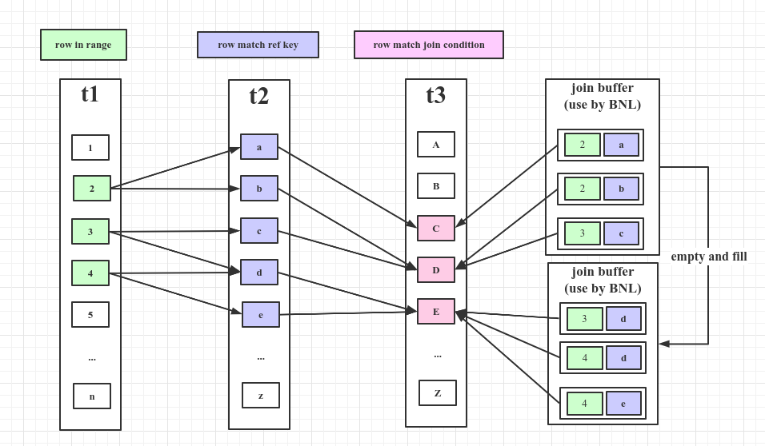

> MySQL使用嵌套循环算法或其变种来实现表之间的关联。

假设有三张表如下；
```sql
Table   Join Type
t1      range
t2      ref
t3      ALL
```
#### 一、NLJ（Nested-Loop Join Algorithm）
NLJ可以理解为关联多表时，执行循环遍历和嵌套操作来筛选结果集。
假如t1,t2,t3的行数分别为x,y,z，那么扫描行数`n=xyz`。

```shell
// 官网伪代码
for each row in t1 matching range {
  for each row in t2 matching reference key {
    for each row in t3 {
      if row satisfies join conditions, send to client
    }
  }
}
```
#### 二、BNL（Block Nested-Loop Join Algorithm）
BNL可以理解为在NLJ的基础上的变种，通过引入join buffer来缓存一批外层的行，减少遍历的次数。
假如t1,t2,t3的行数分别为x,y,z，joinbuffer一次可容纳j条记录，那么扫描行数`n=xyz/j`。

```shell
// 官方伪代码
for each row in t1 matching range {
  for each row in t2 matching reference key {
    store used columns from t1, t2 in join buffer
    if buffer is full {
      for each row in t3 {
        for each t1, t2 combination in join buffer {
          if row satisfies join conditions, send to client
        }
      }
      empty join buffer
    }
  }
}

if buffer is not empty {
  for each row in t3 {
    for each t1, t2 combination in join buffer {
      if row satisfies join conditions, send to client
    }
  }
}
```


#### 参考
1. [https://dev.mysql.com/doc/refman/8.0/en/nested-loop-joins.html#nested-loop-join-algorithm](https://dev.mysql.com/doc/refman/8.0/en/nested-loop-joins.html#nested-loop-join-algorithm)

