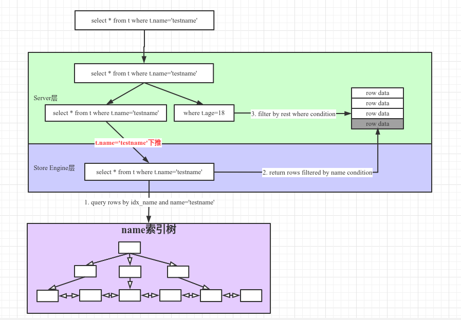
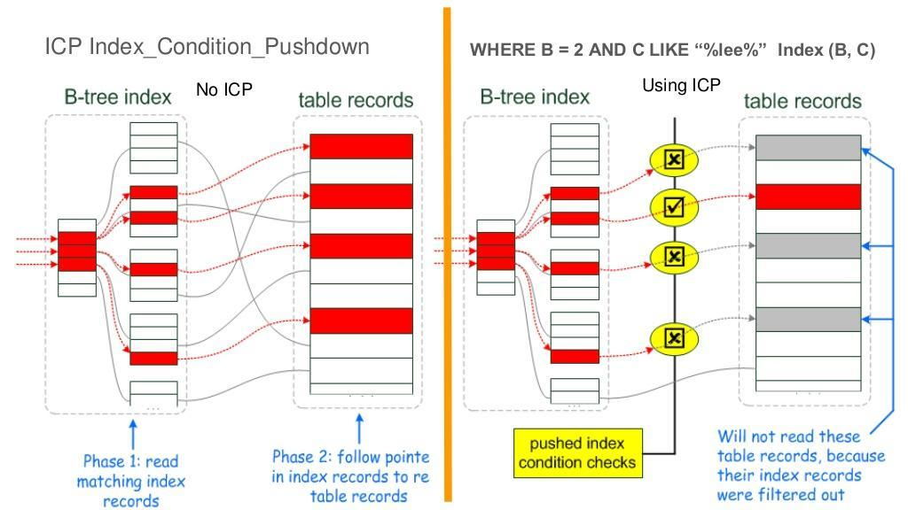

ICP(Index Condition Pushdown)，索引条件下推是Mysql针对使用索引检索时的一种优化手段。索引下推中`下推的是where中有关索引的条件`，`由服务层下推到存储引擎层`，使之返回更小的数据行到服务层。
#### 一、不使用ICP场景
1）存储引擎遍历`table t`的索引，对每一个索引执行后续操作；
2）根据索引从`table t`中取出行（如果是二级索引需要回表），返回服务器；
3）服务器通过where条件中针对`table t`的条件来过滤行；

#### 二、使用ICP场景
1）存储引擎遍历`table t`的索引，对每一个索引执行后续操作；
2）存储引擎根据where中针对`table t`条件中当前索引列的查询条件，对索引进行检查，
- 如果满足，则根据索引从`table t`中取出行并将其返回至mysql服务器层，继续执行后续操作
- 否则，返回第1）步获取下一个索引；

3）服务器根据剩余的条件过滤引擎返回的数据行；

##### 优点：
1）减少存储引擎访问表的次数；
2）减少mysql服务器访问存储引擎的次数；

#### 参考图片

#### 参考链接
1. [https://dev.mysql.com/doc/refman/8.0/en/index-condition-pushdown-optimization.html](https://dev.mysql.com/doc/refman/8.0/en/index-condition-pushdown-optimization.html)