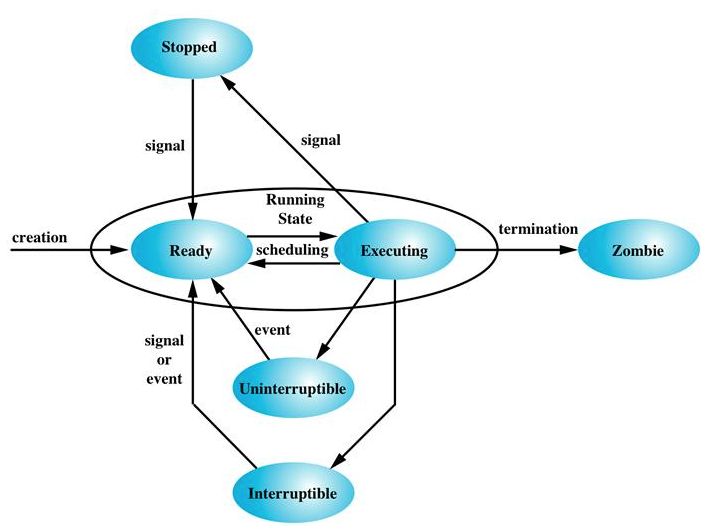
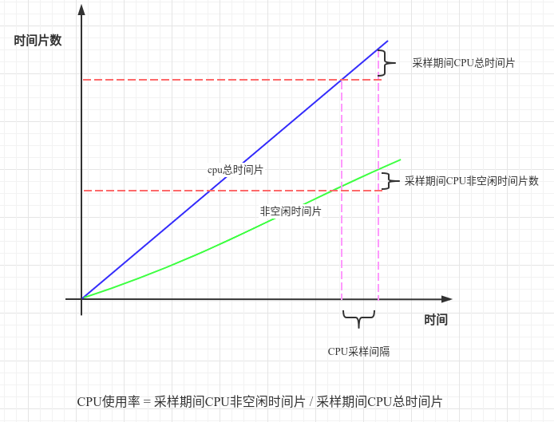
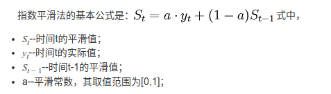

#### 一、Linux线程生命周期 




#### 二、CPU使用率



#### 三、当前负载 - 活跃任务数

##### 1. 负载 - 维基

> An idle computer has a load number of 0 (the idle process isn't counted). Each process using or waiting for CPU (the *ready queue* or run queue) increments the load number by 1. Each process that terminates decrements it by 1. Most UNIX systems count only processes in the *running* (on CPU) or *runnable* (waiting for CPU) states. However, Linux also includes processes in uninterruptible sleep states (usually waiting for disk activity), which can lead to markedly different results if many processes remain blocked in I/O due to a busy or stalled I/O system. 
>
> This, for example, includes processes blocking due to an NFS server failure or too slow media (e.g., USB 1.x storage devices). Such circumstances can result in an elevated load average which does not reflect an actual increase in CPU use (but still gives an idea of how long users have to wait).

一个空闲的电脑的负载是0（空闲进程不被统计）。每个正在使用或等待使用CPU的进程（处于就绪队列或运行队列）都会使负载加1。而随着进程结束，则会使负载减1。大部分UNIX系统只计算了这两种状态。但是Linux还统计了不可中断的睡眠态（通常在等待磁盘活动）进程，如果许多进程由于I/O系统繁忙或停止而在I/O中保持阻塞状态，则会导致明显不同的结果。

例如，这包括由于NFS服务器故障或介质（例如USB 1.x存储设备）太慢而导致的进程阻塞。这种情况可能会导致平均负载增加，而这并不反映CPU使用的实际增加（但仍然给出了用户必须等待多长时间的想法）。

##### 2. 不可中断的睡眠态 - 维基

> An uninterruptible sleep state is a sleep state that won't handle a signal right away. It will wake only as a result of a waited-upon resource becoming available or after a time-out occurs during that wait (if specified when put to sleep). It is mostly used by device drivers waiting for disk or network IO (input/output). When the process is sleeping uninterruptibly, signals accumulated during the sleep will be noticed when the process returns from the system call or trap.
>
> In Unix-like systems the command '`ps -l`' uses code "`D`" for the uninterruptible sleep state of a process. Such processes cannot be killed even with `SIGKILL` and the only non-sophisticated way to get rid of them is to reboot the system.

不可中断的睡眠状态是指不能立即处理信号的睡眠状态。它只会在等待的资源变为可用时或在等待期间发生超时（如果在进入睡眠时指定）后唤醒。它主要由等待磁盘或网络IO（输入/输出）的设备驱动程序使用。当进程处于不可中断的睡眠状态时，当进程从系统调用或调用返回时，将注意到在睡眠过程中积累的信号陷阱。

在类似于Unix的系统命令“`ps-l`”使用代码“`D`”表示进程的不间断睡眠状态。即使使用`SIGKILL`，也不能终止这样的进程，而摆脱它们唯一简单的方法就是重启系统。

##### 3. 总结

由以上可知Linux系统下的活跃任务数计算公式：

```c
active_tasks = ready_queue.length + run_queue.length + uninterruptible_sleep_state.length
```

#### 四、平均负载 - 指数平滑法

> 很多电力公司用它来预测电力负载。



#### 1. 指数平滑法 - MBA智库百科

> 指数平滑法是布朗(Robert G..Brown)所提出，布朗(Robert G..Brown)认为时间序列的态势具有稳定性或规则性，所以时间序列可被合理地顺势推延；他认为最近的过去态势，在某种程度上会持续到最近的未来，所以将较大的权数放在最近的资料。
>
> 　　指数平滑法是生产预测中常用的一种方法。也用于中短期经济发展趋势预测，所有预测方法中，指数平滑是用得最多的一种。简单的全期平均法是对时间数列的过去数据一个不漏地全部加以同等利用；移动平均法则不考虑较远期的数据，并在加权移动平均法中给予近期资料更大的权重；而指数平滑法则兼容了全期平均和移动平均所长，不舍弃过去的数据，但是仅给予逐渐减弱的影响程度，即随着数据的远离，赋予逐渐收敛为零的权数。
>
> 　　也就是说指数平滑法是在移动平均法基础上发展起来的一种时间序列分析预测法，它是通过计算指数平滑值，配合一定的时间序列预测模型对现象的未来进行预测。其原理是任一期的指数平滑值都是本期实际观察值与前一期指数平滑值的加权平均。

##### 2. Linux负载源码注释

来源：*linux/kernel/sched/loadavg.c*  [Github源码](https://github.com/torvalds/linux/blob/master/kernel/sched/loadavg.c)  [本仓库副本](../../src/main/c/kernel/sched/loadavg.c)

```c
/**
 * The global load average is an exponentially decaying average of nr_running +
 * nr_uninterruptible.
 *
 * Once every LOAD_FREQ:
 *
 *   nr_active = 0;
 *   for_each_possible_cpu(cpu)
 *     nr_active += cpu_of(cpu)->nr_running + cpu_of(cpu)->nr_uninterruptible;
 *
 *   avenrun[n] = avenrun[0] * exp_n + nr_active * (1 - exp_n)
 */
```

#### 参考

1. [Process_states](https://en.wikipedia.org/wiki/Process_states)
2. [Uninterruptible_sleep (ps的D状态)](https://en.wikipedia.org/wiki/Sleep_(system_call)#Uninterruptible_sleep)
3. [run queue](https://en.wikipedia.org/wiki/Run_queue)
4. [深度好文：全面解析 Linux Load](https://www.sohu.com/a/334948096_262549)
5. [维基 CPU Load](https://en.wikipedia.org/wiki/Load_(computing))
6. [指数平滑法 MBA智库百科](https://wiki.mbalib.com/wiki/%E6%8C%87%E6%95%B0%E5%B9%B3%E6%BB%91%E6%B3%95)
7. [维基 Exponential_smoothing](https://en.wikipedia.org/wiki/Exponential_smoothing)
8. [维基 Exponential_moving_average](https://en.wikipedia.org/wiki/Moving_average#Exponential_moving_average)

