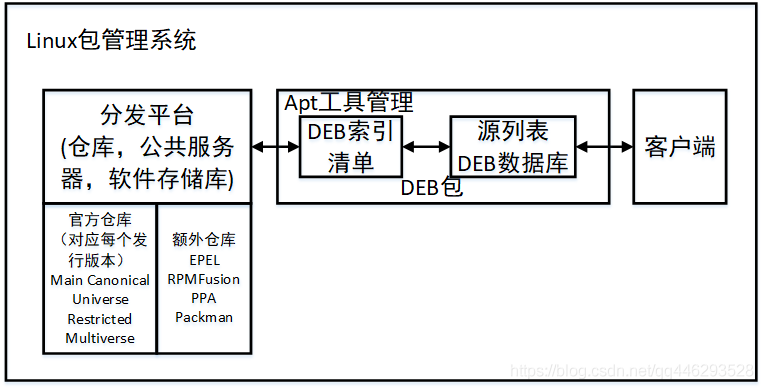
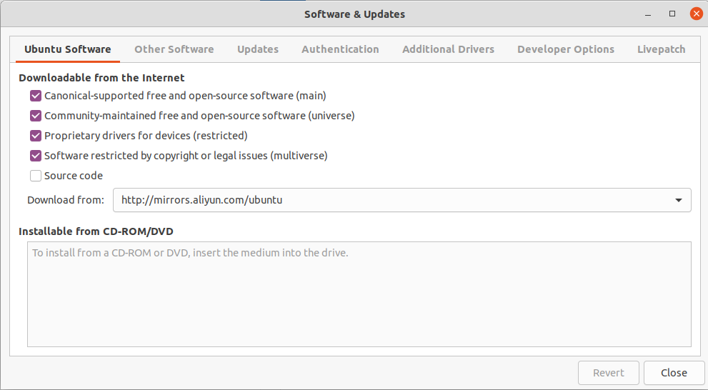
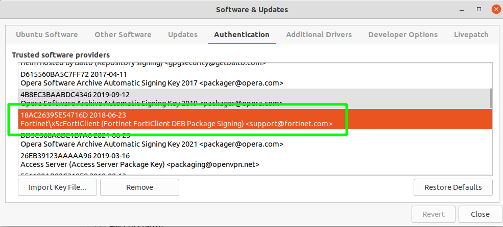

#### 一、Debian包管理

[图片来源](https://blog.csdn.net/qq446293528/article/details/114376213)



其概念可类比Maven，一样一样的。

| APT包管理 | Maven依赖管理     |
| ------ | ------------- |
| APT客户端 | Maven客户端      |
| DEB包   | Java的Jar包     |
| 分发平台   | Maven远程仓库     |
| 官方仓库   | Maven中央仓库     |
| 额外仓库   | Maven私服，非中央仓库 |

#### 二、包仓库配置

```bash
# 官方仓库
/etc/apt/sources.list

# ppa仓库
/etc/apt/sources.list.d/*.list
```

#### 三、包仓库软件

**Software &  Updates**：用于配置仓库信息，自动检查更新，认证等。

**Software Updater**：用于检查仓库更新




#### 四、DEB密钥管理

**应用场景**

把某个Deb包的GPG公钥加入到Deb密钥管理库，此公钥会用来验证DEB的完整和合法性。

```bash
# wget -O后面的-表示下载到标准输出
wget -O - https://repo.fortinet.com/repo/6.4/ubuntu/DEB-GPG-KEY | sudo apt-key add -
```

**分析**

1）下载一个DEB包的GPG公钥

```bash
$ wget -O tmp.gpg https://repo.fortinet.com/repo/6.4/ubuntu/DEB-GPG-KEY
-----BEGIN PGP PUBLIC KEY BLOCK-----
Version: GnuPG v1

mQENBFst9sYBCADK9Wl8PCqSeKq75o4j7y65J8uEfvctyANV2YHqcqIC6DITnPpE
hAy0AybhVGnWLXuApsCgSFvFW81lE/AWBVaZzbtTMoM8PeVTEsts13bp/Ww1VFzY
Zp6z7Pz9KVd4rhauHsDx9QZ+7/BNRe5YlcLfWsF56jOgxIKax5tVudC6OelAf8mL
tIGGlZYDHzJD55SaRjRTgZSrK/KcLxnmYbIGrkNaCN7bW26jFbkBfM2aesu8/zgw
HSTHqlJuvaup+8jiavCwIzh0kOuUO3ZLrH0f9vOu17KuEJl+9eAsGo73TI496wx1
JWr9yTw/61HzJu6+MjadtBgh/sjJXggJLOBBABEBAAG0VkZvcnRpbmV0XEZvcnRp
Q2xpZW50IChGb3J0aW5ldCBGb3J0aUNsaWVudCBERUIgUGFja2FnZSBTaWduaW5n
KSA8c3VwcG9ydEBmb3J0aW5ldC5jb20+iQE+BBMBAgAoBQJbLfbGAhsDBQkJZgGA
BgsJCAcDAgYVCAIJCgsEFgIDAQIeAQIXgAAKCRAYrCY5XlRxbT6bB/0QIRM9FtOz
9yMJdO/C7dYNvjdB6ynamAMIjTzaGXmd281LhHuBOKv9C7NceisJlUjbty1V365L
e3gS8zjaCgr+rerH+Zx8YZVix+GmmvkqZagFUHHleDlVZV6KSJberv7TKir4EwRe
uabYyn93hyOmpF96Nliu9+g8nvvRzgYotANwl6PrhKKyy8emQHNcbQCxuL0PPt9i
FiAxMhE9mXWaIXjXyMA6kVE6rfUy/3QJIHj0ukc+9kdScMRx4lJ/qYImT/RLDTpN
bZmV1i0sRCydEcKHsTuMgW8bPigGwNfYwlT09mGplc5jQ1SfCHidI9cOmzWAy33H
WmrE2K1T4Oio
=pYOe
-----END PGP PUBLIC KEY BLOCK-----
```

2）查看GPG公钥信息

> --show-keys
>               This  commands takes OpenPGP keys as input and prints information about them in the same
>  way the command --list-keys does for locally stored key.

```bash
# --show-keys查看导入前信息，--list-keys查看导入后的信息
$ gpg --show-keys tmp.gpg
pub   rsa2048 2018-06-23 [SC] [expires: 2023-06-22]
      264E114C6911D08D3BA6CE6C18AC26395E54716D
uid           Fortinet\FortiClient (Fortinet FortiClient DEB Package Signing) <support@fortinet.com>
```

3）查看系统已信任的公钥

* 从**Software & Updates**查看



* 命令查看

```bash
$ apt-key list
/etc/apt/trusted.gpg
--------------------
pub   rsa4096 2016-04-12 [SC]
      EB4C 1BFD 4F04 2F6D DDCC  EC91 7721 F63B D38B 4796
uid           [ unknown] Google Inc. (Linux Packages Signing Authority) <linux-packages-keymaster@google.com>
sub   rsa4096 2019-07-22 [S] [expires: 2022-07-21]

pub   dsa1024 2010-03-30 [SC]
      C946 7A82 16C5 70CD FBAC  3AFD 331D 6DDE 7F88 40CE
uid           [ unknown] Scooter Software <support@scootersoftware.com>
sub   elg2048 2010-03-30 [E]

pub   rsa4096 2017-12-15 [SCEA]
      0A0F AB86 0D48 5603 32EF  B581 B754 42BB DE9E 3B09
uid           [ unknown] https://packagecloud.io/AtomEditor/atom (https://packagecloud.io/docs#gpg_signing) <support@packagecloud.io>
sub   rsa4096 2017-12-15 [SEA]

pub   rsa4096 2017-02-22 [SCEA]
      9DC8 5822 9FC7 DD38 854A  E2D8 8D81 803C 0EBF CD88
uid           [ unknown] Docker Release (CE deb) <docker@docker.com>
sub   rsa4096 2017-02-22 [S]

pub   rsa4096 2018-10-08 [SCEA]
      6D39 8DBD 30DD 7894 1E2C  4797 FE2A 5F8B DC28 2033
uid           [ unknown] https://packagecloud.io/github/git-lfs (https://packagecloud.io/docs#gpg_signing) <support@packagecloud.io>
sub   rsa4096 2018-10-08 [SEA]

pub   rsa2048 2016-09-25 [SC]
      4AC4 41BE 68B4 ADAB 7439  FBF9 BA30 0B77 55AF CFAE
uid           [ unknown] Abner Lee <abner@typora.io>

pub   rsa2048 2015-06-26 [SC]
      4CE5 2459 3899 65F1 DEE0  33AE 6E21 12BA CBDD C1A6
uid           [ unknown] Send Anywhere Linux Team <support.linux@estmob.com>
sub   rsa2048 2015-06-26 [E]

pub   rsa1024 2009-01-22 [SC]
      E1DD 2702 88B4 E603 0699  E45F A171 5D88 E1DF 1F24
uid           [ unknown] Launchpad PPA for Ubuntu Git Maintainers

pub   rsa4096 2020-05-06 [SCEA] [expires: 2030-05-04]
      81BF 832E 2F19 CD2A A047  1959 294A C482 7C1A 168A
uid           [ unknown] Helm hosted by Balto (Repository signing) <gpgsecurity@getbalto.com>

pub   rsa4096 2017-04-11 [SC] [expired: 2019-09-28]
      D4CC 8597 4C31 396B 18B3  6837 D615 560B A5C7 FF72
uid           [ expired] Opera Software Archive Automatic Signing Key 2017 <packager@opera.com>

pub   rsa4096 2019-09-12 [SC] [expired: 2021-09-11]
      68E9 B2B0 3661 EE3C 44F7  0750 4B8E C3BA ABDC 4346
uid           [ expired] Opera Software Archive Automatic Signing Key 2019 <packager@opera.com>

pub   rsa2048 2018-06-23 [SC] [expires: 2023-06-22]
      264E 114C 6911 D08D 3BA6  CE6C 18AC 2639 5E54 716D
uid           [ unknown] Fortinet\FortiClient (Fortinet FortiClient DEB Package Signing) <support@fortinet.com>

pub   rsa4096 2021-06-23 [SC] [expires: 2023-06-23]
      9FBD E02F 55F2 54D7 0082  1CCC DD3C 368A 8DE1 B7A0
uid           [ unknown] Opera Software Archive Automatic Signing Key 2021 <packager@opera.com>
sub   rsa4096 2021-06-23 [E] [expires: 2023-06-23]

pub   rsa4096 2019-03-15 [SC]
      8B1B C7FE CB72 59E1 430A  3AA0 26EB 3912 3AAA AA96
uid           [ unknown] Access Server (Access Server Package Key) <packaging@openvpn.net>
sub   rsa4096 2019-03-15 [E]

pub   rsa4096 2019-02-13 [SC]
      8A90 3102 6374 5AEB CF58  5F02 5511 80AB 92C3 19F8
uid           [ unknown] OpenVPN PPA Repository Key <pkg@openvpn.net>
sub   rsa4096 2019-02-13 [E]

pub   rsa4096 2015-05-16 [SC]
      D1E5 B25F 1DC2 7EE8 8019  EA18 61FF 9694 161C E595
uid           [ unknown] Launchpad PPA for enaess

/etc/apt/trusted.gpg.d/daniel-marynicz_ubuntu_filemanager-actions.gpg
---------------------------------------------------------------------
pub   rsa4096 2018-05-19 [SC]
      31E7 BE38 2EB4 A40B 3334  A1DF A279 F292 7618 CC1D
uid           [ unknown] Launchpad PPA for Daniel

/etc/apt/trusted.gpg.d/eivnaes_ubuntu_network-manager-sstp.gpg
--------------------------------------------------------------
pub   rsa4096 2015-05-16 [SC]
      D1E5 B25F 1DC2 7EE8 8019  EA18 61FF 9694 161C E595
uid           [ unknown] Launchpad PPA for enaess

/etc/apt/trusted.gpg.d/fossfreedom_ubuntu_indicator-sysmonitor.gpg
------------------------------------------------------------------
pub   rsa1024 2012-01-05 [SC]
      0D87 EE08 4E8D B990 ADD3  899C 82EB 5823 F4FE 239D
uid           [ unknown] Launchpad PPA for fossfreedom

/etc/apt/trusted.gpg.d/george-edison55_ubuntu_nitroshare.gpg
------------------------------------------------------------
pub   rsa1024 2010-08-02 [SC]
      B118 CD3C 377D F930 EDD0  6C67 084E CFC5 828A B726
uid           [ unknown] Launchpad George Edison's PPA

/etc/apt/trusted.gpg.d/linuxuprising_ubuntu_libpng12.gpg
--------------------------------------------------------
pub   rsa4096 2018-04-06 [SC]
      1CC3 D16E 460A 94EE 17FE  581C EA8C ACC0 73C3 DB2A
uid           [ unknown] Launchpad PPA for Linux Uprising
```

#### # 参考

1. [GPG入门教程](https://www.ruanyifeng.com/blog/2013/07/gpg.html)
2. [ubuntu中deb包签名与应用](https://blog.csdn.net/yikunbai5708/article/details/117070779)
3. [apt-key命令](https://man.linuxde.net/apt-key)